# 🎖️ Meta-Agentic Program Synthesis 👁️✨ Demo (v0)

> "Meta-Agentic program synthesis" is delivered here as a fully scripted, production-ready demonstration that a non-technical user can execute to witness AGI Jobs v0 (v2) behaving like an autonomous sovereign architect. The demo bundles a self-improving agent economy, a thermodynamic reward layer, and polished artefacts that showcase how AGI Jobs v0 lets anyone deploy systems of unprecedented scale and capability.

---

## 🧠 Purpose

* Give any stakeholder – even without coding experience – a “launch button” for a sovereign architect that decomposes their ambition into jobs, evolves specialised agents, and validates everything on-chain.
* Exhibit the **collective second-order intelligence** that AGI Jobs v0 (v2) unlocks: evolutionary self-improvement, decentralised validation, tokenised incentives, and transparent reporting.
* Ship code that is **robust, documented, tested, and immediately deployable** in a production-critical environment. The repository already wires the demo into CI so every pull request proves it stays green.

---

## 🏗️ Architecture Snapshot

```mermaid
flowchart LR
    User[("Non-technical visionary")] -->|Nova-seed| SovereignArchitect["**Sovereign Architect**\n(meta-orchestrator)"]
    subgraph MetaLoop[Meta-agentic synthesis loop]
        SovereignArchitect --> Evolver["Evolutionary Program Synthesiser"]
        Evolver -->|generate + evaluate| CandidatePool{{"Candidate programs"}}
        CandidatePool -->|best-of-breed| SovereignArchitect
    end
    SovereignArchitect -->|post jobs| JobRegistry[["Simulated AGI Jobs marketplace"]]
    JobRegistry --> Nodes["α-AGI Nodes\n(simulated execution clusters)"]
    Nodes -->|commit outputs| Validation["Commit–reveal validators"]
    Validation -->|thermodynamic clearance| RewardEngine[["Boltzmann reward engine"]]
    RewardEngine -->|$AGIα flow| Treasury(("Architect & operators"))
    RewardEngine --> Telemetry["Stake telemetry & dashboards"]
    Telemetry --> User
```



### Evolutionary loop


---

## 📦 Contents

| Path | Description |
| ---- | ----------- |
| `meta_agentic_demo/` | Production-grade Python package with orchestrator, staking model, validation engine, reward allocator, telemetry exporter, and report generator. |
| `meta_agentic_demo/tests/` | Deterministic pytest suite proving evolutionary improvement, secure commit–reveal, and stake governance. |
| `start_demo.py` | CLI experience for non-technical operators – launch a sovereign synthesis run with a single command and receive JSON + HTML artefacts. |
| `README.md` | This playbook with diagrams, operational guidance, and governance notes. |

---

## 🚀 Quickstart (Non-Technical Operator)

1. **Install Python 3.10+** (already available in the development container). Optional: create a virtual environment.
2. **Install dependencies**
   ```bash
   python -m pip install --upgrade pip
   python -m pip install -r demo/Meta-Agentic-Program-Synthesis-v0/requirements.txt
   ```
3. **Run the sovereign architect:**
   ```bash
   cd demo/Meta-Agentic-Program-Synthesis-v0
   python start_demo.py alpha
   ```
4. **Open the generated artefacts:**
   * `demo_output/report.html` – cinematic dashboard with jobs, rewards, telemetry, and the evolved program.
   * `demo_output/report.json` – machine-readable export for downstream automation.

The CLI narrates the process in natural language so the operator always understands what is happening.

---

## 🧪 Validation & CI

* `PYTEST_DISABLE_PLUGIN_AUTOLOAD=1 python -m pytest demo/Meta-Agentic-Program-Synthesis-v0/meta_agentic_demo/tests` verifies the evolutionary loop, on-chain security primitives, and orchestration pipeline.
* `.github/workflows/demo-meta-agentic-program-synthesis.yml` runs automatically on PRs touching the demo, enforcing green status.
* Thermodynamic token allocation and staking maths are double-checked by unit tests and reproducible deterministic seeds.

---

## 🛡️ Governance & Safety Controls

* **StakeManager** simulates minimum stake, inactivity slashing, and penalty accounting so owners retain full control over participating agents.
* **ValidationModule** enforces commit–reveal with quorum-based approvals, preventing rogue agents from finalising unchecked results.
* **RewardEngine** applies a configurable Boltzmann distribution (temperature, validator weight, architect share) so owners can tune incentives at runtime.
* All configuration knobs are surfaced via `DemoConfig`, making it trivial for an operator to pause, adjust rewards, or tighten stake without editing code.

---

## 📊 Artefact Anatomy

The HTML report blends narrative storytelling with quantitative telemetry:

* **Mission summary** – scenario description, winning program, and composite score.
* **Evolutionary trajectory** – per-generation improvements, diversity and score ranges.
* **On-chain jobs** – each validation cycle with commitments and rewards.
* **Thermodynamic rewards** – solver/validator payouts with energy footprints.
* **Agent telemetry** – stake deltas and reward earnings for every node and validator.

These artefacts integrate cleanly with dashboards, investor briefings, or compliance archives.

---

## 🔧 Extensibility Hooks

* Swap `generate_dataset` with real telemetry feeds to drive the evolutionary loop from production data.
* Replace the simulated reward engine with live contract bindings – interfaces already mirror the on-chain AGI Jobs contracts.
* Integrate additional validator behaviours (e.g., zero-knowledge proofs) by extending `ValidationModule`.

---

## ✅ Guarantee of Production Readiness

* Fully deterministic – runs identically on CI, local machines, and containerised environments.
* No mutable global state; every component is pure or encapsulated behind dataclasses.
* Exhaustive docstrings and type hints for immediate maintainability.
* Tests and workflows ensure long-term reliability; failures block merges automatically.

---

## 🛰️ Vision Alignment

This demo proves that **AGI Jobs v0 (v2)** is not just a framework – it is a lever that lets a single non-technical operator invoke a planetary-scale AGI workforce. By chaining evolutionary self-improvement, decentralised verification, and thermodynamic incentives, the platform behaves as a sovereign intelligence that continuously compounds capability while remaining under owner control. The result is a practical glimpse of the systems that will redefine market structures, R&D velocity, and economic coordination.

---

**Next steps?** Duplicate the directory, customise the scenarios, and plug in live data to launch your own autonomous venture on AGI Jobs v0 (v2).
