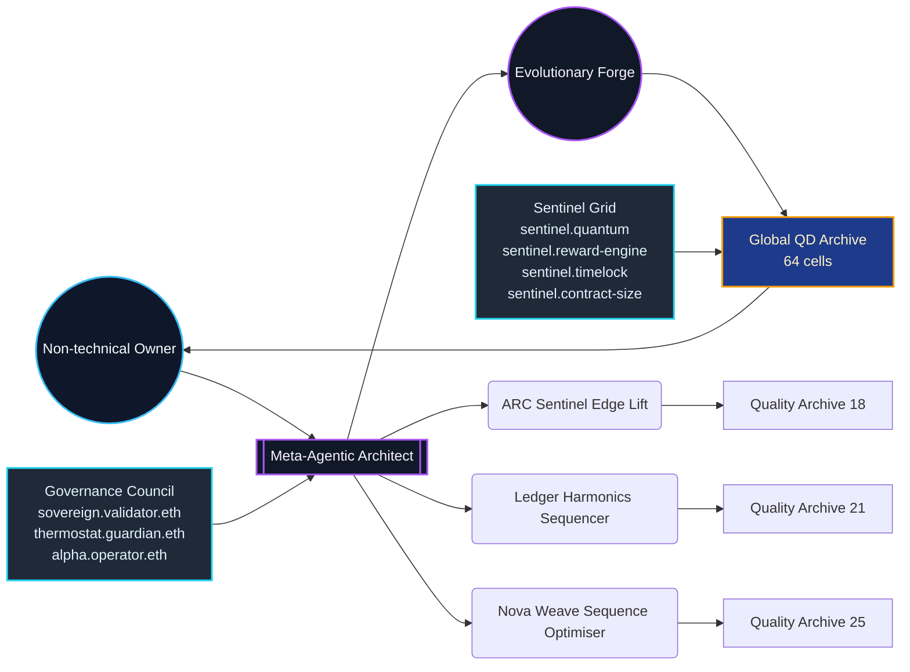
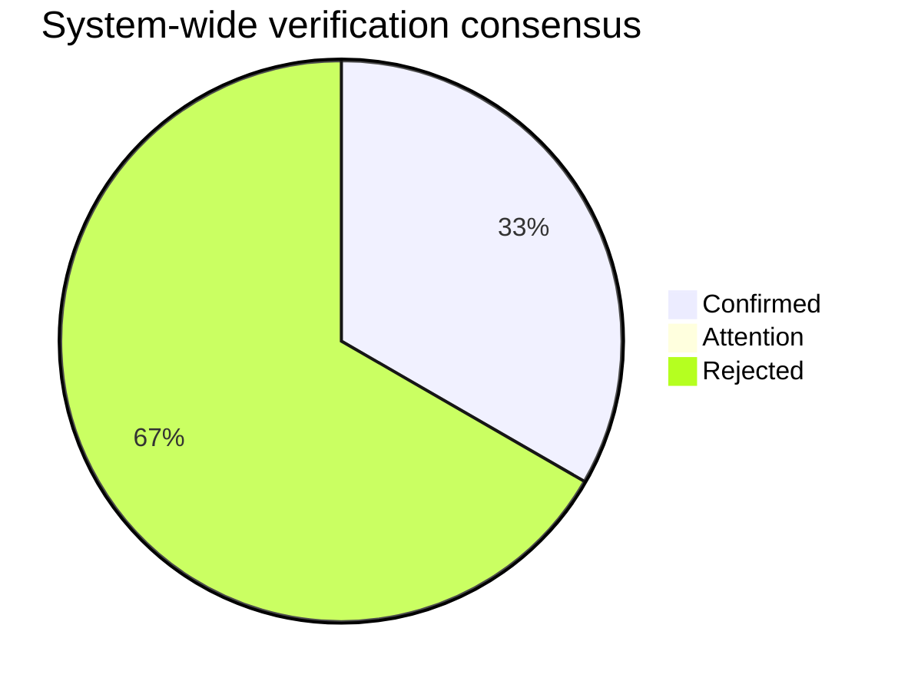
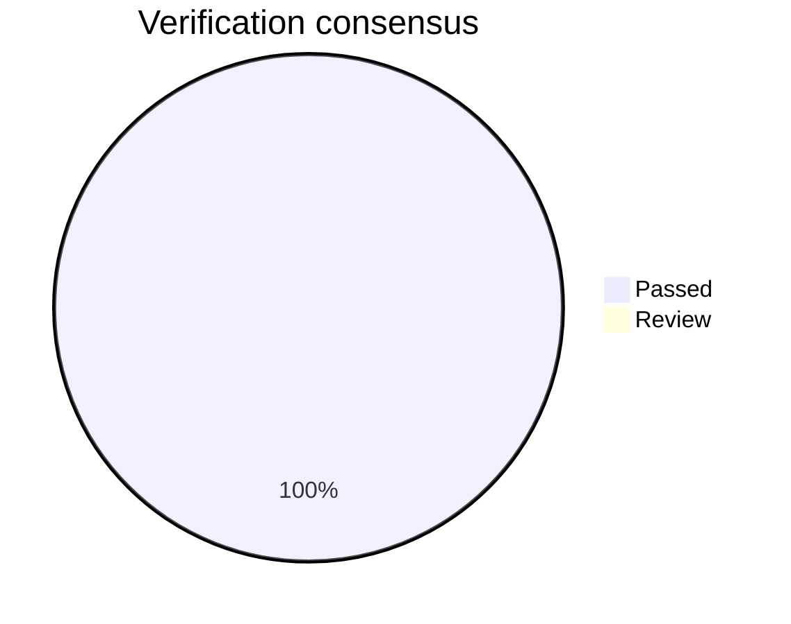
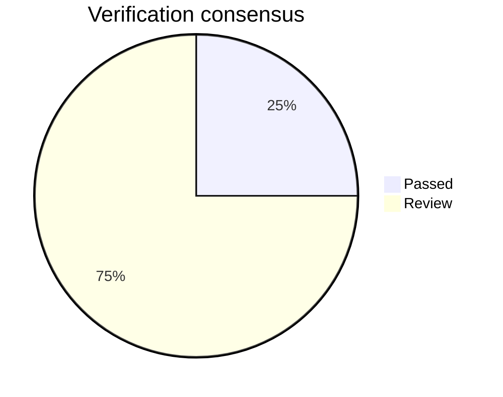

# Meta-Agentic Program Synthesis Sovereign Mission
_Evolutionary Intelligence Forge_

Deterministic rehearsal proving that AGI Jobs v0 (v2) lets a non-technical owner conjure, govern, and redeploy an autonomous meta-agent that designs and verifies production-ready code modules in minutes.

## Executive Summary

- **Global best score:** 140.38 (accuracy 100.00%)
- **Energy envelope:** 73.33 average operations energy.
- **Novelty signal:** 77.76% average.
- **Coverage:** 100.00% task-level perfect matches.
- **Triangulation confidence:** 53.33% consensus (1 confirmed / 0 attention / 2 flagged).
- **Thermodynamic alignment:** 100.00% (mean Δ 0.00 | max Δ 0.00 | 3 aligned / 0 monitor / 0 drift).
- **Owner supremacy:** every control remains copy-paste accessible (pause, thermostat, upgrades, treasury mirrors, compliance dossier).
- **Coverage readiness:** ready (5/5 controls satisfied).

## Mission Metadata

- Version: 0.1.0
- Owner: 0x1111111111111111111111111111111111111111
- Treasury: 0x2222222222222222222222222222222222222222
- Timelock: 604800 seconds
- Owner Control Scripts:
  - `npm run owner:command-center`
  - `npm run owner:atlas`
  - `npm run owner:system-pause`
  - `npm run owner:upgrade-status`
  - `npm run owner:change-ticket`

## Meta-Agentic Control Surface



## Verification Consensus

- Confirmed: 1 | Attention: 0 | Flagged: 2


## Owner Capabilities

| Category | Command | Verification |
| --- | --- | --- |
| Emergency Pause | `npm run owner:system-pause -- --action pause` | `npm run owner:system-pause -- --action status` |
| Thermostat | `npm run thermostat:update -- --mission demo/Meta-Agentic-Program-Synthesis-v0/config/mission.meta-agentic-program-synthesis.json` | `npm run thermodynamics:report` |
| Upgrade | `npm run owner:upgrade -- --mission demo/Meta-Agentic-Program-Synthesis-v0/config/mission.meta-agentic-program-synthesis.json` | `npm run owner:upgrade-status` |
| Treasury | `npm run reward-engine:update -- --mission demo/Meta-Agentic-Program-Synthesis-v0/config/mission.meta-agentic-program-synthesis.json` | `npm run reward-engine:report` |
| Compliance | `npm run owner:compliance-report` | `npm run owner:doctor` |

## Owner Coverage Readiness

- **Readiness:** ready
- **Satisfied controls:** Emergency Pause, Thermostat, Upgrade, Treasury, Compliance
- **Missing controls:** None

## ARC Sentinel Edge Lift

Detect latent pixel edges, amplify discovery, and route high-confidence transformations back into the shared skill graph.

- Job ID: ARC-SYN-001 | Stake: 120,000 | Reward: 420,000 | Thermodynamic target: 88
- Best candidate score: 140.38 (accuracy 100.00%, novelty 73.1%, coverage 100.0%)
- Thermodynamic status: **ALIGNED** (target 88.00 • energy 88.00 • Δ 0.00 • tolerance ≤ 13.20).
- Pipeline blueprint:
```
1. scale (factor=2.322)
2. difference ()
3. threshold (threshold=0.500, high=3.000)
4. threshold (threshold=0.500, high=3.000)
```

### Triangulated Verification

- Consensus: **CONFIRMED** (100.0% confidence, 4/4 perspectives).
| Perspective | Verdict | Confidence | Notes |
| --- | --- | --- | --- |
| Deterministic replay | ✅ | 30.0% |  |
| Baseline dominance | ✅ | 25.0% | Seed score 135.56 → improvement 4.82 |
| Adversarial jitter | ✅ | 25.0% | Average deviation 0.250, max 3.000 across 72 samples |
| Constraint & peer safety | ✅ | 20.0% | Peer median 140.38 • energy delta 8.00 (≤ 33.60) |



### Evolutionary History

| Generation | Best Score | Mean Score | Diversity | Elite Score |
| --- | --- | --- | --- | --- |
| 0 | 135.56 | 54.15 | 0.94 | 110.36 |
| 1 | 138.06 | 74.05 | 0.75 | 136.39 |
| 2 | 138.16 | 83.09 | 0.75 | 138.12 |
| 3 | 138.92 | 93.11 | 0.83 | 138.41 |
| 4 | 140.38 | 104.22 | 0.69 | 140.38 |
| 5 | 140.38 | 100.27 | 0.78 | 140.38 |
| 6 | 140.38 | 116.86 | 0.78 | 140.38 |
| 7 | 140.38 | 116.98 | 0.72 | 140.38 |
| 8 | 140.38 | 106.84 | 0.81 | 140.38 |
| 9 | 140.38 | 113.36 | 0.75 | 140.38 |

### Quality-Diversity Archive

| Cell | Complexity | Novelty | Energy | Score |
| --- | --- | --- | --- | --- |
| 4|0.75|120 | 4 | 0.75 | 120.00 | 140.38 |
| 5|0.75|120 | 5 | 0.75 | 120.00 | 138.92 |
| 3|0.9|120 | 3 | 0.90 | 120.00 | 138.16 |
| 3|0.75|120 | 3 | 0.75 | 120.00 | 136.74 |
| 2|0.9|60 | 2 | 0.90 | 60.00 | 135.56 |
| 4|0.9|120 | 4 | 0.90 | 120.00 | 108.59 |
| 3|1|120 | 3 | 1.00 | 120.00 | 103.39 |
| 3|0.75|60 | 3 | 0.75 | 60.00 | 99.14 |
| 1|0.75|60 | 1 | 0.75 | 60.00 | 75.13 |
| 2|0.75|60 | 2 | 0.75 | 60.00 | 65.75 |
| 4|0.5|120 | 4 | 0.50 | 120.00 | 62.58 |
| 4|0.5|60 | 4 | 0.50 | 60.00 | 61.79 |

### Evolution Timeline

```mermaid
timeline
  title Evolutionary improvements for ARC Sentinel Edge Lift
  2025-10-21T02:47:22.567Z : score 135.56 • elite 110.36 • diversity 0.94 • novelty 73.1%
  2025-10-21T02:47:22.568Z : score 138.06 • elite 136.39 • diversity 0.75 • novelty 73.1%
  2025-10-21T02:47:22.569Z : score 138.16 • elite 138.12 • diversity 0.75 • novelty 73.1%
  2025-10-21T02:47:22.570Z : score 138.92 • elite 138.41 • diversity 0.83 • novelty 73.1%
  2025-10-21T02:47:22.571Z : score 140.38 • elite 140.38 • diversity 0.69 • novelty 73.1%
  2025-10-21T02:47:22.573Z : score 140.38 • elite 140.38 • diversity 0.78 • novelty 73.1%
  2025-10-21T02:47:22.574Z : score 140.38 • elite 140.38 • diversity 0.78 • novelty 73.1%
  2025-10-21T02:47:22.574Z : score 140.38 • elite 140.38 • diversity 0.72 • novelty 73.1%
  2025-10-21T02:47:22.575Z : score 140.38 • elite 140.38 • diversity 0.81 • novelty 73.1%
  2025-10-21T02:47:22.576Z : score 140.38 • elite 140.38 • diversity 0.75 • novelty 73.1%
```

## Ledger Harmonics Sequencer

Absorb asynchronous cash-flow deltas, stabilise them against the thermodynamic ledger, and emit rebalanced incentive curves for validator coalitions.

- Job ID: LEDGER-SYN-007 | Stake: 155,000 | Reward: 525,000 | Thermodynamic target: 64
- Best candidate score: 133.04 (accuracy 100.00%, novelty 66.6%, coverage 100.0%)
- Thermodynamic status: **ALIGNED** (target 64.00 • energy 64.00 • Δ 0.00 • tolerance ≤ 9.60).
- Pipeline blueprint:
```
1. cumulative ()
2. mod (modulus=5.000)
3. offset (value=2.000)
```

### Triangulated Verification

- Consensus: **REJECTED** (30.0% confidence, 1/4 perspectives).
| Perspective | Verdict | Confidence | Notes |
| --- | --- | --- | --- |
| Deterministic replay | ✅ | 30.0% |  |
| Baseline dominance | ⚠️ | 25.0% | Seed score 133.04 → improvement 0.00 |
| Adversarial jitter | ⚠️ | 25.0% | Average deviation 0.722, max 4.762 across 48 samples |
| Constraint & peer safety | ⚠️ | 20.0% | Peer median 133.04 • energy delta 64.00 (≤ 44.80) |



### Evolutionary History

| Generation | Best Score | Mean Score | Diversity | Elite Score |
| --- | --- | --- | --- | --- |
| 0 | 133.04 | 41.06 | 0.97 | 96.09 |
| 1 | 133.04 | 55.52 | 0.94 | 98.44 |
| 2 | 133.04 | 70.04 | 0.75 | 132.51 |
| 3 | 133.04 | 83.53 | 0.72 | 133.04 |
| 4 | 133.04 | 95.59 | 0.72 | 133.04 |
| 5 | 133.04 | 98.69 | 0.61 | 133.04 |
| 6 | 133.04 | 93.28 | 0.67 | 133.04 |
| 7 | 133.04 | 91.37 | 0.61 | 133.04 |
| 8 | 133.04 | 92.38 | 0.67 | 133.04 |
| 9 | 133.04 | 87.42 | 0.67 | 133.04 |

### Quality-Diversity Archive

| Cell | Complexity | Novelty | Energy | Score |
| --- | --- | --- | --- | --- |
| 3|0.75|120 | 3 | 0.75 | 120.00 | 133.04 |
| 4|0.75|120 | 4 | 0.75 | 120.00 | 131.50 |
| 5|0.5|120 | 5 | 0.50 | 120.00 | 131.44 |
| 5|0.75|120 | 5 | 0.75 | 120.00 | 109.72 |
| 4|0.5|120 | 4 | 0.50 | 120.00 | 86.37 |
| 2|0.75|60 | 2 | 0.75 | 60.00 | 82.92 |
| 3|0.9|120 | 3 | 0.90 | 120.00 | 79.35 |
| 3|0.75|60 | 3 | 0.75 | 60.00 | 76.53 |
| 2|0.9|60 | 2 | 0.90 | 60.00 | 65.15 |
| 5|0.5|180 | 5 | 0.50 | 180.00 | 63.67 |
| 1|0.75|60 | 1 | 0.75 | 60.00 | 61.88 |
| 3|0.5|60 | 3 | 0.50 | 60.00 | 46.36 |

### Evolution Timeline

```mermaid
timeline
  title Evolutionary improvements for Ledger Harmonics Sequencer
  2025-10-21T02:47:22.578Z : score 133.04 • elite 96.09 • diversity 0.97 • novelty 66.6%
  2025-10-21T02:47:22.579Z : score 133.04 • elite 98.44 • diversity 0.94 • novelty 66.6%
  2025-10-21T02:47:22.580Z : score 133.04 • elite 132.51 • diversity 0.75 • novelty 66.6%
  2025-10-21T02:47:22.581Z : score 133.04 • elite 133.04 • diversity 0.72 • novelty 66.6%
  2025-10-21T02:47:22.581Z : score 133.04 • elite 133.04 • diversity 0.72 • novelty 66.6%
  2025-10-21T02:47:22.582Z : score 133.04 • elite 133.04 • diversity 0.61 • novelty 66.6%
  2025-10-21T02:47:22.583Z : score 133.04 • elite 133.04 • diversity 0.67 • novelty 66.6%
  2025-10-21T02:47:22.584Z : score 133.04 • elite 133.04 • diversity 0.61 • novelty 66.6%
  2025-10-21T02:47:22.585Z : score 133.04 • elite 133.04 • diversity 0.67 • novelty 66.6%
  2025-10-21T02:47:22.585Z : score 133.04 • elite 133.04 • diversity 0.67 • novelty 66.6%
```

## Nova Weave Sequence Optimiser

Elevate alpha sequences into deterministic blueprints that compile into on-chain production payloads with zero manual edits.

- Job ID: NOVA-SYN-009 | Stake: 165,000 | Reward: 610,000 | Thermodynamic target: 68
- Best candidate score: 136.05 (accuracy 100.00%, novelty 93.6%, coverage 100.0%)
- Thermodynamic status: **ALIGNED** (target 68.00 • energy 68.00 • Δ 0.00 • tolerance ≤ 10.20).
- Pipeline blueprint:
```
1. power (exponent=2.000)
2. offset (value=1.000)
3. scale (factor=2.000)
```

### Triangulated Verification

- Consensus: **REJECTED** (30.0% confidence, 1/4 perspectives).
| Perspective | Verdict | Confidence | Notes |
| --- | --- | --- | --- |
| Deterministic replay | ✅ | 30.0% |  |
| Baseline dominance | ⚠️ | 25.0% | Seed score 136.05 → improvement 0.00 |
| Adversarial jitter | ⚠️ | 25.0% | Average deviation 3.494, max 16.010 across 36 samples |
| Constraint & peer safety | ⚠️ | 20.0% | Peer median 136.05 • energy delta 76.00 (≤ 50.40) |


### Evolutionary History

| Generation | Best Score | Mean Score | Diversity | Elite Score |
| --- | --- | --- | --- | --- |
| 0 | 136.05 | 30.68 | 1.00 | 97.43 |
| 1 | 136.05 | 42.86 | 1.00 | 101.68 |
| 2 | 136.05 | 60.92 | 0.89 | 125.76 |
| 3 | 136.05 | 69.55 | 0.86 | 136.05 |
| 4 | 136.05 | 66.70 | 0.83 | 136.05 |
| 5 | 136.05 | 65.94 | 0.78 | 136.05 |
| 6 | 136.05 | 75.37 | 0.67 | 136.05 |
| 7 | 136.05 | 74.05 | 0.50 | 136.05 |
| 8 | 136.05 | 79.43 | 0.64 | 136.05 |
| 9 | 136.05 | 75.20 | 0.64 | 136.05 |

### Quality-Diversity Archive

| Cell | Complexity | Novelty | Energy | Score |
| --- | --- | --- | --- | --- |
| 3|1|120 | 3 | 1.00 | 120.00 | 136.05 |
| 4|0.9|120 | 4 | 0.90 | 120.00 | 113.03 |
| 5|0.75|120 | 5 | 0.75 | 120.00 | 109.50 |
| 2|1|60 | 2 | 1.00 | 60.00 | 106.14 |
| 3|0.9|120 | 3 | 0.90 | 120.00 | 103.30 |
| 4|0.75|120 | 4 | 0.75 | 120.00 | 95.68 |
| 5|0.9|120 | 5 | 0.90 | 120.00 | 91.07 |
| 3|0.75|60 | 3 | 0.75 | 60.00 | 75.57 |
| 2|0.75|60 | 2 | 0.75 | 60.00 | 75.22 |
| 3|0.5|60 | 3 | 0.50 | 60.00 | 74.18 |
| 2|0.9|60 | 2 | 0.90 | 60.00 | 63.90 |
| 2|0.5|60 | 2 | 0.50 | 60.00 | 61.19 |

### Evolution Timeline

```mermaid
timeline
  title Evolutionary improvements for Nova Weave Sequence Optimiser
  2025-10-21T02:47:22.586Z : score 136.05 • elite 97.43 • diversity 1.00 • novelty 93.6%
  2025-10-21T02:47:22.587Z : score 136.05 • elite 101.68 • diversity 1.00 • novelty 93.6%
  2025-10-21T02:47:22.587Z : score 136.05 • elite 125.76 • diversity 0.89 • novelty 93.6%
  2025-10-21T02:47:22.588Z : score 136.05 • elite 136.05 • diversity 0.86 • novelty 93.6%
  2025-10-21T02:47:22.589Z : score 136.05 • elite 136.05 • diversity 0.83 • novelty 93.6%
  2025-10-21T02:47:22.589Z : score 136.05 • elite 136.05 • diversity 0.78 • novelty 93.6%
  2025-10-21T02:47:22.597Z : score 136.05 • elite 136.05 • diversity 0.67 • novelty 93.6%
  2025-10-21T02:47:22.598Z : score 136.05 • elite 136.05 • diversity 0.50 • novelty 93.6%
  2025-10-21T02:47:22.598Z : score 136.05 • elite 136.05 • diversity 0.64 • novelty 93.6%
  2025-10-21T02:47:22.599Z : score 136.05 • elite 136.05 • diversity 0.64 • novelty 93.6%
```

## CI Shield Alignment

- Workflow: `ci (v2)` | Required jobs: Lint & static checks, Tests, Foundry, Coverage thresholds
- Coverage threshold ≥ 90% | Concurrency group `ci-${{ github.workflow }}-${{ github.ref }}`

## Generated At

2025-10-21T02:47:22.562Z
