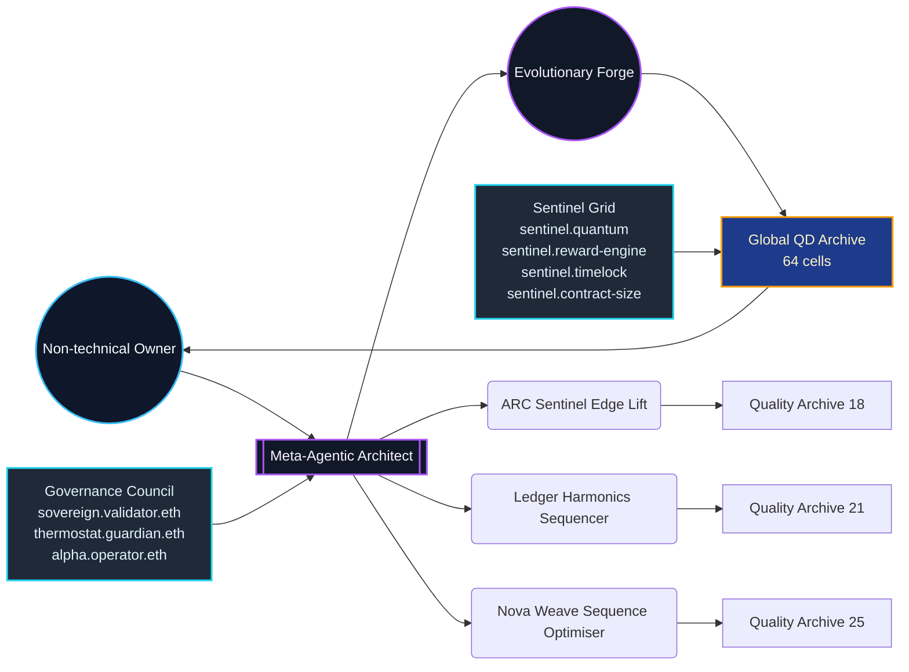
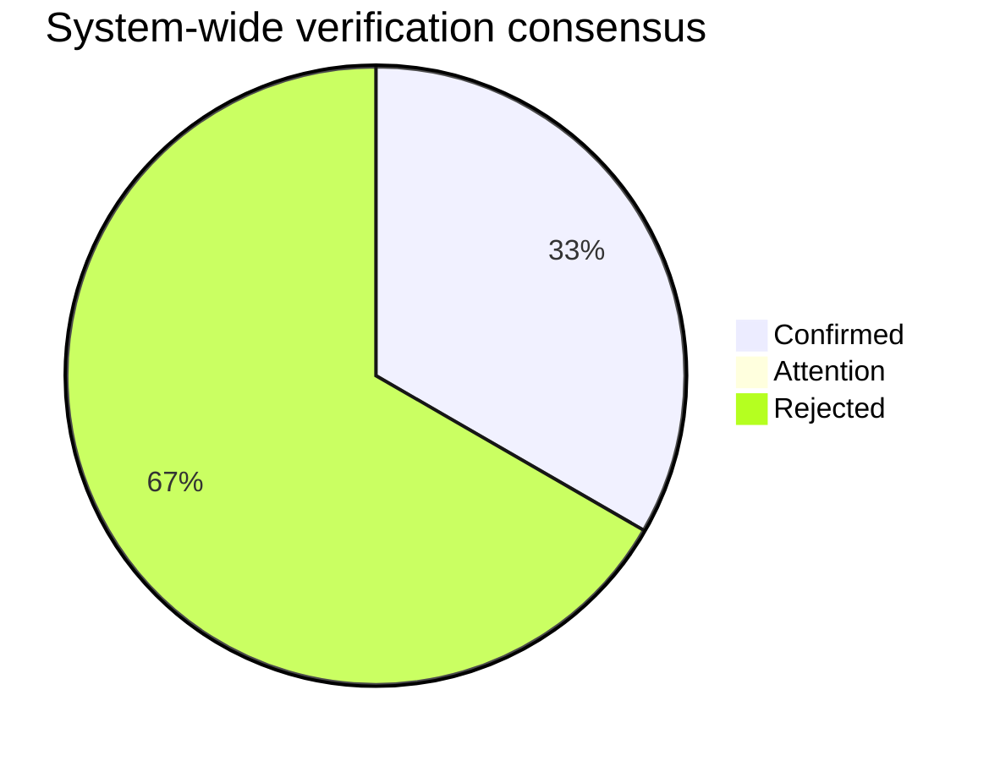
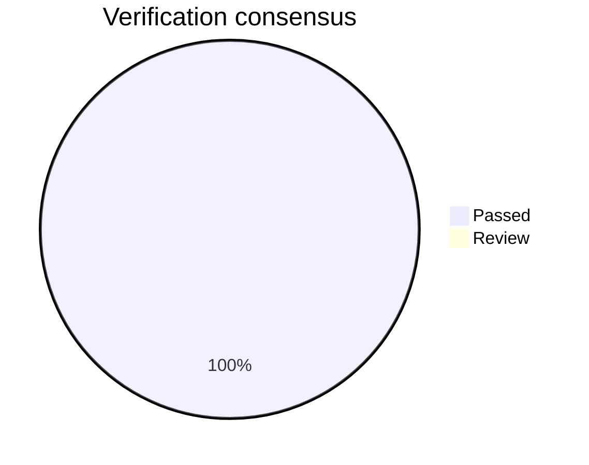
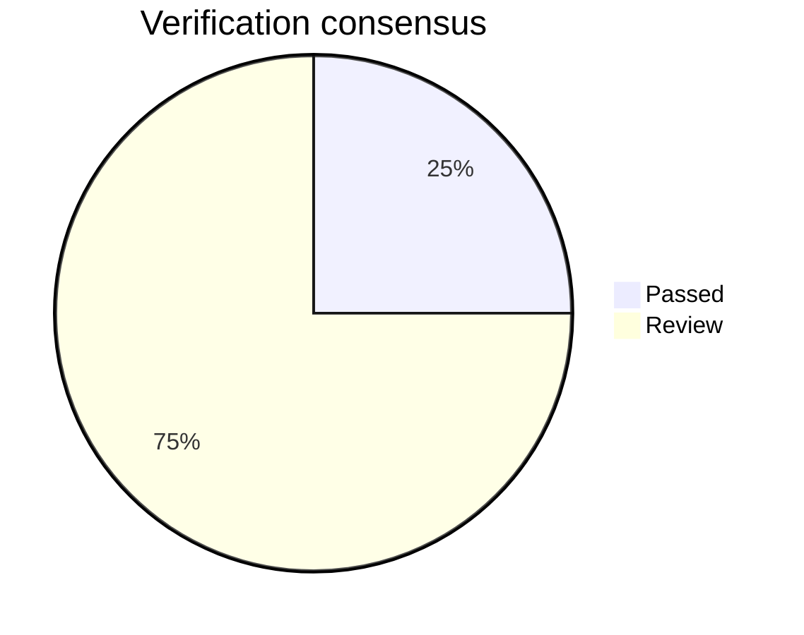
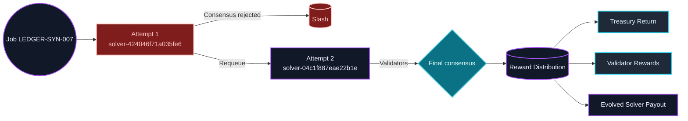
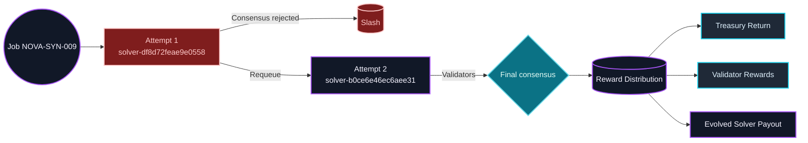

# Meta-Agentic Program Synthesis Sovereign Mission
_Evolutionary Intelligence Forge_

Deterministic rehearsal proving that AGI Jobs v0 (v2) lets a non-technical owner conjure, govern, and redeploy an autonomous meta-agent that designs and verifies production-ready code modules in minutes.

## Executive Summary

- **Global best score:** 140.38 (accuracy 100.00%)
- **Energy envelope:** 73.33 average operations energy.
- **Novelty signal:** 77.76% average.
- **Coverage:** 100.00% task-level perfect matches.
- **Triangulation confidence:** 53.33% consensus (1 confirmed / 0 attention / 2 flagged).
- **Thermodynamic alignment:** 100.00% (mean Δ 0.00 | max Δ 0.00 | 3 aligned / 0 monitor / 0 drift).
- **Ledger economy:** 1,461,700 rewards / 52,800 slashed / validators 186,600 / treasury 93,300 (participation 95.8% • latency 250.2s • alerts 0).
- **Owner supremacy:** every control remains copy-paste accessible (pause, thermostat, upgrades, treasury mirrors, compliance dossier).
- **Coverage readiness:** ready (5/5 controls satisfied).

## Mission Metadata

- Version: 0.1.0
- Owner: 0x1111111111111111111111111111111111111111
- Treasury: 0x2222222222222222222222222222222222222222
- Timelock: 604800 seconds
- Owner Control Scripts:
  - `npm run owner:command-center`
  - `npm run owner:atlas`
  - `npm run owner:system-pause`
  - `npm run owner:upgrade-status`
  - `npm run owner:change-ticket`

## Meta-Agentic Control Surface



## Verification Consensus

- Confirmed: 1 | Attention: 0 | Flagged: 2


## Owner Capabilities

| Category | Command | Verification |
| --- | --- | --- |
| Emergency Pause | `npm run owner:system-pause -- --action pause` | `npm run owner:system-pause -- --action status` |
| Thermostat | `npm run thermostat:update -- --mission demo/Meta-Agentic-Program-Synthesis-v0/config/mission.meta-agentic-program-synthesis.json` | `npm run thermodynamics:report` |
| Upgrade | `npm run owner:upgrade -- --mission demo/Meta-Agentic-Program-Synthesis-v0/config/mission.meta-agentic-program-synthesis.json` | `npm run owner:upgrade-status` |
| Treasury | `npm run reward-engine:update -- --mission demo/Meta-Agentic-Program-Synthesis-v0/config/mission.meta-agentic-program-synthesis.json` | `npm run reward-engine:report` |
| Compliance | `npm run owner:compliance-report` | `npm run owner:doctor` |

## Owner Coverage Readiness

- **Readiness:** ready
- **Satisfied controls:** Emergency Pause, Thermostat, Upgrade, Treasury, Compliance
- **Missing controls:** None

## ARC Sentinel Edge Lift

Detect latent pixel edges, amplify discovery, and route high-confidence transformations back into the shared skill graph.

- Job ID: ARC-SYN-001 | Stake: 120,000 | Reward: 420,000 | Thermodynamic target: 88
- Best candidate score: 140.38 (accuracy 100.00%, novelty 73.1%, coverage 100.0%)
- Thermodynamic status: **ALIGNED** (target 88.00 • energy 88.00 • Δ 0.00 • tolerance ≤ 13.20).
- Pipeline blueprint:
```
1. scale (factor=2.322)
2. difference ()
3. threshold (threshold=0.500, high=3.000)
4. threshold (threshold=0.500, high=3.000)
```

### Triangulated Verification

- Consensus: **CONFIRMED** (100.0% confidence, 4/4 perspectives).
| Perspective | Verdict | Confidence | Notes |
| --- | --- | --- | --- |
| Deterministic replay | ✅ | 30.0% |  |
| Baseline dominance | ✅ | 25.0% | Seed score 135.56 → improvement 4.82 |
| Adversarial jitter | ✅ | 25.0% | Average deviation 0.250, max 3.000 across 72 samples |
| Constraint & peer safety | ✅ | 20.0% | Peer median 140.38 • energy delta 8.00 (≤ 33.60) |



### Evolutionary History

| Generation | Best Score | Mean Score | Diversity | Elite Score |
| --- | --- | --- | --- | --- |
| 0 | 135.56 | 54.15 | 0.94 | 110.36 |
| 1 | 138.06 | 74.05 | 0.75 | 136.39 |
| 2 | 138.16 | 83.09 | 0.75 | 138.12 |
| 3 | 138.92 | 93.11 | 0.83 | 138.41 |
| 4 | 140.38 | 104.22 | 0.69 | 140.38 |
| 5 | 140.38 | 100.27 | 0.78 | 140.38 |
| 6 | 140.38 | 116.86 | 0.78 | 140.38 |
| 7 | 140.38 | 116.98 | 0.72 | 140.38 |
| 8 | 140.38 | 106.84 | 0.81 | 140.38 |
| 9 | 140.38 | 113.36 | 0.75 | 140.38 |

### Quality-Diversity Archive

| Cell | Complexity | Novelty | Energy | Score |
| --- | --- | --- | --- | --- |
| 4|0.75|120 | 4 | 0.75 | 120.00 | 140.38 |
| 5|0.75|120 | 5 | 0.75 | 120.00 | 138.92 |
| 3|0.9|120 | 3 | 0.90 | 120.00 | 138.16 |
| 3|0.75|120 | 3 | 0.75 | 120.00 | 136.74 |
| 2|0.9|60 | 2 | 0.90 | 60.00 | 135.56 |
| 4|0.9|120 | 4 | 0.90 | 120.00 | 108.59 |
| 3|1|120 | 3 | 1.00 | 120.00 | 103.39 |
| 3|0.75|60 | 3 | 0.75 | 60.00 | 99.14 |
| 1|0.75|60 | 1 | 0.75 | 60.00 | 75.13 |
| 2|0.75|60 | 2 | 0.75 | 60.00 | 65.75 |
| 4|0.5|120 | 4 | 0.50 | 120.00 | 62.58 |
| 4|0.5|60 | 4 | 0.50 | 60.00 | 61.79 |

### Evolution Timeline

```mermaid
timeline
  title Evolutionary improvements for ARC Sentinel Edge Lift
  2025-10-21T03:23:20.682Z : score 135.56 • elite 110.36 • diversity 0.94 • novelty 73.1%
  2025-10-21T03:23:20.683Z : score 138.06 • elite 136.39 • diversity 0.75 • novelty 73.1%
  2025-10-21T03:23:20.684Z : score 138.16 • elite 138.12 • diversity 0.75 • novelty 73.1%
  2025-10-21T03:23:20.685Z : score 138.92 • elite 138.41 • diversity 0.83 • novelty 73.1%
  2025-10-21T03:23:20.686Z : score 140.38 • elite 140.38 • diversity 0.69 • novelty 73.1%
  2025-10-21T03:23:20.696Z : score 140.38 • elite 140.38 • diversity 0.78 • novelty 73.1%
  2025-10-21T03:23:20.699Z : score 140.38 • elite 140.38 • diversity 0.78 • novelty 73.1%
  2025-10-21T03:23:20.700Z : score 140.38 • elite 140.38 • diversity 0.72 • novelty 73.1%
  2025-10-21T03:23:20.704Z : score 140.38 • elite 140.38 • diversity 0.81 • novelty 73.1%
  2025-10-21T03:23:20.705Z : score 140.38 • elite 140.38 • diversity 0.75 • novelty 73.1%
```

### On-chain Ledger Synthesis

- Consensus: **ACCEPTED** across 2 attempts
- Rewards paid: 394,800 (validators 50,400 | treasury 25,200)
- Slashed stake: 14,400 | Participation 87.5%
- Commit–reveal integrity: verified • Avg latency 247.0 seconds

#### Validator Performance

| Validator | Stake (before) | Stake (after) | Rewards | Slashed | Participation |
| --- | --- | --- | --- | --- | --- |
| validator-195a5d4bfbdae573 | 52,687 | 65,287 | 12,600 | 0 | 100.0% |
| validator-76bf560baa38ba87 | 53,186 | 65,786 | 12,600 | 0 | 100.0% |
| validator-79c9d91afd1ddf92 | 60,772 | 73,372 | 12,600 | 0 | 100.0% |
| validator-a93d1e2a9c0e3a2a | 49,970 | 62,570 | 12,600 | 0 | 50.0% |

#### Timeline

| Timestamp | Event | Details |
| --- | --- | --- |
| 2042-01-01T08:54:24.000Z | job_posted | jobId=ARC-SYN-001; reward=420,000; stakeRequired=120,000; description=Detect latent pixel edges, amplify discovery, and route high-confidence transformations back into the shared skill graph. |
| 2042-01-01T08:55:09.000Z | solver_selected | solverId=solver-834077d2c7cd0093; stakePosted=120,000 |
| 2042-01-01T08:55:44.000Z | result_committed | solverId=solver-834077d2c7cd0093; commit=cdccfe1d1ecc488574b306b0afa622e76d4619196d444d00ed36bc17317dba16 |
| 2042-01-01T08:55:54.000Z | vote_commit | validator=validator-195a5d4bfbdae573; commitment=6a13cc921e0d27d543a1f1a7b80eb4fa2b75c0525449b8f73a219358fdeb5116 |
| 2042-01-01T08:56:09.000Z | vote_reveal | validator=validator-195a5d4bfbdae573; vote=yes |
| 2042-01-01T08:56:20.000Z | vote_commit | validator=validator-76bf560baa38ba87; commitment=ff5cf0e04b2467375ef805362e542c143abea25b2bb7bb443515daa8dc3f1354 |
| 2042-01-01T08:56:31.000Z | vote_reveal | validator=validator-76bf560baa38ba87; vote=no |
| 2042-01-01T08:56:42.000Z | vote_commit | validator=validator-79c9d91afd1ddf92; commitment=95fe40173c0a29a739e2d0fa2d0105c755fb04b43e3532d8c310c35ce472c1d2 |
| 2042-01-01T08:56:52.000Z | vote_reveal | validator=validator-79c9d91afd1ddf92; vote=no |
| 2042-01-01T08:57:08.000Z | consensus_finalised | attempt=1; solverId=solver-834077d2c7cd0093; consensus=rejected; yesWeight=52,687 |
| 2042-01-01T08:57:14.000Z | slash_applied | solverId=solver-834077d2c7cd0093; amount=14,400; reason=Failed consensus |
| 2042-01-01T08:57:26.000Z | requeue | solverId=solver-85b7571cb9684c4c; reason=Meta-architect escalated to evolved agent |
| 2042-01-01T08:57:30.000Z | solver_selected | solverId=solver-85b7571cb9684c4c; stakePosted=120,000 |
| 2042-01-01T08:58:02.000Z | result_committed | solverId=solver-85b7571cb9684c4c; commit=a71fc6a4d27f9928547e7c9286a86675979d6854026355e0559ce8baf2e50211; operations=4 |
| 2042-01-01T08:58:13.000Z | vote_commit | validator=validator-195a5d4bfbdae573; commitment=c0e7ac904a95f3b6b07a2d8458d1be1ea31b81714501555ef6da2be49ddaadce |
| 2042-01-01T08:58:24.000Z | vote_reveal | validator=validator-195a5d4bfbdae573; vote=yes |
| 2042-01-01T08:58:33.000Z | vote_commit | validator=validator-76bf560baa38ba87; commitment=ba808148dada8a23c0977f5798f313954ad76c389605df96d26cab84f14ea32a |
| 2042-01-01T08:58:46.000Z | vote_reveal | validator=validator-76bf560baa38ba87; vote=yes |
| 2042-01-01T08:58:55.000Z | vote_commit | validator=validator-79c9d91afd1ddf92; commitment=9d1ce6a17520b9b429f727eeb800908b5a13200a307782f3a8874baf70f96c11 |
| 2042-01-01T08:59:08.000Z | vote_reveal | validator=validator-79c9d91afd1ddf92; vote=yes |
| 2042-01-01T08:59:16.000Z | vote_commit | validator=validator-a93d1e2a9c0e3a2a; commitment=d112ff2b6d9545978359f988200e0c135e6b7c05e0812b51815198a85b53a97f |
| 2042-01-01T08:59:28.000Z | vote_reveal | validator=validator-a93d1e2a9c0e3a2a; vote=yes |
| 2042-01-01T08:59:42.000Z | consensus_finalised | attempt=2; solverId=solver-85b7571cb9684c4c; consensus=accepted; yesWeight=216,615 |
| 2042-01-01T08:59:54.000Z | reward_distributed | solverId=solver-85b7571cb9684c4c; solverReward=344,400; validatorRewards=50,400; treasuryReturn=25,200 |


## Ledger Harmonics Sequencer

Absorb asynchronous cash-flow deltas, stabilise them against the thermodynamic ledger, and emit rebalanced incentive curves for validator coalitions.

- Job ID: LEDGER-SYN-007 | Stake: 155,000 | Reward: 525,000 | Thermodynamic target: 64
- Best candidate score: 133.04 (accuracy 100.00%, novelty 66.6%, coverage 100.0%)
- Thermodynamic status: **ALIGNED** (target 64.00 • energy 64.00 • Δ 0.00 • tolerance ≤ 9.60).
- Pipeline blueprint:
```
1. cumulative ()
2. mod (modulus=5.000)
3. offset (value=2.000)
```

### Triangulated Verification

- Consensus: **REJECTED** (30.0% confidence, 1/4 perspectives).
| Perspective | Verdict | Confidence | Notes |
| --- | --- | --- | --- |
| Deterministic replay | ✅ | 30.0% |  |
| Baseline dominance | ⚠️ | 25.0% | Seed score 133.04 → improvement 0.00 |
| Adversarial jitter | ⚠️ | 25.0% | Average deviation 0.722, max 4.762 across 48 samples |
| Constraint & peer safety | ⚠️ | 20.0% | Peer median 133.04 • energy delta 64.00 (≤ 44.80) |



### Evolutionary History

| Generation | Best Score | Mean Score | Diversity | Elite Score |
| --- | --- | --- | --- | --- |
| 0 | 133.04 | 41.06 | 0.97 | 96.09 |
| 1 | 133.04 | 55.52 | 0.94 | 98.44 |
| 2 | 133.04 | 70.04 | 0.75 | 132.51 |
| 3 | 133.04 | 83.53 | 0.72 | 133.04 |
| 4 | 133.04 | 95.59 | 0.72 | 133.04 |
| 5 | 133.04 | 98.69 | 0.61 | 133.04 |
| 6 | 133.04 | 93.28 | 0.67 | 133.04 |
| 7 | 133.04 | 91.37 | 0.61 | 133.04 |
| 8 | 133.04 | 92.38 | 0.67 | 133.04 |
| 9 | 133.04 | 87.42 | 0.67 | 133.04 |

### Quality-Diversity Archive

| Cell | Complexity | Novelty | Energy | Score |
| --- | --- | --- | --- | --- |
| 3|0.75|120 | 3 | 0.75 | 120.00 | 133.04 |
| 4|0.75|120 | 4 | 0.75 | 120.00 | 131.50 |
| 5|0.5|120 | 5 | 0.50 | 120.00 | 131.44 |
| 5|0.75|120 | 5 | 0.75 | 120.00 | 109.72 |
| 4|0.5|120 | 4 | 0.50 | 120.00 | 86.37 |
| 2|0.75|60 | 2 | 0.75 | 60.00 | 82.92 |
| 3|0.9|120 | 3 | 0.90 | 120.00 | 79.35 |
| 3|0.75|60 | 3 | 0.75 | 60.00 | 76.53 |
| 2|0.9|60 | 2 | 0.90 | 60.00 | 65.15 |
| 5|0.5|180 | 5 | 0.50 | 180.00 | 63.67 |
| 1|0.75|60 | 1 | 0.75 | 60.00 | 61.88 |
| 3|0.5|60 | 3 | 0.50 | 60.00 | 46.36 |

### Evolution Timeline

```mermaid
timeline
  title Evolutionary improvements for Ledger Harmonics Sequencer
  2025-10-21T03:23:20.716Z : score 133.04 • elite 96.09 • diversity 0.97 • novelty 66.6%
  2025-10-21T03:23:20.717Z : score 133.04 • elite 98.44 • diversity 0.94 • novelty 66.6%
  2025-10-21T03:23:20.718Z : score 133.04 • elite 132.51 • diversity 0.75 • novelty 66.6%
  2025-10-21T03:23:20.719Z : score 133.04 • elite 133.04 • diversity 0.72 • novelty 66.6%
  2025-10-21T03:23:20.725Z : score 133.04 • elite 133.04 • diversity 0.72 • novelty 66.6%
  2025-10-21T03:23:20.726Z : score 133.04 • elite 133.04 • diversity 0.61 • novelty 66.6%
  2025-10-21T03:23:20.727Z : score 133.04 • elite 133.04 • diversity 0.67 • novelty 66.6%
  2025-10-21T03:23:20.727Z : score 133.04 • elite 133.04 • diversity 0.61 • novelty 66.6%
  2025-10-21T03:23:20.728Z : score 133.04 • elite 133.04 • diversity 0.67 • novelty 66.6%
  2025-10-21T03:23:20.728Z : score 133.04 • elite 133.04 • diversity 0.67 • novelty 66.6%
```

### On-chain Ledger Synthesis

- Consensus: **ACCEPTED** across 2 attempts
- Rewards paid: 493,500 (validators 63,000 | treasury 31,500)
- Slashed stake: 18,600 | Participation 100.0%
- Commit–reveal integrity: verified • Avg latency 270.0 seconds

#### Validator Performance

| Validator | Stake (before) | Stake (after) | Rewards | Slashed | Participation |
| --- | --- | --- | --- | --- | --- |
| validator-02b303e331d093d1 | 60,555 | 76,305 | 15,750 | 0 | 100.0% |
| validator-8fb387f22ab17dbb | 77,689 | 93,439 | 15,750 | 0 | 100.0% |
| validator-b48c4f3bd017c796 | 60,967 | 76,717 | 15,750 | 0 | 100.0% |
| validator-f3cbd6e75978a4b6 | 78,620 | 94,370 | 15,750 | 0 | 100.0% |

#### Timeline

| Timestamp | Event | Details |
| --- | --- | --- |
| 2042-01-01T13:16:24.000Z | job_posted | jobId=LEDGER-SYN-007; reward=525,000; stakeRequired=155,000; description=Absorb asynchronous cash-flow deltas, stabilise them against the thermodynamic ledger, and emit rebalanced incentive curves for validator coalitions. |
| 2042-01-01T13:17:09.000Z | solver_selected | solverId=solver-424046f71a035fe6; stakePosted=155,000 |
| 2042-01-01T13:17:44.000Z | result_committed | solverId=solver-424046f71a035fe6; commit=3a489a39a4ac760eea4e21600c7db814fc7ef4e73499a6f0e7c200e447c856d5 |
| 2042-01-01T13:17:55.000Z | vote_commit | validator=validator-02b303e331d093d1; commitment=386876e8b46f541afba7e9ba7981dc0e41940b840db1165200b4fc64be00fa49 |
| 2042-01-01T13:18:08.000Z | vote_reveal | validator=validator-02b303e331d093d1; vote=no |
| 2042-01-01T13:18:17.000Z | vote_commit | validator=validator-8fb387f22ab17dbb; commitment=d26aaf535bef21fa45371b67e612ecbf4724c3beceefe3b1a7c4771a699ff16c |
| 2042-01-01T13:18:31.000Z | vote_reveal | validator=validator-8fb387f22ab17dbb; vote=yes |
| 2042-01-01T13:18:41.000Z | vote_commit | validator=validator-b48c4f3bd017c796; commitment=811943ed1d5afdf34e266be81f71f2fddee8d3426f4d5f4ae04b55056f5f3021 |
| 2042-01-01T13:18:53.000Z | vote_reveal | validator=validator-b48c4f3bd017c796; vote=no |
| 2042-01-01T13:19:05.000Z | vote_commit | validator=validator-f3cbd6e75978a4b6; commitment=df4080472bf5202c53c8cb11c5b947306a9a14c0bf8db697cf7d132e6fe4329d |
| 2042-01-01T13:19:17.000Z | vote_reveal | validator=validator-f3cbd6e75978a4b6; vote=no |
| 2042-01-01T13:19:33.000Z | consensus_finalised | attempt=1; solverId=solver-424046f71a035fe6; consensus=rejected; yesWeight=77,689 |
| 2042-01-01T13:19:39.000Z | slash_applied | solverId=solver-424046f71a035fe6; amount=18,600; reason=Failed consensus |
| 2042-01-01T13:19:51.000Z | requeue | solverId=solver-04c1f887eae22b1e; reason=Meta-architect escalated to evolved agent |
| 2042-01-01T13:19:55.000Z | solver_selected | solverId=solver-04c1f887eae22b1e; stakePosted=155,000 |
| 2042-01-01T13:20:27.000Z | result_committed | solverId=solver-04c1f887eae22b1e; commit=ebda15b38d5047ceaade3779010231933171b8cdb316da86dbb9e61379be79fa; operations=3 |
| 2042-01-01T13:20:37.000Z | vote_commit | validator=validator-02b303e331d093d1; commitment=a9ff81a696c9a6329240f07cca03b7d28a3d6b7674cf7706e5c465ec3e792d4e |
| 2042-01-01T13:20:50.000Z | vote_reveal | validator=validator-02b303e331d093d1; vote=yes |
| 2042-01-01T13:21:01.000Z | vote_commit | validator=validator-8fb387f22ab17dbb; commitment=781a3ed0c6d16a9f5f6540199d91856aacd60d7ebbc832febf25e052a62f4f5c |
| 2042-01-01T13:21:10.000Z | vote_reveal | validator=validator-8fb387f22ab17dbb; vote=yes |
| 2042-01-01T13:21:19.000Z | vote_commit | validator=validator-b48c4f3bd017c796; commitment=39593093be96192e274a31d636936a404d09f149af4366a54a2b4b2fd463bb23 |
| 2042-01-01T13:21:28.000Z | vote_reveal | validator=validator-b48c4f3bd017c796; vote=yes |
| 2042-01-01T13:21:38.000Z | vote_commit | validator=validator-f3cbd6e75978a4b6; commitment=a1ead23f0685e364f8d70ef43d00c2e91a83cfda9a907ba1fa0b75579202cc58 |
| 2042-01-01T13:21:49.000Z | vote_reveal | validator=validator-f3cbd6e75978a4b6; vote=yes |
| 2042-01-01T13:22:03.000Z | consensus_finalised | attempt=2; solverId=solver-04c1f887eae22b1e; consensus=accepted; yesWeight=277,831 |
| 2042-01-01T13:22:15.000Z | reward_distributed | solverId=solver-04c1f887eae22b1e; solverReward=430,500; validatorRewards=63,000; treasuryReturn=31,500 |



## Nova Weave Sequence Optimiser

Elevate alpha sequences into deterministic blueprints that compile into on-chain production payloads with zero manual edits.

- Job ID: NOVA-SYN-009 | Stake: 165,000 | Reward: 610,000 | Thermodynamic target: 68
- Best candidate score: 136.05 (accuracy 100.00%, novelty 93.6%, coverage 100.0%)
- Thermodynamic status: **ALIGNED** (target 68.00 • energy 68.00 • Δ 0.00 • tolerance ≤ 10.20).
- Pipeline blueprint:
```
1. power (exponent=2.000)
2. offset (value=1.000)
3. scale (factor=2.000)
```

### Triangulated Verification

- Consensus: **REJECTED** (30.0% confidence, 1/4 perspectives).
| Perspective | Verdict | Confidence | Notes |
| --- | --- | --- | --- |
| Deterministic replay | ✅ | 30.0% |  |
| Baseline dominance | ⚠️ | 25.0% | Seed score 136.05 → improvement 0.00 |
| Adversarial jitter | ⚠️ | 25.0% | Average deviation 3.494, max 16.010 across 36 samples |
| Constraint & peer safety | ⚠️ | 20.0% | Peer median 136.05 • energy delta 76.00 (≤ 50.40) |


### Evolutionary History

| Generation | Best Score | Mean Score | Diversity | Elite Score |
| --- | --- | --- | --- | --- |
| 0 | 136.05 | 30.68 | 1.00 | 97.43 |
| 1 | 136.05 | 42.86 | 1.00 | 101.68 |
| 2 | 136.05 | 60.92 | 0.89 | 125.76 |
| 3 | 136.05 | 69.55 | 0.86 | 136.05 |
| 4 | 136.05 | 66.70 | 0.83 | 136.05 |
| 5 | 136.05 | 65.94 | 0.78 | 136.05 |
| 6 | 136.05 | 75.37 | 0.67 | 136.05 |
| 7 | 136.05 | 74.05 | 0.50 | 136.05 |
| 8 | 136.05 | 79.43 | 0.64 | 136.05 |
| 9 | 136.05 | 75.20 | 0.64 | 136.05 |

### Quality-Diversity Archive

| Cell | Complexity | Novelty | Energy | Score |
| --- | --- | --- | --- | --- |
| 3|1|120 | 3 | 1.00 | 120.00 | 136.05 |
| 4|0.9|120 | 4 | 0.90 | 120.00 | 113.03 |
| 5|0.75|120 | 5 | 0.75 | 120.00 | 109.50 |
| 2|1|60 | 2 | 1.00 | 60.00 | 106.14 |
| 3|0.9|120 | 3 | 0.90 | 120.00 | 103.30 |
| 4|0.75|120 | 4 | 0.75 | 120.00 | 95.68 |
| 5|0.9|120 | 5 | 0.90 | 120.00 | 91.07 |
| 3|0.75|60 | 3 | 0.75 | 60.00 | 75.57 |
| 2|0.75|60 | 2 | 0.75 | 60.00 | 75.22 |
| 3|0.5|60 | 3 | 0.50 | 60.00 | 74.18 |
| 2|0.9|60 | 2 | 0.90 | 60.00 | 63.90 |
| 2|0.5|60 | 2 | 0.50 | 60.00 | 61.19 |

### Evolution Timeline

```mermaid
timeline
  title Evolutionary improvements for Nova Weave Sequence Optimiser
  2025-10-21T03:23:20.730Z : score 136.05 • elite 97.43 • diversity 1.00 • novelty 93.6%
  2025-10-21T03:23:20.731Z : score 136.05 • elite 101.68 • diversity 1.00 • novelty 93.6%
  2025-10-21T03:23:20.731Z : score 136.05 • elite 125.76 • diversity 0.89 • novelty 93.6%
  2025-10-21T03:23:20.732Z : score 136.05 • elite 136.05 • diversity 0.86 • novelty 93.6%
  2025-10-21T03:23:20.733Z : score 136.05 • elite 136.05 • diversity 0.83 • novelty 93.6%
  2025-10-21T03:23:20.733Z : score 136.05 • elite 136.05 • diversity 0.78 • novelty 93.6%
  2025-10-21T03:23:20.734Z : score 136.05 • elite 136.05 • diversity 0.67 • novelty 93.6%
  2025-10-21T03:23:20.734Z : score 136.05 • elite 136.05 • diversity 0.50 • novelty 93.6%
  2025-10-21T03:23:20.735Z : score 136.05 • elite 136.05 • diversity 0.64 • novelty 93.6%
  2025-10-21T03:23:20.736Z : score 136.05 • elite 136.05 • diversity 0.64 • novelty 93.6%
```

### On-chain Ledger Synthesis

- Consensus: **ACCEPTED** across 2 attempts
- Rewards paid: 573,400 (validators 73,200 | treasury 36,600)
- Slashed stake: 19,800 | Participation 100.0%
- Commit–reveal integrity: verified • Avg latency 233.5 seconds

#### Validator Performance

| Validator | Stake (before) | Stake (after) | Rewards | Slashed | Participation |
| --- | --- | --- | --- | --- | --- |
| validator-998a4f56b41c1653 | 85,872 | 110,272 | 24,400 | 0 | 100.0% |
| validator-9d05a69084156cb4 | 68,211 | 92,611 | 24,400 | 0 | 100.0% |
| validator-d3dc9de91651750d | 58,085 | 82,485 | 24,400 | 0 | 100.0% |

#### Timeline

| Timestamp | Event | Details |
| --- | --- | --- |
| 2042-01-01T07:29:20.000Z | job_posted | jobId=NOVA-SYN-009; reward=610,000; stakeRequired=165,000; description=Elevate alpha sequences into deterministic blueprints that compile into on-chain production payloads with zero manual edits. |
| 2042-01-01T07:30:05.000Z | solver_selected | solverId=solver-df8d72feae9e0558; stakePosted=165,000 |
| 2042-01-01T07:30:40.000Z | result_committed | solverId=solver-df8d72feae9e0558; commit=53ccd0481295cff8b777e9e746537f782210d0d6634463a6ee45af55c9df399c |
| 2042-01-01T07:30:49.000Z | vote_commit | validator=validator-998a4f56b41c1653; commitment=b1c8d5fb8311d466fe88c58b0121b6c45662d842bf31bfe7485ceae3038ccd8c |
| 2042-01-01T07:31:00.000Z | vote_reveal | validator=validator-998a4f56b41c1653; vote=no |
| 2042-01-01T07:31:10.000Z | vote_commit | validator=validator-9d05a69084156cb4; commitment=4657fd854d9a91e5f21ab296f043f3cb95e3e701e4a80fb5c7fc3a5bfef81729 |
| 2042-01-01T07:31:23.000Z | vote_reveal | validator=validator-9d05a69084156cb4; vote=yes |
| 2042-01-01T07:31:32.000Z | vote_commit | validator=validator-d3dc9de91651750d; commitment=b4affd948c6de5ef384077b29023dd77a88c6af547d1f8308a27ad6a0895ced4 |
| 2042-01-01T07:31:47.000Z | vote_reveal | validator=validator-d3dc9de91651750d; vote=no |
| 2042-01-01T07:32:03.000Z | consensus_finalised | attempt=1; solverId=solver-df8d72feae9e0558; consensus=rejected; yesWeight=68,211 |
| 2042-01-01T07:32:09.000Z | slash_applied | solverId=solver-df8d72feae9e0558; amount=19,800; reason=Failed consensus |
| 2042-01-01T07:32:21.000Z | requeue | solverId=solver-b0ce6e46ec6aee31; reason=Meta-architect escalated to evolved agent |
| 2042-01-01T07:32:25.000Z | solver_selected | solverId=solver-b0ce6e46ec6aee31; stakePosted=165,000 |
| 2042-01-01T07:32:57.000Z | result_committed | solverId=solver-b0ce6e46ec6aee31; commit=ec051e8ee05f18e96d72bcc879d6325db1bba43c808cc42dfbe7895eabdea108; operations=3 |
| 2042-01-01T07:33:04.000Z | vote_commit | validator=validator-998a4f56b41c1653; commitment=76f6ee53383c2999cbe79913a5f6167c4ca686cdc3e266a2e28c96fea559c37a |
| 2042-01-01T07:33:15.000Z | vote_reveal | validator=validator-998a4f56b41c1653; vote=yes |
| 2042-01-01T07:33:25.000Z | vote_commit | validator=validator-9d05a69084156cb4; commitment=8976703d78e5c6073ca9f883c7e6593a311201bf7e021cdfd02726cb0d218003 |
| 2042-01-01T07:33:35.000Z | vote_reveal | validator=validator-9d05a69084156cb4; vote=yes |
| 2042-01-01T07:33:46.000Z | vote_commit | validator=validator-d3dc9de91651750d; commitment=3cb52a63d7218a3eaa12727a77ed6b8e3c2261ed8db9007f22ec5ce0849c7d8d |
| 2042-01-01T07:33:58.000Z | vote_reveal | validator=validator-d3dc9de91651750d; vote=yes |
| 2042-01-01T07:34:12.000Z | consensus_finalised | attempt=2; solverId=solver-b0ce6e46ec6aee31; consensus=accepted; yesWeight=212,168 |
| 2042-01-01T07:34:24.000Z | reward_distributed | solverId=solver-b0ce6e46ec6aee31; solverReward=500,200; validatorRewards=73,200; treasuryReturn=36,600 |



## CI Shield Alignment

- Workflow: `ci (v2)` | Required jobs: Lint & static checks, Tests, Foundry, Coverage thresholds
- Coverage threshold ≥ 90% | Concurrency group `ci-${{ github.workflow }}-${{ github.ref }}`

## Generated At

2025-10-21T03:23:20.678Z
