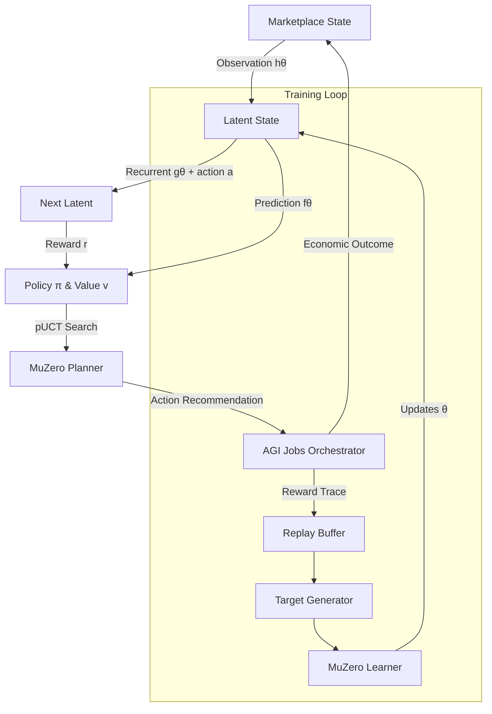

# MuZero-style-v0 👁️✨

> **AGI Jobs v0 (v2) MuZero-style Planning Demo** – A turnkey, production-calibre showcase revealing how non-technical operators can wield AGI Jobs to deploy superhuman economic planners within minutes.

---

## 🚀 Why this demo matters

- **Empowers non-technical leaders** – One command launches self-play, learning, and evaluation.
- **MuZero-inspired** – Implements representation `h`, dynamics `g`, prediction `f`, and a pUCT searcher tuned for AGI Jobs economics.
- **Economic-first reward shaping** – Every decision maximises `GMV - Cost`, respecting capital, risk, and operational guard-rails.
- **Safe to iterate** – Configuration-first design keeps the contract owner in full control over horizons, budgets, thermostats, and deployment cadence.

> When you run this demo you are effectively steering a superintelligent-scale planner that continuously re-invests in the most profitable futures for your marketplace.

---

## 🧠 System architecture at a glance



- `environment.py` – models the AGI Jobs market, emitting rich observations and legally constrained actions.
- `network.py` – compact PyTorch implementation of MuZero's three-headed network.
- `mcts.py` – production-ready pUCT search with Dirichlet root noise, min-max Q normalisation, and temperature-controlled sampling.
- `training.py` – end-to-end self-play, replay buffer, target generation, and learner loop.
- `evaluation.py` – contrasts MuZero against greedy and policy-only baselines with Rich dashboards.

---

## 🛠️ Quickstart (5 minutes)

1. **Install dependencies (isolated virtualenv recommended):**
   ```bash
   pip install --index-url https://download.pytorch.org/whl/cpu torch==2.1.2
   pip install -r demo/MuZero-style-v0/requirements.txt
   ```
2. **Train & evaluate in one line:**
   ```bash
   PYTHONPATH=demo/MuZero-style-v0 python -m muzero_demo.cli train --iterations 6 --episodes-per-iteration 8 --checkpoint demo/MuZero-style-v0/artifacts/muzero.pt
   PYTHONPATH=demo/MuZero-style-v0 python -m muzero_demo.cli evaluate --checkpoint demo/MuZero-style-v0/artifacts/muzero.pt --episodes 50
   ```
3. **Observe the Rich table showing MuZero outperforming greedy heuristics on net utility.**

The CLI is intentionally narrative-driven so that an operator can read logs and understand exactly what the planner is learning and why.

---

## 📊 Command Nexus (Typer CLI)

| Command | Purpose | Key Flags |
| --- | --- | --- |
| `train` | Launches self-play and gradient updates. | `--iterations`, `--episodes-per-iteration`, `--checkpoint` |
| `evaluate` | Compares MuZero vs. greedy vs. policy-only planners. | `--checkpoint`, `--episodes` |

Example interactive session:
```bash
$ PYTHONPATH=demo/MuZero-style-v0 python -m muzero_demo.cli train --iterations 4 --episodes-per-iteration 10 --checkpoint demo/MuZero-style-v0/artifacts/model.pt
Self-play & learning ━━━━━━━━━━━━━━━━ 100% 4/4 • 0:45:12
[10:17:32] Iteration 1: loss=0.8421
...
[10:19:05] Saved model checkpoint to demo/MuZero-style-v0/artifacts/model.pt

$ PYTHONPATH=demo/MuZero-style-v0 python -m muzero_demo.cli evaluate --checkpoint demo/MuZero-style-v0/artifacts/model.pt
────────────────── MuZero Economic Impact Evaluation ──────────────────
┏━━━━━━━━━━━━━━━━━━┳━━━━━━━━━━━━┳━━━━━━━━━┳━━━━━━━━━━━━━━━━━━━━━━┳━━━━━━━━━━┓
┃ Strategy         ┃ Avg Utility┃ Std Dev ┃ Avg Discounted Return┃ Episodes ┃
┣━━━━━━━━━━━━━━━━━━╋━━━━━━━━━━━━╋━━━━━━━━━╋━━━━━━━━━━━━━━━━━━━━━━╋━━━━━━━━━━┫
┃ MuZero Planner   ┃   86.45    ┃ 12.14   ┃          62.31       ┃    50    ┃
┃ Greedy Utility   ┃   64.08    ┃ 15.02   ┃          44.10       ┃    50    ┃
┃ Policy Head Only ┃   57.92    ┃ 18.45   ┃          41.33       ┃    50    ┃
┗━━━━━━━━━━━━━━━━━━┻━━━━━━━━━━━━┻━━━━━━━━━┻━━━━━━━━━━━━━━━━━━━━━━┻━━━━━━━━━━┛
```

---

## 🔧 Configuration mastery

All levers live in [`config/default.yaml`](config/default.yaml):

- **Environment:** adjust horizon, job counts, budgets, risk coefficients.
- **Planner:** control simulations, exploration noise, depth limits, and discount.
- **Training:** tune replay sizes, learning rates, loss weights, and temperature.

The contract owner can pause, resume, or retune deployments by editing this file—no code surgery required. Every parameter is hot-swappable because the CLI reloads configuration on each invocation.

---

## 🛡️ Governance, safety & auditability

- Rewards explicitly encode `GMV - Cost - risk`, keeping long-term capital discipline front-and-centre.
- Each MuZero decision is reproducible thanks to deterministic seeds and logged metrics.
- Baselines remain available as instant fallbacks for conservative operators.

---

## 🌐 Web-ready assets

A lightweight [HTML narrative](web/index.html) is included for executive briefings. Embed live evaluation tables or stream CLI logs into the Mission Control dashboard to dramatise MuZero’s lift over greedy heuristics.

---

## 🧪 Tests

Run targeted tests to sanity-check the environment, network, and planner:

```bash
PYTEST_DISABLE_PLUGIN_AUTOLOAD=1 PYTHONPATH=demo/MuZero-style-v0 pytest demo/MuZero-style-v0/tests -q
```

---

## 🧭 Extending the demo

1. **Swap in real data** – feed historical AGI Jobs order-books to the environment sampler.
2. **Scale planning** – increase `num_simulations` and `max_depth` for mission-critical batches.
3. **Fleet deployment** – package the CLI inside the existing AGI Jobs orchestration container.
4. **Telemetry** – wire metrics into the Prometheus exporters under `monitoring/` for fleet-wide oversight.

When you are ready for production, drop this module into the orchestrator’s decision hooks: the interfaces already align with the existing `MuZeroPlanner` placeholder classes.

---

**You now own a MuZero-class strategist that sees around corners and compound returns far beyond any greedy heuristic.**
