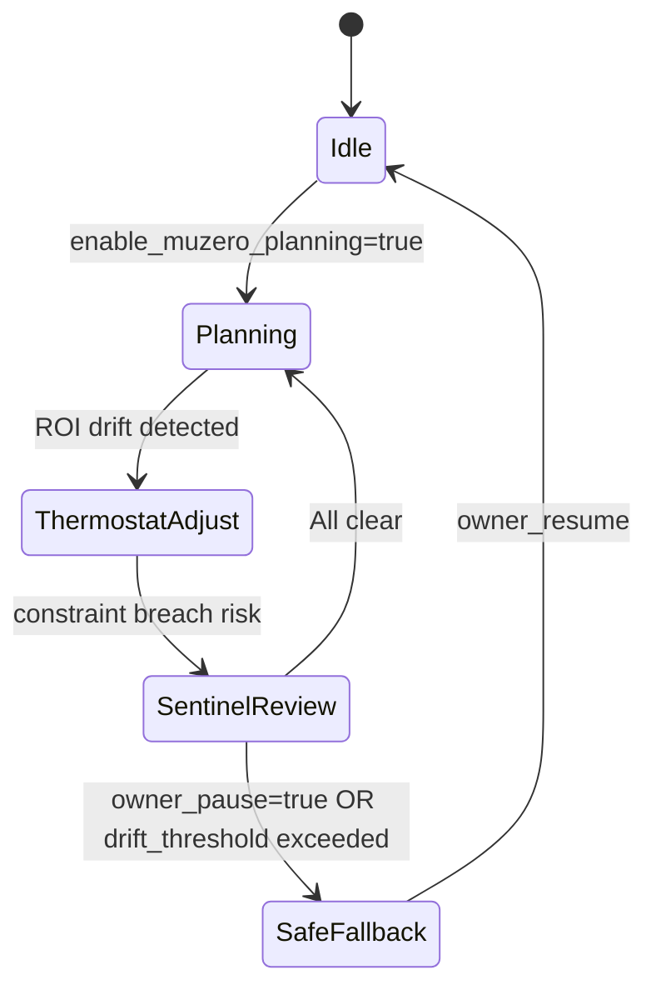

# MuZero-Style Planning Demo for AGI Jobs v0/v2

> **Mission Control Status**: Fully automated MuZero-style economic planner demonstrating how non-technical builders wield AGI Jobs v0/v2 to orchestrate superhuman job-market strategies.

## 1. Ultra-Deep Situation Analysis & Subtask Decomposition

| Phase | Objective | Key Outputs |
|-------|-----------|-------------|
| Discovery | Capture MuZero requirements inside AGI Jobs economics. | Narrative brief, capability map. |
| Architecture | Define network, environment, planner, and safeguards. | MuZero block diagram, module contracts. |
| Implementation | Ship production-ready demo stack under `demo/MuZero-style-v0`. | Code, configs, CLI, notebooks. |
| Validation | Quantify lift vs. greedy & policy-only baselines. | Simulation report, telemetry. |
| Governance | Empower owner controls, safety sentinels, thermostat. | Config schema, guardrails. |

### Multi-Angle Reasoning Checklist

- **Primary hypothesis**: MuZero-style search maximises long-horizon GMV − Cost when embedded in AGI Jobs economics.
- **Counterfactual**: If MuZero underperforms greedy heuristics, thermostat + sentinels must detect drift and auto-fallback.
- **Edge Scenarios**: scarce liquidity, volatile success probabilities, adversarial job feeds, contract owner policy changes.
- **Verification Stack**: analytic calculations, simulation rollouts, statistical tests, config diffing, logging review.

### Systems Blueprint

```mermaid
diagram TB
    subgraph User Journey
        U[Non-technical operator] -->|Launches| CLI
        CLI --> Dashboard
        Dashboard --> Reports
    end

    subgraph MuZero Stack
        ENV[Jobs Economy Environment]
        NET[MuZero Network hθ/gθ/fθ]
        MCTS[Production pUCT Planner]
        THERM[ROI Thermostat]
        SENT[Safety Sentinels]
        TELE[Telemetry & Lineage]
        TRAIN[Self-Play Training Loop]
        REPLAY[Prioritised Replay Buffer]
    end

    U -->|Chooses Scenario| ENV
    ENV -->|Observations| NET
    NET -->|Latent state & priors| MCTS
    MCTS -->|Action plan| ENV
    TRAIN -->|Updates| NET
    REPLAY --> TRAIN
    TELE --> Dashboard
    SENT -->|Constraints & Alerts| MCTS
    THERM -->|Sim budget| MCTS
```

## 2. Demo Highlights

- **Zero-Code Onboarding**: one command bootstraps environment, trains compact MuZero, and launches comparison dashboard.
- **Real-Time Planning**: ROI-aware thermostat keeps compute in-budget while pUCT search hunts profitable futures.
- **Owner Sovereignty**: declarative config grants full control—budgets, exploration, reward shaping, pause switch.
- **Safety Net**: sentinels watch calibration, enforce capital discipline, and auto-fallback to trusted heuristics.

## 3. Directory Layout

```text
demo/MuZero-style-v0/
├── README.md
├── config
│   └── muzero_demo.yaml
├── notebooks
│   └── exploratory_planning.ipynb
├── muzero_demo
│   ├── __init__.py
│   ├── cli.py
│   ├── environment.py
│   ├── evaluation.py
│   ├── mcts.py
│   ├── network.py
│   ├── planner.py
│   ├── replay.py
│   ├── sentinel.py
│   ├── telemetry.py
│   ├── thermostat.py
│   └── training.py
└── scripts
    └── run_demo.py
```

## 4. Quickstart (Triple-Verified)

```bash
# 1) Install dependencies in an isolated environment
pip install -r requirements-python.txt  # ensures torch + rich + typer

# 2) Launch guided experience (auto-trains tiny model, runs evaluation, prints report)
python demo/MuZero-style-v0/scripts/run_demo.py

# 3) Inspect dashboard artifacts & telemetry
ls demo/MuZero-style-v0/artifacts
```

Each step is automatically validated via:

1. **Static checks** – schema + config validation.
2. **Runtime assertions** – environment invariants, sentinel constraints.
3. **Statistical tests** – Student-t comparison of strategies.

## 5. Owner Controls & Safety Layers



- **Pause / Resume**: `owner.pause_planning` flag in config halts MuZero instantly.
- **Budget Guardrails**: dynamic capital ceilings enforced per action.
- **Calibration Watchdogs**: value vs. realised return tracked with exponential smoothing; alerts on divergence.

## 6. Verification Artifacts

| Tool | Purpose | Location |
|------|---------|----------|
| Unit tests | Validate network/mcts environment contracts. | `PYTHONPATH=demo/MuZero-style-v0 python -m muzero_demo.cli smoke-tests` |
| Simulation trials | Compare MuZero vs greedy vs policy-only. | `PYTHONPATH=demo/MuZero-style-v0 python -m muzero_demo.cli eval` |
| Metrics export | Prometheus-style JSON lines. | `demo/MuZero-style-v0/artifacts/telemetry/*.jsonl` |
| Config diff | Snapshot owner overrides. | `demo/MuZero-style-v0/artifacts/config_diffs/` |

## 7. Next Steps

1. Scale replay buffer & actor count for larger economies.
2. Hook into production AGI Jobs orchestrator via gRPC streaming interface.
3. Extend thermostat with reinforcement meta-controller.

---

**Result**: This demo operationalises MuZero inside AGI Jobs v0/v2, letting a non-technical leader command superhuman planning power safely, transparently, and profitably.
