# MuZero-style-v0 👁️✨

> **AGI Jobs v0 (v2) MuZero-style Planning Demo** – A turnkey, production-calibre showcase revealing how non-technical operators can wield AGI Jobs to deploy superhuman economic planners within minutes.

---

## 🚀 Why this demo matters

- **Empowers non-technical leaders** – One command launches self-play, learning, and evaluation.
- **MuZero-inspired** – Implements representation `h`, dynamics `g`, prediction `f`, and a pUCT searcher tuned for AGI Jobs economics.
- **Economic-first reward shaping** – Every decision maximises `GMV - Cost`, respecting capital, risk, and operational guard-rails.
- **Safe to iterate** – Configuration-first design keeps the contract owner in full control over horizons, budgets, thermostats, and deployment cadence.

> When you run this demo you are effectively steering a superintelligent-scale planner that continuously re-invests in the most profitable futures for your marketplace.

---

## 🧠 System architecture at a glance

```mermaid
flowchart TD
    A[Marketplace State] -->|Observation hθ| B[Latent State]
    B -->|Prediction fθ| C[Policy π & Value v]
    B -->|Recurrent gθ + action a| D[Next Latent]
    D -->|Reward r| C
    C -->|pUCT Search| E[MuZero Planner]
    E -->|Action Recommendation| F[AGI Jobs Orchestrator]
    subgraph Economic Thermostat
        B --> T[ROI Thermostat]
        T --> E
    end
    subgraph Sentinel Safety Layer
        E --> S[Value Alignment Sentinel]
        S --> F
    end
    F -->|Economic Outcome| A
    subgraph Training Loop
        F -->|Reward Trace| G[Replay Buffer]
        G --> H[Target Generator]
        H --> I[MuZero Learner]
        I -->|Updates θ| B
    end
```



- `environment.py` – models the AGI Jobs market, emitting rich observations and legally constrained actions.
- `network.py` – compact PyTorch implementation of MuZero's three-headed network.
- `mcts.py` – production-ready pUCT search with Dirichlet root noise, min-max Q normalisation, and temperature-controlled sampling.
- `thermostat.py` – ROI-aware planning thermostat that adapts simulation budgets to uncertainty, budget pressure, and decision horizon.
- `sentinel.py` – always-on safeguard monitoring value alignment, simulation ROI, and budget compliance.
- `training.py` – end-to-end self-play, replay buffer, target generation, learner loop, plus sentinel/thermostat instrumentation.
- `evaluation.py` – contrasts MuZero against greedy and policy-only baselines with Rich dashboards and sentinel reporting.

---

## 🛠️ Quickstart (5 minutes)

1. **Install dependencies (isolated virtualenv recommended):**
   ```bash
   pip install --index-url https://download.pytorch.org/whl/cpu torch==2.1.2
   pip install -r demo/MuZero-style-v0/requirements.txt
   ```
2. **Train & evaluate in one line:**
   ```bash
   PYTHONPATH=demo/MuZero-style-v0 python -m muzero_demo.cli train --iterations 6 --episodes-per-iteration 8 --checkpoint demo/MuZero-style-v0/artifacts/muzero.pt
   PYTHONPATH=demo/MuZero-style-v0 python -m muzero_demo.cli evaluate --checkpoint demo/MuZero-style-v0/artifacts/muzero.pt --episodes 50
   ```
3. **Observe the Rich table showing MuZero outperforming greedy heuristics on net utility.**

The CLI is intentionally narrative-driven so that an operator can read logs and understand exactly what the planner is learning and why.

---

## 📊 Command Nexus (Typer CLI)

| Command | Purpose | Key Flags |
| --- | --- | --- |
| `train` | Launches self-play and gradient updates with thermostat & sentinel metrics. | `--iterations`, `--episodes-per-iteration`, `--checkpoint`, `--config-path` |
| `evaluate` | Compares MuZero vs. greedy vs. policy-only planners with sentinel tracking. | `--checkpoint`, `--episodes`, `--config-path` |

Example interactive session:
```bash
$ PYTHONPATH=demo/MuZero-style-v0 python -m muzero_demo.cli train --iterations 4 --episodes-per-iteration 10 --checkpoint demo/MuZero-style-v0/artifacts/model.pt
Self-play & learning ━━━━━━━━━━━━━━━━ 100% 4/4 • 0:45:12
[10:17:32] Iteration 1 | loss=0.8421 | avg_sim=42.8 | sentinel_mae=3.12 | alert=no
...
[10:19:05] Saved model checkpoint to demo/MuZero-style-v0/artifacts/model.pt

$ PYTHONPATH=demo/MuZero-style-v0 python -m muzero_demo.cli evaluate --checkpoint demo/MuZero-style-v0/artifacts/model.pt
────────────────── MuZero Economic Impact Evaluation ──────────────────
┏━━━━━━━━━━━━━━━━━━┳━━━━━━━━━━━━┳━━━━━━━━━┳━━━━━━━━━━━━━━━━━━━━━━┳━━━━━━━━━━┓
┃ Strategy         ┃ Avg Utility┃ Std Dev ┃ Avg Discounted Return┃ Episodes ┃
┣━━━━━━━━━━━━━━━━━━╋━━━━━━━━━━━━╋━━━━━━━━━╋━━━━━━━━━━━━━━━━━━━━━━╋━━━━━━━━━━┫
┃ MuZero Planner   ┃   86.45    ┃ 12.14   ┃          62.31       ┃    50    ┃
┃ Greedy Utility   ┃   64.08    ┃ 15.02   ┃          44.10       ┃    50    ┃
┃ Policy Head Only ┃   57.92    ┃ 18.45   ┃          41.33       ┃    50    ┃
┗━━━━━━━━━━━━━━━━━━┻━━━━━━━━━━━━┻━━━━━━━━━┻━━━━━━━━━━━━━━━━━━━━━━┻━━━━━━━━━━┛
Sentinel summary: episodes=50, mae=4.11, alert=no, fallback=no
```

---

## 🔧 Configuration mastery

All levers live in [`config/default.yaml`](config/default.yaml):

- **Environment:** adjust horizon, job counts, budgets, risk coefficients.
- **Planner:** control simulations, exploration noise, depth limits, and discount.
- **Training:** tune replay sizes, learning rates, loss weights, and temperature.
- **Thermostat:** guarantee ROI-aware planning effort via min/max simulations and entropy thresholds.
- **Sentinel:** set alert thresholds, fallback behaviour, and budget floors for instant operator control.

The contract owner can pause, resume, or retune deployments by editing this file—no code surgery required. Every parameter is hot-swappable because the CLI reloads configuration on each invocation.

---

## 🛡️ Governance, safety & auditability

- Rewards explicitly encode `GMV - Cost - risk`, keeping long-term capital discipline front-and-centre.
- Each MuZero decision is reproducible thanks to deterministic seeds and logged metrics.
- Baselines remain available as instant fallbacks for conservative operators.
- Sentinel dashboards surface mean absolute error between predicted value and realised return; if thresholds are crossed, the CLI announces the alert and operators can flip back to conservative strategies instantly.

---

## 🌐 Web-ready assets

A lightweight [HTML narrative](web/index.html) is included for executive briefings. Embed live evaluation tables or stream CLI logs into the Mission Control dashboard to dramatise MuZero’s lift over greedy heuristics.

---

## 🧪 Tests

Run targeted tests to sanity-check the environment, network, and planner:

```bash
PYTEST_DISABLE_PLUGIN_AUTOLOAD=1 PYTHONPATH=demo/MuZero-style-v0 pytest demo/MuZero-style-v0/tests -q
```

---

## 🧭 Extending the demo

1. **Swap in real data** – feed historical AGI Jobs order-books to the environment sampler.
2. **Scale planning** – increase `num_simulations` and `max_depth` for mission-critical batches.
3. **Fleet deployment** – package the CLI inside the existing AGI Jobs orchestration container.
4. **Telemetry** – wire metrics into the Prometheus exporters under `monitoring/` for fleet-wide oversight.

When you are ready for production, drop this module into the orchestrator’s decision hooks: the interfaces already align with the existing `MuZeroPlanner` placeholder classes.

---

**You now own a MuZero-class strategist that sees around corners and compound returns far beyond any greedy heuristic.**
