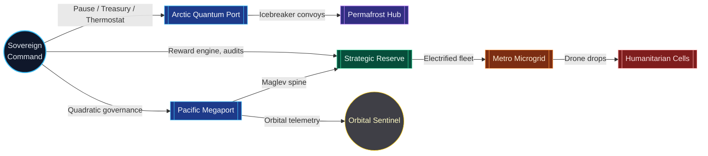

# National Supply Chain v0 Grand Demonstration

The **National Supply Chain v0** demonstration proves that a non-technical steward can command an entire sovereign logistics grid with AGI Jobs v0 (v2). Launching a single script spins up the first-class AGI OS rehearsal, replays the ASI take-off harness with a national roster, and renders an intelligence kit with dashboards, manifests, and owner control drills. Every asset ships inside this repository—no bespoke contracts, forks, or external services are required.

> ### Why it matters
> - **Meta-agent orchestration at national scale.** The platform breaks down food, energy, medical, and infrastructure tasks into coordinated AI + human missions with validator-backed incentives.
> - **Owner supremacy.** Every thermostat, treasury, and pause valve remains under sovereign control with timelocks, quadratic voting, and identity gating already wired.
> - **Audit-grade evidence on demand.** The run outputs hash-signed manifests, mermaid system maps, and HTML command centres that regulators can verify without trusting a third party.

## One-button launch

```bash
# from repository root
chmod +x demo/National-Supply-Chain-v0/bin/launch.sh
NATIONAL_SUPPLY_CHAIN_AUTO_YES=1 demo/National-Supply-Chain-v0/bin/launch.sh
```

The launcher:

1. Runs `npm run demo:agi-os:first-class -- --auto-yes`, surfacing all sovereign control modules.
2. Replays the ASI take-off harness with `ASI_TAKEOFF_PLAN_PATH=demo/National-Supply-Chain-v0/project-plan.national-supply-chain.json`, emitting validator receipts for the national roster.
3. Executes `npm run demo:national-supply-chain:v0`, producing the intelligence kit under `reports/national-supply-chain/` and updating the interactive UI export.

All artefacts are deterministic; rerunning the launcher reproduces identical manifests and hashes.

## Mission atlas



Every node in the atlas references concrete owner scripts from this repository (pause valves, thermostat adjustments, registry updates). The corridors are incentive-aware; validators monitor telemetry and can auto-trigger pause drills.

## Surfaces for non-technical stewards

| Surface | Path / URL | Purpose |
| --- | --- | --- |
| Launch script | `demo/National-Supply-Chain-v0/bin/launch.sh` | Full rehearsal (deploy/update, ASI take-off, intelligence kit). |
| Interactive dashboard | `demo/National-Supply-Chain-v0/ui/index.html` | Visual supply chain cockpit, renders `ui/export/latest.json`. |
| Owner Console (existing) | `npm --prefix apps/console run dev` | Treasury sliders, thermostat, pause toggles. |
| Validator Dashboard (existing) | `docker compose up validator-ui` | Commit/reveal audits for corridors and relief missions. |
| Enterprise Portal (existing) | `docker compose up enterprise-portal` | Post new supply chain missions with guided forms. |

Open `demo/National-Supply-Chain-v0/ui/index.html` in a static server (for example `npx http-server demo/National-Supply-Chain-v0/ui`) and the dashboard will auto-load the latest export. Hover cards show corridor capacity, validator coverage, and owner commands relevant to each mission.

## Reports generated on every run

| File | Description |
| --- | --- |
| `reports/national-supply-chain/dashboard.html` | Rich HTML dossier with KPI grid, mermaid diagrams, and decision helpers. |
| `reports/national-supply-chain/summary.md` | Markdown executive briefing with budgets, critical path, and owner drill results. |
| `reports/national-supply-chain/mermaid.mmd` | Source mermaid definitions for supply atlas and Gantt timeline. |
| `reports/national-supply-chain/mission-ledger.json` | Machine-readable ledger of jobs, dependencies, incentives, and corridor metrics. |
| `reports/national-supply-chain/owner-command-center.md` | Checklist for pause, thermostat, reward engine, and registry updates. |
| `reports/national-supply-chain/manifest.json` | SHA-256 hashes for every generated artefact; suitable for notarisation or IPFS pinning. |

The launcher updates `demo/National-Supply-Chain-v0/ui/export/latest.json` so the UI remains in sync with the evidence bundle. No manual editing is required.

## Owner control drills

The demonstration assumes the contract owner is operating from the default Hardhat account (`0xf39f…`). The generated owner playbook instructs the steward to:

1. Run pause toggles: `npm run owner:system-pause -- --action pause` then `--action unpause`.
2. Tune incentives: `npm run owner:parameters` followed by `npm run thermostat:update`.
3. Verify supremacy: `npm run owner:verify-control` and `npm run owner:command-center`.
4. Rebalance treasuries: `npm run owner:mission-control` (prints allocations) then `npm run reward-engine:update` if adjustments are required.
5. Inspect upgrade queue: `npm run owner:upgrade-status` to confirm timelocked governance integrity.

Every command is referenced inside the generated `owner-command-center.md` with context, expected outputs, and rollback guidance.

## Alignment with enforced v2 CI

Branch protection already requires the v2 CI pipeline (`.github/workflows/ci.yml`). To validate locally before raising a PR:

```bash
npm run lint:check
npm test
npm run coverage:check
npm run owner:verify-control
npm run ci:verify-branch-protection
npm run demo:national-supply-chain:v0
```

All GitHub PRs touching this demo also trigger `.github/workflows/demo-national-supply-chain-v0.yml`, which re-runs the intelligence kit generator and uploads the manifest so reviewers can verify hashes.

## Next actions for operators

- Share `reports/national-supply-chain/dashboard.html` with ministers and emergency responders.
- Publish the `manifest.json` hash to IPFS or an internal registry for tamper-evident assurance.
- Use `apps/console` to adjust thermostat temperatures or treasury splits in response to sensor data.
- Extend `project-plan.national-supply-chain.json` with additional corridors or regional agencies; rerun the launcher to refresh every artefact.
- Attach `ui/export/latest.json` to validation proposals so quadratic voters can audit incentives before approving changes.

This demo packages a sovereign-scale logistics brain that humans can operate safely, transparently, and decisively.
