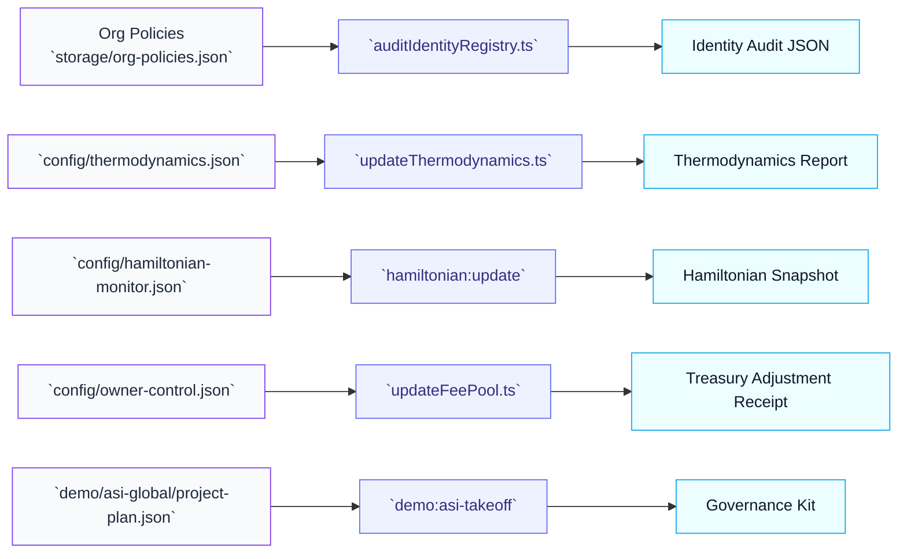

# Omni Concord Ascension Atlas — Mission Playbook

## Stage Alignment

```mermaid
gantt
    title Mission Cadence
    dateFormat  HH:mm
    axisFormat  %H:%M
    section Preparation
    ENS + identity hardening            :done,    p1, 00:00, 00:30
    Owner atlas + mission control       :active,  p2, after p1, 00:45
    section Execution
    Planner → simulator reconciliation  :crit,    e1, after p2, 01:15
    Runner receipts + IPFS pinning      :crit,    e2, after e1, 00:45
    Thermodynamics & Hamiltonian sync   :milestone, e3, after e2, 00:10
    section Assurance
    Change-ticket emission              :a1,      after e3, 00:20
    Governance kit publication          :a2,      after a1, 00:25
    CI summary + coverage upload        :a3,      after a2, 00:15
```

The cadence above reuses existing deterministic harnesses to guarantee each stage emits immutable artefacts and can be rerun under CI without manual intervention.【F:demo/asi-takeoff/README.md†L23-L82】【F:README.md†L17-L45】

## Module Lever Index

| Lever | Existing Capability | Command | Artefact |
| ----- | ------------------- | ------- | -------- |
| Identity sealing | Audit the registry for orphaned agents and validators | `npx hardhat run --no-compile scripts/v2/auditIdentityRegistry.ts --network mainnet` | `reports/mainnet/identity-audit.json` |
| Thermodynamic steering | Apply updated role enthalpy budgets via Hardhat | `npx hardhat run --no-compile scripts/v2/updateThermodynamics.ts --network mainnet` | `reports/mainnet/thermodynamics-update.json` |
| Hamiltonian guardrails | Update energy gradients & monitoring thresholds | `npm run hamiltonian:update -- --network mainnet --config config/hamiltonian-monitor.json` | `reports/mainnet/hamiltonian-update.json` |
| Treasury routing | Tune FeePool treasury/burn shares in place | `npx hardhat run --no-compile scripts/v2/updateFeePool.ts --network mainnet --treasury <address>` | `reports/mainnet/fee-pool-update.json` |
| Mission dossier | Compile deterministic evidence bundle | `npm run demo:asi-takeoff:kit -- --report-root reports/mainnet/omni-concord-ascension-atlas` | `reports/mainnet/omni-concord-ascension-atlas/governance-kit.md` |

## Assurance Mesh

All assurance pathways terminate in deterministic artefacts under `reports/<network>/`, matching the expectations laid out in the owner control verification suite and change-ticket playbook.【F:docs/owner-control-verification.md†L50-L120】【F:docs/owner-control-change-ticket.md†L1-L140】

## Change Ticket Checklist

1. Run `npm run owner:atlas -- --network mainnet --report-root reports/mainnet/atlas` and attach the resulting atlas summary to the mission folder.【F:scripts/v2/ownerControlAtlas.ts†L1-L170】
2. Capture pre-change policy surfaces with `npm run owner:snapshot -- --network mainnet --out reports/mainnet/omni-concord-ascension-atlas/pre-change.md` before executing parameter updates.【F:scripts/v2/ownerControlSnapshot.ts†L1-L180】
3. Execute `npm run owner:change-ticket -- --network mainnet --format markdown --out reports/mainnet/omni-concord-ascension-atlas/change-ticket.md` to bind the atlas, snapshot, and verification outputs in one tamper-evident manifest.【F:docs/owner-control-change-ticket.md†L1-L140】
4. Append CI logs (`npm run ci:verify-branch-protection`, `npm run coverage:report`) to the change-ticket archive to demonstrate branch protection and test discipline at the time of execution.【F:README.md†L23-L45】

## Mainnet Safety Valves

- **Emergency pause drill.** Execute `npm run owner:emergency -- --network mainnet --out reports/mainnet/omni-concord-ascension-atlas/emergency.md` to verify all pause/resume runbooks remain executable.【F:scripts/v2/ownerEmergencyRunbook.ts†L1-L210】
- **Thermostat sanity.** After thermodynamic updates, run `npx hardhat run --no-compile scripts/v2/updateThermostat.ts --network mainnet` (without `--execute`) to confirm role temperatures remain within pre-approved envelopes before publishing receipts.【F:scripts/v2/updateThermostat.ts†L1-L160】
- **Stake reconciliation.** Call `npm run owner:parameters -- --network mainnet --out reports/mainnet/omni-concord-ascension-atlas/parameters.md` to reconcile stake minima with the mission loadout.【F:scripts/v2/ownerParameterMatrix.ts†L1-L200】

By chaining these safety valves with the mission blueprint, the Atlas demonstration exhibits a continuously verifiable, economically transformative machine that remains bounded by rigorous governance controls already living inside AGI Jobs v2.
