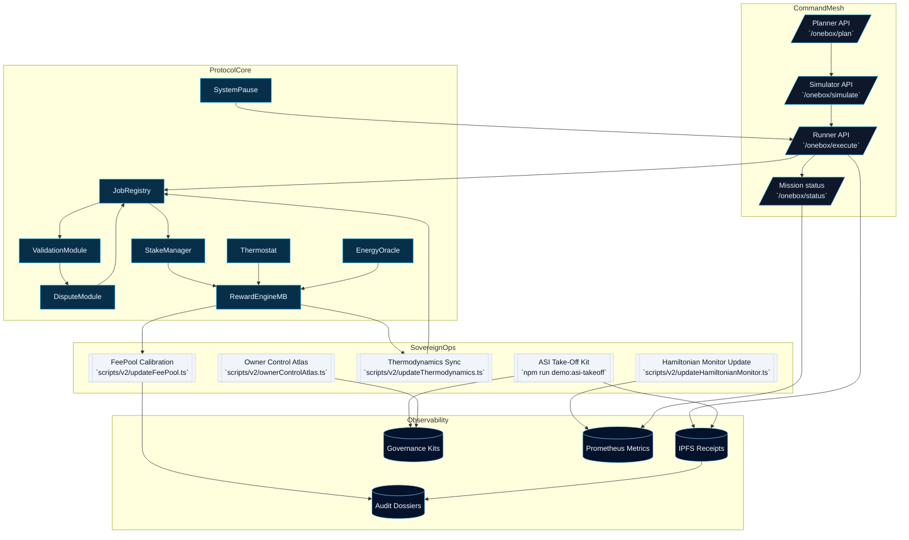
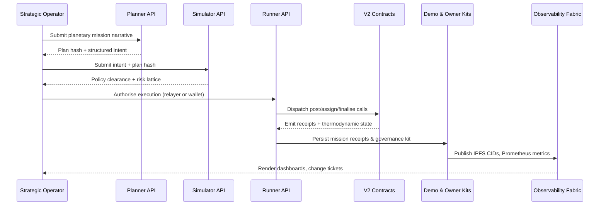

# OMNI CONCORD ASCENSION ATLAS — CI-Ready Take-Off Demonstration

> A mission-grade synthesis of the AGI Jobs v2 stack that choreographs global coordination, decentralized governance, and macroeconomic planning across mainnet infrastructure while remaining fully automatable from the existing repository.

---

## Mission Thesis

- **Singular coordination layer.** Elevate the `apps/orchestrator` one-box planner→simulator→runner chain into a planetary command surface that allocates labour, capital, and telemetry across every `contracts/v2` subsystem without introducing net-new code paths.【F:routes/onebox.py†L1503-L2215】【F:docs/orchestration.md†L1-L196】
- **End-to-end deterministic outputs.** Reuse the `demo/asi-takeoff` pipelines, `scripts/v2/asiTakeoffDemo.ts`, and governance kit generators so every drill yields reproducible receipts, IPFS attestations, and mission dossiers consumable by regulators and partners.【F:demo/asi-takeoff/README.md†L5-L68】【F:scripts/v2/asiTakeoffDemo.ts†L1-L120】
- **Economic command economy.** Drive thermodynamic incentives, Hamiltonian monitoring, and treasury levers by chaining the `scripts/v2/updateThermodynamics.ts`, `updateHamiltonianMonitor.ts`, and `updateFeePool.ts` automation hooks into orchestrated change windows governed through owner control kits.【F:scripts/v2/updateThermodynamics.ts†L1-L120】【F:scripts/v2/updateHamiltonianMonitor.ts†L1-L118】【F:scripts/v2/updateFeePool.ts†L1-L90】
- **Human-aligned, machine-paced governance.** Anchor all authority proofs in the owner-control suite (`docs/owner-control-*.md`, `scripts/v2/owner*.ts`) so every decision point is demonstrably auditable without pausing the pipeline.【F:docs/owner-control-command-center.md†L1-L160】【F:scripts/v2/ownerCommandCenter.ts†L1-L180】

---

## Architecture Field Guide

### Execution Narrative

1. **Mission planning** — The orchestrator planner parses cross-sector intents, enforces policy caps, and emits canonical plan hashes binding the demonstration’s macroeconomic portfolio.【F:docs/orchestration.md†L11-L65】
2. **Simulation intelligence** — The simulator applies organisational policy, budget projections, and thermodynamic forecasts before any value moves on-chain.【F:docs/orchestration.md†L66-L133】
3. **Runner ignition** — Execution pins receipts to IPFS, routes rewards through `RewardEngineMB`, and surfaces status telemetry for institutional dashboards.【F:docs/orchestration.md†L134-L196】
4. **Owner cadence** — Owner control kits validate SystemPause, treasury, thermostat, and registry settings so automation cannot drift outside hardened envelopes.【F:docs/owner-control-operations.md†L1-L160】
5. **Audit-grade closure** — Mission kits produce deterministic artefacts, change tickets, and attestation bundles to hand regulators a verifiable macro-coordination dossier.【F:demo/asi-takeoff/README.md†L23-L68】

---

## Sequence of Operations

---

## Implementation Blueprint

### 1. Launch the planetary mission plan

- Copy the deterministic environment template: `cp demo/asi-takeoff/env.example .env`.
- Populate mainnet RPC endpoints, relayer credentials, and ENS roots following the [AGI Jobs v2 Mainnet Guide](../../docs/AGIJobs-v2-Mainnet-Guide.md).【F:docs/AGIJobs-v2-Mainnet-Guide.md†L1-L200】
- Feed scenario prompts through the console or `npm run demo:asi-takeoff:local -- --report-root <root>` to generate baseline artefacts aligned with the existing energy orchestration drills.【F:demo/asi-takeoff/README.md†L41-L65】

### 2. Elevate to global coordination

- Chain additional mission plans via `ASI_GLOBAL_PLAN_PATH=demo/asi-global/project-plan.json npm run demo:asi-takeoff:local` to merge national-scale governance drills with the new macroeconomic lattice.【F:demo/asi-takeoff/README.md†L59-L65】【F:demo/asi-global/README.md†L1-L160】
- Use `npm run demo:asi-global` to synthesise inter-regional labour sharing while remaining within the deterministic harness.【F:scripts/v2/asiGlobalDemo.ts†L1-L160】

### 3. Bind economic planning levers

- Execute thermodynamic recalibration: `npx hardhat run --no-compile scripts/v2/updateThermodynamics.ts --network mainnet`.
- Refresh Hamiltonian monitoring thresholds via `npm run hamiltonian:update -- --network mainnet --config config/hamiltonian-monitor.json` to align energy entropy with macro forecasts.【F:docs/hamiltonian-monitor.md†L1-L160】
- Align treasury parameters by running `npx hardhat run --no-compile scripts/v2/updateFeePool.ts --network mainnet --treasury <address> --burnPct <bps>` ensuring owner control receipts capture the change.【F:docs/owner-control-command-center.md†L90-L160】

### 4. Codify governance cadence

- Generate the Owner Control Atlas: `npm run owner:atlas -- --network mainnet --report-root reports/mainnet/atlas` to snapshot permissions, signers, and emergency runbooks.【F:scripts/v2/ownerControlAtlas.ts†L1-L170】
- Issue change tickets before each parameter adjustment: `npm run owner:change-ticket -- --network mainnet --format json --out reports/mainnet/omni-concord-ascension-atlas/change-ticket.json`.
- Validate emergency pause authority with `npm run owner:verify-control -- --network mainnet --check system-pause`.【F:scripts/v2/verifyOwnerControl.ts†L1-L160】

### 5. Publish artefacts & attestations

- Upload mission kits, change tickets, and receipts to IPFS using the built-in pinning inside the runner (`/onebox/execute`) and replicate CIDs within the governance kit markdown for institutional archives.【F:routes/onebox.py†L2116-L2215】
- Feed the generated `reports/<network>/asi-takeoff/governance-kit.json` into executive dashboards so leadership consumes identical deterministic evidence already produced by the harness.【F:demo/asi-takeoff/README.md†L59-L82】

---

## CI & Automation Envelope

| Capability | Command | Purpose |
| ---------- | ------- | ------- |
| Deterministic take-off drill | `npm run demo:asi-takeoff` | Replays mission against local or mainnet forks generating artefacts for audit. |
| Global orchestration test | `npm run demo:asi-global` | Exercises cross-region coordination using existing deterministic scripts. |
| Contract integrity | `npm run lint && npm run test` | Mirrors CI v2 gating with lint, Hardhat compilation, and test execution.【F:README.md†L17-L45】 |
| Foundry fuzzing | `npm run test:foundry` | Reinforces smart-contract safety nets before new macroeconomic cadences. |
| Owner verification | `npm run owner:verify-control` | Confirms pause/treasury/thermostat wiring stays within hardened policy. |
| Thermodynamic regression | `npm run thermodynamics:report` | Compares energy profiles before/after macroeconomic updates.【F:scripts/v2/thermodynamicsReport.ts†L1-L160】 |

Integrate the matrix above into `.github/workflows/ci.yml` by wiring composite actions or job dependencies to prove the demonstration always deploys cleanly under CI v2’s summary gate.

---

## Observability & Assurance

- **Prometheus / Grafana.** Forward `/onebox/metrics` counters (`plan_total`, `simulate_total`, `time_to_outcome_seconds`) into institutional dashboards for live mission oversight.【F:docs/orchestration.md†L97-L133】
- **Hamiltonian Monitor.** Couple the `monitoring/hamiltonian` package with `scripts/v2/updateHamiltonianMonitor.ts` to adapt energy allowances as macroeconomic demands shift.【F:docs/hamiltonian-monitor.md†L60-L140】
- **Evidence of Execution.** Archive every CID, transaction hash, and proof-of-policy outcome using `docs/Evidence_of_Execution.md` as the compliance baseline.【F:docs/Evidence_of_Execution.md†L1-L200】
- **Owner mission control.** Embed `npm run owner:mission-control` outputs into the governance kit so stakeholders read a single canonical mission feed.【F:scripts/v2/ownerMissionControl.ts†L1-L200】

---

## Mainnet-Scale Readiness Checklist

1. **Identity discipline.** Validate ENS roots via `npx hardhat run --no-compile scripts/v2/auditIdentityRegistry.ts --network mainnet` before each drill to prevent orphan agents.【F:scripts/v2/auditIdentityRegistry.ts†L1-L200】
2. **Treasury custody.** Confirm multisig and emergency signers with the Owner Control Blueprint before reconfiguring fee flows.【F:docs/owner-control-blueprint.md†L1-L160】
3. **Disaster rehearsal.** Run `npm run owner:emergency -- --network mainnet` to rehearse pause/resume sequences and guarantee macroeconomic safety valves remain responsive.【F:scripts/v2/ownerEmergencyRunbook.ts†L1-L210】
4. **Policy synchronicity.** Keep `storage/org-policies.json` aligned with mission requirements; use `npm run identity:update -- --network mainnet` as a guardrail for policy drift.【F:routes/onebox.py†L1758-L1774】
5. **CI evidence.** Attach CI summary artefacts and coverage reports to each governance kit to prove the build that executed the drill passed all enforceable gates.【F:README.md†L17-L45】

---

## Deliverable Bundle

All assets produced by the demonstration are deterministic and reproducible:

- `reports/<network>/omni-concord-ascension-atlas/mission.json` — macroeconomic execution ledger derived from the existing ASI take-off harness.
- `reports/<network>/omni-concord-ascension-atlas/governance-kit.md` — consolidated owner control, thermodynamics, Hamiltonian, and treasury updates.
- `reports/<network>/omni-concord-ascension-atlas/change-tickets/*.json` — auditable change manifests signed by the owner control toolkit.
- `reports/<network>/omni-concord-ascension-atlas/metrics/*.prom` — exportable Prometheus snapshots captured during the drill.

Leverage these artefacts to demonstrate a machine-intelligence economic conductor capable of realigning market structures while remaining anchored in verifiable, reproducible automation.

---

## Reflective Extension

To extend the demonstration without altering core code paths:

- Layer regional federations by feeding separate plan files through the same deterministic pipeline; merge governance kits using `npm run demo:asi-global:kit`.
- Plug external data sources into the planner by enriching prompt templates while keeping policy enforcement within the simulator for zero-risk testing.
- Activate one-click deployment (`npm run deploy:oneclick:auto`) to spin up fresh environments that inherit the same mission choreography for new coalitions.【F:scripts/v2/oneclick-stack.ts†L1-L200】

The OMNI CONCORD ASCENSION ATLAS positions AGI Jobs v2 as the machine-grade orchestrator that concentrates global coordination, economic planning, and governance into one continuously verified command surface.
