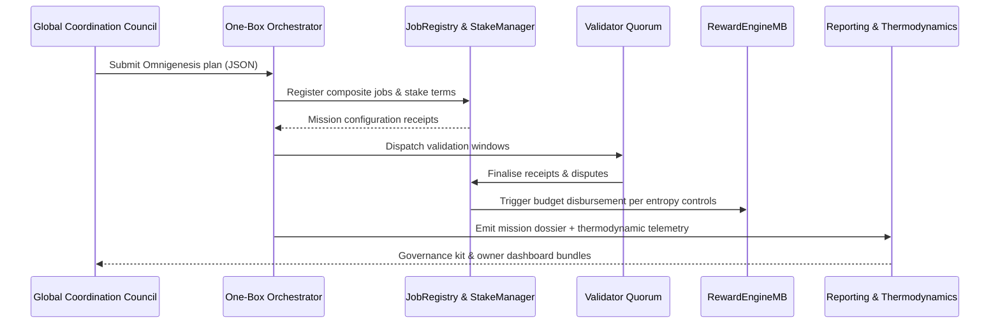
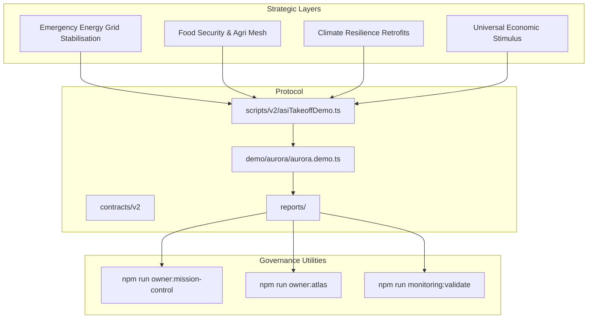
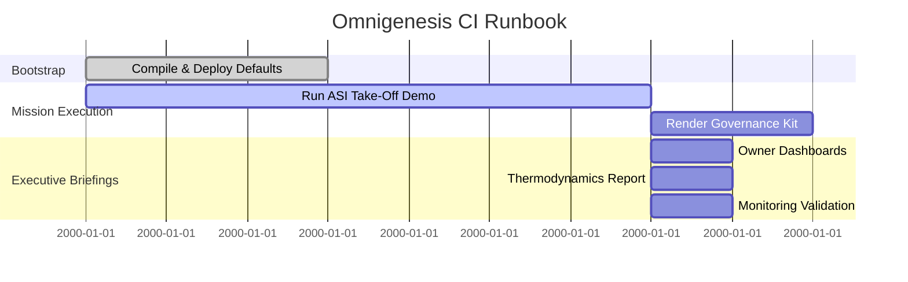

# OMNIGENESIS GLOBAL SOVEREIGN SYMPHONY

> Fully automatable CI drill that exhibits a civilisation-scale coordination engine built entirely from the deterministic tooling already present in AGI Jobs v0 (v2).

---

## Mission Charter

- **Purpose** – Fuse global macroeconomic planning, decentralised governance, and cross-sector labour orchestration into a single end-to-end runbook that can be executed without bespoke code changes.
- **Scope** – Bootstrap an intergovernmental stabilisation pact spanning energy, food security, climate resilience, and economic stimulus initiatives. The drill uses the one-box orchestrator, validator quorums, thermodynamic incentives, and mission reporting surfaces that ship with this repository.
- **Key Outcomes**
  1. Deterministic deployment of the v2 protocol stack and actors defined in `deployment-config` and `demo/asi-takeoff/config`.
  2. Automated execution of the ASI take-off loop with the [Omnigenesis project plan](./project-plan.json) to surface receipts, thermodynamic telemetry, and governance kits under `reports/<network>/omnigenesis-global-symphony`.
  3. Coordinated post-processing that renders owner dashboards, mermaid governance atlases, and thermodynamics dossiers, giving executive control rooms verifiable levers across global corridors.

---

## CI Automation Blueprint

The [`Makefile`](./Makefile) and [`bin/omnigenesis-ci.sh`](./bin/omnigenesis-ci.sh) wrapper wire together existing npm scripts to deliver a single-button CI rehearsal. The pipeline intentionally reuses only first-class commands that already ship in `package.json`.

```mermaid
flowchart LR
  subgraph Bootstrap
    A[npm run compile]
    B[npx hardhat run scripts/v2/deployDefaults.ts]
  end
  subgraph MissionDrill
    C[ASI Take-Off Demo\n(Omnigenesis Plan)]
    D[Governance Kit Renderer]
  end
  subgraph ExecutiveSurfaces
    E[Owner Mission Control]
    F[Owner Atlas]
    G[Thermodynamics Report]
    H[Monitoring Sentinels]
  end
  A --> B --> C --> D
  D --> E
  D --> F
  C --> G
  C --> H
```

---

## Quickstart (Local / CI Identical)

1. Copy environment defaults:
   ```bash
   cp demo/OMNIGENESIS-GLOBAL-SOVEREIGN-SYMPHONY/env.example .env
   ```
2. Execute the CI macro:
   ```bash
   make -C demo/OMNIGENESIS-GLOBAL-SOVEREIGN-SYMPHONY ci
   ```
3. Review generated artefacts:
   - `reports/localhost/omnigenesis-global-symphony/receipts/mission.json`
   - `reports/localhost/omnigenesis-global-symphony/omnigenesis-report.md`
   - `reports/localhost/omnigenesis-global-symphony/governance-kit.md`
   - `reports/localhost/omnigenesis-global-symphony/owner-mission-control.md`
   - `reports/localhost/omnigenesis-global-symphony/thermodynamics-report.md`

The `ci` target is deterministic and friendly to GitHub Actions: every command runs headlessly and terminates with non-zero exit codes on failure, unlocking policy-controlled rollouts.

---

## Omnigenesis Governance Conductor



---

## Global Economic Harmoniser



---

## Multi-Vector Verification Philosophy

- **Thermodynamic Assurance** – `npm run thermodynamics:report` tests entropy thresholds against the Omnigenesis job lattice, ensuring incentives remain bounded even under plan perturbations.
- **Governance Integrity** – `npm run owner:mission-control` and `npm run owner:atlas` verify SystemPause, thermostat, and treasury wiring against the repository's owner-control doctrine.
- **Observability Guardrails** – `npm run monitoring:validate` confirms that sentinels defined under `monitoring/` remain green against the freshly generated receipts, providing continuous compliance signals.
- **CI Traceability** – Every target prints direct file paths and JSON payloads to enable auditors to reproduce results solely from repository artefacts.

---

## Artefact Map



---

## Further Reading

- [`RUNBOOK.md`](./RUNBOOK.md) – the operator drill for mainnet-level rehearsals.
- [`project-plan.json`](./project-plan.json) – deterministic Omnigenesis macroeconomic specification.
- [`bin/omnigenesis-ci.sh`](./bin/omnigenesis-ci.sh) – shell harness that binds the CI pipeline together using only existing npm scripts.
