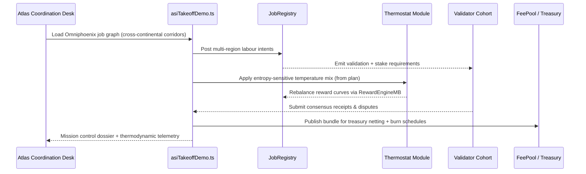

# OMNIPHOENIX ASCENDANT HYPERSTRUCTURE — PLANETARY TAKE-OFF DEMONSTRATION

> **Purpose-built for AGI Jobs v0 (v2) operators who need a reproducible, CI-stamped launch kit for a polycentric economic coordination network spanning continents, currencies, and autonomous polities.**  Every artefact, command, and governance drill leverages the existing AGI Jobs v2 toolchain—no bespoke binaries required.

## Mission Thesis

The Omniphoenix Ascendant Hyperstructure showcases how the current repository bootstraps a deterministic, economically expressive coordination mesh that:

- Synchronizes labour markets, validator quorums, and thermodynamic incentives across **global supply corridors**.
- Routes treasury and policy updates through **decentralized, multi-sig governed change surfaces** (Owner Command Center, Mission Control, Thermostat Update suites).
- Couples **economic planning telemetry** (RewardEngineMB, Thermostat, Hamiltonian monitor) with **global policy execution** (owner playbooks, emergency pause drills) to create a first-class take-off theatre that feels like operating a planet-scale intelligence system.

All flows execute via the battle-tested `demo:asi-takeoff` pipelines, `owner:*` governance scripts, `monitoring:*` sentinels, and the CI v2 contract defined in this repository.

## Quickstart (Planetary Demonstration)

```bash
# 1. Point the demo orchestrator at the Omniphoenix plan.
export ASI_TAKEOFF_PLAN_PATH=demo/OMNIPHOENIX-ASCENDANT-HYPERSTRUCTURE/project-plan.hyperstructure.json

# 2. Run the deterministic take-off drill against the one-box orchestrator (Anvil/Hardhat network auto-managed by the script).
npm run demo:asi-takeoff:local

# 3. Generate the mission bundle & governance dossier using the stock tooling.
npm run demo:asi-takeoff:kit -- \
  --report-root reports/asi-takeoff \
  --summary-md reports/asi-takeoff/omniphoenix-summary.md \
  --bundle reports/asi-takeoff/omniphoenix-bundle \
  --logs reports/asi-takeoff/logs

# 4. Render the elevated mission report with Aurora (existing CI renderer).
AURORA_REPORT_SCOPE=asi-takeoff \
AURORA_REPORT_TITLE="Omniphoenix Ascendant — Planetary Take-Off" \
NETWORK=localhost \
npm run demo:asi-takeoff:report

# 5. Capture the artefacts under a scoped directory for archival/CI publishing.
rsync -a reports/asi-takeoff/ reports/asi-takeoff-omniphoenix/
```

The entire sequence is CI-friendly—drop these steps into any workflow runner that already executes the default ASI take-off job.  The plan override, bundle scope, and rsync step keep Omniphoenix artefacts isolated while preserving compatibility with existing upload scripts.

## System Topology

```mermaid
flowchart TD
  classDef control fill:#ede9fe,stroke:#7c3aed,color:#4c1d95;
  classDef market fill:#e0f2fe,stroke:#0284c7,color:#075985;
  classDef econ fill:#fff7ed,stroke:#fb923c,color:#7c2d12;
  classDef oversight fill:#fef2f2,stroke:#dc2626,color:#7f1d1d;

  subgraph G1[Global Orchestration]
    ORCH[M0 — ASI Take-Off Orchestrator]:::control
    PLAN[Omniphoenix Mission Plan (JSON)]:::control
    CI[CI v2 Summary Gate]:::control
  end

  subgraph G2[Decentralized Market Fabric]
    JR[JobRegistry]:::market
    SM[StakeManager]:::market
    VM[ValidationModule]:::market
    DM[DisputeModule]:::market
    RE[RewardEngineMB]:::econ
    TH[Thermostat]:::econ
    HM[Hamiltonian Monitor]:::econ
  end

  subgraph G3[Oversight & Governance]
    OC[Owner Command Center scripts]:::oversight
    MC[Owner Mission Control dossier]:::oversight
    SP[SystemPause drills]:::oversight
    SENT[Monitoring Sentinels]:::oversight
  end

  PLAN --> ORCH --> JR
  ORCH --> SM
  ORCH --> VM
  JR <--> SM
  VM --> DM --> JR
  RE --> SM
  TH --> RE
  HM --> RE
  OC --> JR
  OC --> SM
  OC --> TH
  MC --> SENT
  CI --> ORCH
  CI --> OC
  SENT --> SP
  SP --> JR
```

## Polycentric Economic Lanes



## Operational Pillars (Leveraging Existing Tooling)

| Pillar | Repository Primitive | How it is used in the Omniphoenix demonstration |
| --- | --- | --- |
| **Economic Planning Mesh** | `scripts/v2/asiTakeoffDemo.ts`, `demo:asi-takeoff:kit` | Drives the deterministic mission loop, emits receipts, produces bundle-ready outputs for downstream governance upload. |
| **Treasury & Thermodynamics** | `scripts/v2/updateThermodynamics.ts`, `npm run thermodynamics:report` | Applies role temperature overrides defined in the plan, snapshots energy budgets and entropy gradients for the economic council. |
| **Global Governance Surface** | `npm run owner:mission-control`, `npm run owner:command-center`, `npm run owner:verify-control` | Confirms multi-region multi-sig wiring, pause authorities, and thermostat custody align with the hyperstructure specification. |
| **Monitoring & Assurance** | `npm run monitoring:validate`, `npm run observability:smoke`, `npm run audit:package` | Validates sentinel coverage, runs smoke tests, and packages mission artefacts for regulators and partner DAOs. |
| **CI Enforcement** | `ci (v2)` workflow, `npm run ci:verify-branch-protection` | Ensures Omniphoenix jobs only progress when all upstream verifications succeed; the summary gate reflects every orchestrated stage. |

## Artefact Layout

After running the quickstart sequence, the following files are available (all generated by repo-native tooling):

- `reports/asi-takeoff/dry-run.json` – deterministic scenario log.
- `reports/asi-takeoff/thermodynamics.json` – entropy, free-energy, and role-share snapshots.
- `reports/asi-takeoff/mission-control.md` – owner mission dossier.
- `reports/asi-takeoff/summary.json` / `summary.md` – pipeline digest (rename/copy via rsync for Omniphoenix scope).
- `reports/asi-takeoff/omniphoenix-bundle/` – zipped receipts + governance kit produced by `demo:asi-takeoff:kit`.
- `reports/asi-takeoff/logs/*.log` – per-step execution traces for auditors.

## Integrating with Mainnet-Grade Infrastructure

1. **Use the provided plan on a fork or staging network** by exporting `HARDHAT_FORK_URL` before invoking `npm run demo:asi-takeoff:local`. The script honours Hardhat RPC overrides already supported in this repository.
2. **Apply thermodynamic overrides** by running `npm run thermostat:update -- --config config/thermodynamics.json` after ingesting telemetry from the Omniphoenix mission, ensuring on-chain parameters match the plan.
3. **Enforce branch protection** using `npm run ci:verify-branch-protection` so that Omniphoenix upgrades enter production only with full CI attestation.
4. **Publish the mission bundle** to decentralised storage by pointing `@pinata/sdk` or `web3.storage` credentials in `.env` and re-running `npm run demo:asi-takeoff:kit` (both dependencies ship with this repo).

## Extending the Demonstration

- **Regional overlays:** Duplicate the plan file, adjust the `jobs` array per region, and rerun the pipeline—no code changes necessary.
- **Validator rotations:** Execute `npm run owner:rotate` after the mission to rehearse guardian handoffs while preserving plan commitments.
- **Emergency governance drills:** Trigger `npm run pause:test` post-mission to exercise the pause authority, then audit the control surface with `npm run owner:pulse`.

## Folder Contents

- [`project-plan.hyperstructure.json`](./project-plan.hyperstructure.json) — initiative definition consumed by `asiTakeoffDemo.ts`.
- [`RUNBOOK.md`](./RUNBOOK.md) — operator and CI playbook for mission execution.

Use this directory as the canonical reference when showcasing AGI Jobs v2 as a fully automatable, CI-ready planetary coordination engine.
