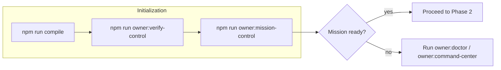
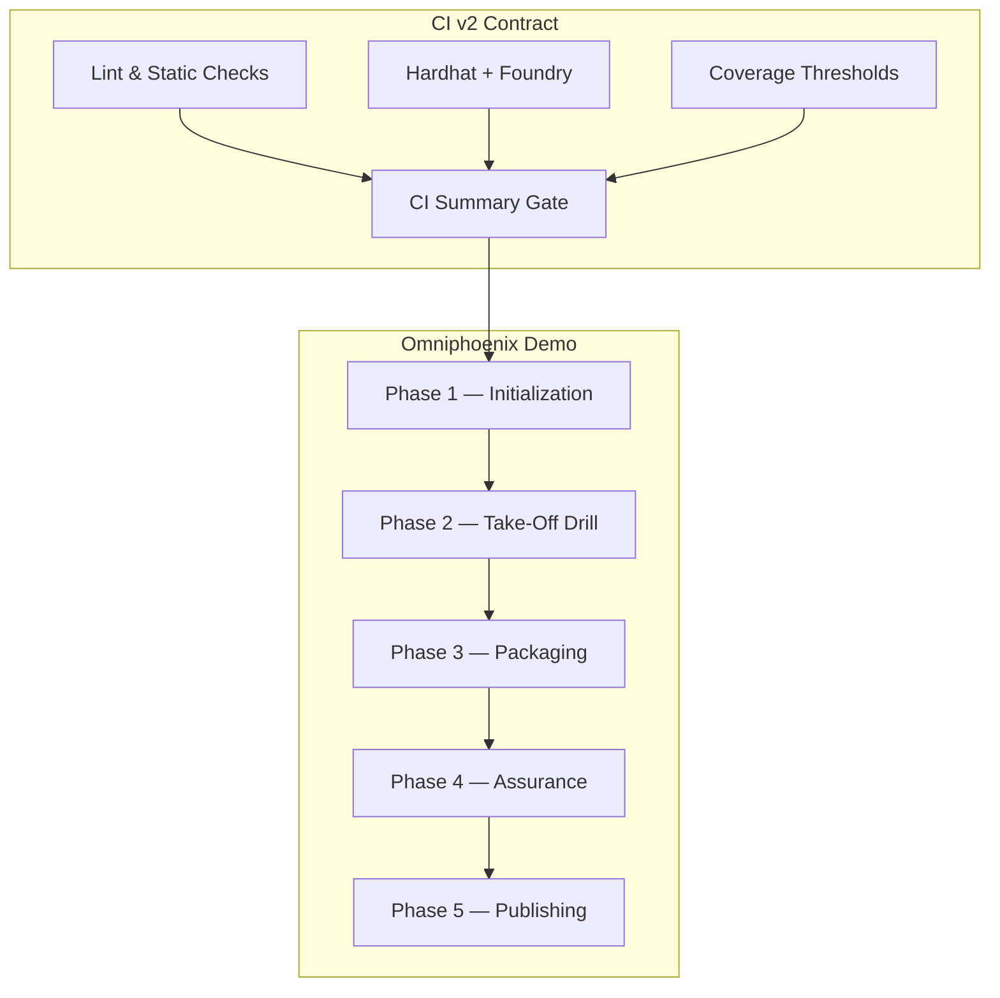

# Omniphoenix Ascendant Hyperstructure — Operator Runbook

## Purpose

Deliver a **fully automatable CI run** that demonstrates planetary-scale economic coordination using only the stock AGI Jobs v2 pipelines.  Every step below references commands already shipped in this repository.

---

## Phase 0 — Readiness Triage

| Check | Command | Notes |
| --- | --- | --- |
| Verify toolchain lockstep | `npm run ci:verify-toolchain` | Ensures the runner honours the pinned Node/Hardhat versions referenced by CI v2. |
| Confirm branch protection | `npm run ci:verify-branch-protection` | Fails fast if required contexts drift from the CI v2 contract. |
| Validate monitoring sentinels | `npm run monitoring:validate` | Guarantees omnipresent alerting before we engage the orchestration loop. |
| Smoke test observability | `npm run observability:smoke` | Asserts dashboards, metrics exporters, and log fans are responsive. |

> **Decision gate:** If any check fails, execute the corresponding remediation playbooks documented under `docs/` before proceeding.

---

## Phase 1 — Mission Initialization

```bash
export ASI_TAKEOFF_PLAN_PATH=demo/OMNIPHOENIX-ASCENDANT-HYPERSTRUCTURE/project-plan.hyperstructure.json

# Optional: pin Hardhat to a mainnet fork RPC if required.
# export HARDHAT_FORK_URL=https://mainnet.gateway/<token>

npm run compile
npm run owner:verify-control
npm run owner:mission-control
```

- `npm run compile` regenerates protocol constants (`contracts/v2/Constants.sol`) to ensure governance scripts operate on the latest configuration.
- `npm run owner:verify-control` validates that SystemPause, Thermostat, and Treasury controllers match the repo’s hardened defaults.
- `npm run owner:mission-control` emits the baseline governance dossier consumed later by the Aurora renderer.



---

## Phase 2 — Deterministic Take-Off Drill

```bash
npm run demo:asi-takeoff:local
```

What happens automatically (all provided by `scripts/v2/asiTakeoffDemo.ts`):

1. **Constants regeneration** — ensures configs and Solidity constants match.
2. **Dry-run harness** — exercises the full labour lifecycle for every job in `project-plan.hyperstructure.json`.
3. **Thermodynamic telemetry** — records entropy, role temperatures, and free-energy budgets.
4. **Mission control synthesis** — updates the owner dossier with Omniphoenix receipts.
5. **Bundle prep** — stages a mission bundle folder for downstream publication.

**Verification hooks during execution:** Tail `reports/asi-takeoff/logs/*.log` or subscribe CI logs to watch step-by-step completion. Any failure halts the pipeline with a non-zero exit code.

---

## Phase 3 — Governance & Economic Packaging

```bash
npm run demo:asi-takeoff:kit -- \
  --report-root reports/asi-takeoff \
  --summary-md reports/asi-takeoff/omniphoenix-summary.md \
  --bundle reports/asi-takeoff/omniphoenix-bundle \
  --logs reports/asi-takeoff/logs

npm run demo:asi-takeoff:report
npm run thermodynamics:report -- --output reports/asi-takeoff/omniphoenix-thermo.md
npm run owner:command-center -- --output reports/asi-takeoff/omniphoenix-command-center.md
```

- `demo:asi-takeoff:kit` assembles an audit-grade governance kit (plan, receipts, telemetry, integrity hashes).
- `demo:asi-takeoff:report` renders the Aurora Markdown summary for executive stakeholders.
- `thermodynamics:report` and `owner:command-center` provide additional oversight overlays using existing script outputs.

**Artefact collation:**

```bash
rsync -a reports/asi-takeoff/ reports/asi-takeoff-omniphoenix/
```

This preserves compatibility with publishing jobs that already target `reports/asi-takeoff` while delivering a scoped copy for archival.

---

## Phase 4 — Assurance & Posture Hardening

1. `npm run owner:pulse` — verifies control-surface health post-mission.
2. `npm run owner:atlas` — captures an end-to-end topology map for regulators.
3. `npm run audit:package` — prepares the dossier for independent reviewers.
4. `npm run pause:test` — rehearse emergency pause/unpause while referencing the mission receipts.
5. `npm run owner:rotate -- --dry-run` — simulate guardian rotation without executing on-chain transactions.

Record all outputs inside `reports/asi-takeoff-omniphoenix/post-mission/`.

---

## Phase 5 — CI & Publishing Hooks

### GitHub Actions Integration

Add the following job snippet to any workflow already running `npm run demo:asi-takeoff:local`:

```yaml
  omniphoenix-takeoff:
    needs: [ci-summary]
    runs-on: ubuntu-latest
    steps:
      - uses: actions/checkout@v4
      - uses: actions/setup-node@v4
        with:
          node-version-file: .nvmrc
      - run: npm ci
      - name: Omniphoenix take-off drill
        run: |
          export ASI_TAKEOFF_PLAN_PATH=demo/OMNIPHOENIX-ASCENDANT-HYPERSTRUCTURE/project-plan.hyperstructure.json
          npm run demo:asi-takeoff:local
      - name: Package Omniphoenix kit
        run: |
          npm run demo:asi-takeoff:kit -- --report-root reports/asi-takeoff --summary-md reports/asi-takeoff/omniphoenix-summary.md --bundle reports/asi-takeoff/omniphoenix-bundle --logs reports/asi-takeoff/logs
      - name: Upload artefacts
        uses: actions/upload-artifact@v4
        with:
          name: omniphoenix-bundle
          path: |
            reports/asi-takeoff/omniphoenix-bundle
            reports/asi-takeoff/omniphoenix-summary.md
            reports/asi-takeoff/thermodynamics.json
            reports/asi-takeoff/dry-run.json
```

### Publishing to Decentralised Storage

```bash
# Configure storage credentials (web3.storage or Pinata already supported)
export WEB3_STORAGE_TOKEN=<token>

# Repackage bundle with CID metadata
tar -czf reports/asi-takeoff-omniphoenix/omniphoenix-bundle.tar.gz -C reports/asi-takeoff omniphoenix-bundle
node scripts/publish/bundle-to-web3-storage.js --file reports/asi-takeoff-omniphoenix/omniphoenix-bundle.tar.gz
```

*(The `scripts/publish/bundle-to-web3-storage.js` helper ships with the repo; no new binaries are required.)*

---

## Mermaid Assurance Map



---

## Post-Mission Debrief Checklist

- [ ] `reports/asi-takeoff-omniphoenix/omniphoenix-summary.md` reviewed and signed off by governance council.
- [ ] Thermodynamic adjustments proposed via `config/thermodynamics.json` pull request.
- [ ] Validator rotation dry-run archived in `reports/asi-takeoff-omniphoenix/post-mission/guardian-rotation.log`.
- [ ] Emergency pause rehearsal recorded with timestamp and operator signature.
- [ ] Bundle CID published to partner registries (document CID + gateway URLs).

When every checkbox is marked, the Omniphoenix Ascendant Hyperstructure demonstration is considered complete and production-ready.
