# 🎖️ AGI Jobs One‑Box 👁️✨ Demo

> **Mission:** Prove that a single conversational window can orchestrate institution-grade labour markets on-chain — without the user ever touching Solidity, wallets, or RPC jargon. This demo packages the AGI Jobs v0 (v2) stack into a launchable experience that even a first-time operator can run in minutes.

## Why this matters

- **Non-technical mastery.** One chat box is all it takes to post, simulate, and settle complex AGI Jobs workflows. The assistant translates natural language directly into on-chain labour orchestration.
- **Production discipline.** Every component ships with hardened defaults: strict CSP/SRI, deterministic builds, contract owner controls, pause switches, observability, and audited economic guardrails.
- **Operator sovereignty.** The contract owner retains full command — fees, staking pressure, validator policy, and pause states can all be updated or halted instantly through the standard owner toolchain.
- **Chain-agnostic execution.** Point the stack at any AGI Jobs v2 deployment (local Anvil, testnets, mainnet). The relayer model grants walletless UX while respecting the on-chain escrow model.

## System map

```mermaid
flowchart LR
    subgraph User[User Experience]
        U["👤 Non-technical operator"] -->|Describes goal| UI["🎛️ One‑Box chat interface"]
        UI -->|Shows plan, asks confirmation| U
    end

    subgraph Brain[AI Orchestrator]
        UI -->|/plan| Planner["🧠 LLM planner"]
        Planner -->|Structured intent| UI
        UI -->|/simulate & /execute| Executor["⚙️ Execution pipeline"]
    end

    subgraph Chain[On-chain & Storage]
        Executor -->|Tx signed by relayer| JobRegistry{{"📜 Job Registry"}}
        Executor -->|Uploads specs| IPFS[("🗂️ IPFS / pinning")]
        JobRegistry -->|Events & receipts| Executor
    end

    subgraph Owner[Owner Command]
        OwnerCLI["🛡️ Owner CLI"] -->|Update fees, pause, rotate keys| JobRegistry
        OwnerCLI -->|Surface configuration| Planner
    end

    JobRegistry -->|Finalise payouts| Agent["🤖 / 👩‍💻 Agents"]
```



## Directory layout

```
demo/One-Box/
├── Dockerfile.ui          # Builds the static One‑Box UI, injects runtime config at container start
├── Makefile               # Friendly targets for bootstrap / launch / teardown
├── README.md              # This guide
├── config/                # Slot for future network presets (testnet, mainnet)
├── docker-compose.yaml    # Minimal stack: Anvil + orchestrator + One‑Box UI
├── scripts/
│   └── entrypoint.sh      # Generates runtime-config.js so the browser knows the orchestrator endpoint
└── .env.example           # Safe defaults (Anvil key, demo API token, CORS)
```

## One-click launch (local Anvil)

1. **Install prerequisites.** Docker ≥ 24, Docker Compose plugin, Node.js 20 (matches repo `engines`), GNU Make.
2. **Bootstrap contracts + config.**
   ```sh
   cp demo/One-Box/.env.example demo/One-Box/.env
   make -C demo/One-Box bootstrap
   ```
   This runs the hardened `deploy:oneclick:auto` wizard: it spins Anvil, deploys the entire AGI Jobs v2 suite, and writes fresh addresses into `deployment-config/oneclick.env` for Compose to consume. The script exits once deployments and owner wiring checks pass.
3. **Launch the stack.**
   ```sh
   make -C demo/One-Box up-detached
   ```
   Services:
   - `anvil`: local Ethereum with deterministic keys
   - `orchestrator`: /onebox API + relayer using the key from `.env`
   - `onebox-ui`: the static assistant hosted at http://localhost:4173/
4. **Open the assistant.** Browse to `http://localhost:4173` and start chatting. The Advanced panel is already pre-filled with the orchestrator URL and API token, so you can immediately issue instructions like “Post a research job for 5 AGIALPHA, deadline 5 days.”
5. **Shut down when finished.**
   ```sh
   make -C demo/One-Box down
   ```

### Operator cockpit

- `make -C demo/One-Box logs` tails all containers (or add `service=orchestrator`).
- `make -C demo/One-Box status` prints port bindings and health.
- `make -C demo/One-Box clean` stops containers, prunes volumes, and removes the demo `.env` file.

## Manual controls (advanced)

Prefer to run services individually?

1. Deploy contracts via `npm run deploy:oneclick:wizard -- --no-compose --network localhost`.
2. Start the orchestrator in a shell: `npm run onebox:server`.
3. Build + serve the UI: `npm run onebox:build && cd apps/onebox/dist && python -m http.server 4173`.
4. Point the Advanced panel to `http://localhost:8080/onebox` with the API token you configured.

The Docker assets in this demo simply automate the same workflow for non-technical operators.

## Conversational playbook

| Step | Example user message | Behind the scenes |
| --- | --- | --- |
| 1 | “I need 250 product descriptions polished. Offer 12 AGIALPHA. Deadline 4 days.” | Planner converts narrative into a `JobIntent` JSON, summarises scope, budget, and deadlines. |
| 2 | “Yes.” | Simulator validates funds, fee policy, burn schedule, staking requirements. Any blockers are surfaced as natural-language hints. |
| 3 | “Finalize job 12.” | Executor anchors deliverable CIDs, calls `finalize` on the Job Registry, and returns a signed receipt plus explorer links. |

Receipts are cached locally and link to the relevant transaction or IPFS CID so the operator has immediate proof-of-work.

## Security & owner command

- **Full pause authority.** After bootstrap, run `npm run owner:system-pause -- --pause` at any time to freeze job creation. Resume with `--unpause`. The demo UI surfaces pause errors as clear assistant responses.
- **Parameter agility.** Use the owner toolkit to tweak fees, burns, staking, validator mixes, or network throttles:
  ```sh
  npm run owner:surface
  npm run owner:parameters
  npm run owner:update-all
  ```
  These scripts introspect the deployed addresses written during bootstrap, ensuring owner updates stay in sync with the live contracts.
- **Relayer hygiene.** The `.env.example` ships with the first Anvil key (full balance). Swap in a dedicated private key for production and rotate regularly. The orchestrator enforces policy caps via `ONEBOX_MAX_JOB_BUDGET_AGIA`, `ONEBOX_MAX_JOB_DURATION_DAYS`, and other env guards.
- **Audit trail.** Every plan/execute request is logged with correlation IDs. `make logs` reveals structured JSON for compliance or debugging.

## CI & quality gates

The repository already enforces the V2 pipeline (`.github/workflows/ci.yml`). A green PR requires:

- Solidity lint (`solhint`), enterprise portal linting, and static analysis.
- Hardhat unit tests, Foundry fuzzing, and coverage ≥ 90%.
- CI summary aggregation with branch protections.

This demo integrates with those pipelines automatically — Dockerfiles reuse the pinned Node 20 toolchain, and no checks are skipped. Run `npm run lint` and `npm run test` locally before opening a PR.

## Troubleshooting

| Symptom | Fix |
| --- | --- |
| UI reports “Orchestrator not configured” | Check that `.env` contains `ONEBOX_API_TOKEN` and `ORCHESTRATOR_URL`, then `make up-detached` again. |
| Simulation says “Insufficient balance” | Fund the relayer (from Anvil account `0xf39…`) with AGIALPHA or reduce the reward. |
| `deploy:oneclick:auto` fails | Inspect the wizard output; rerun after `make clean` to reset state. |
| Need a fresh slate | `make -C demo/One-Box clean` and rerun the bootstrap. |

## Next steps

- Swap the RPC target in `.env` to a production endpoint and redeploy contracts with multisig ownership.
- Connect real operators by exposing the One‑Box UI through an ENS name or IPFS gateway (`npm run onebox:publish`).
- Extend the chat playbook with new intents (disputes, staking, validator onboarding) — the planner already supports them via the orchestrator SDK.

Unleash the assistant, and show stakeholders how AGI Jobs v0 (v2) makes institutional-grade automation accessible to anyone with a browser.
