# 🎖️ AGI Jobs One‑Box 👁️✨

The One‑Box demo turns AGI Jobs v0 (v2) into a single conversational surface where a non‑technical user can design, verify, and execute institutional-grade on-chain work. This directory packages the orchestrator server, the walletless One‑Box UI, and owner observability tooling into a launch kit that boots in under two minutes.

## Why this matters

* **One command, production power.** `npm run demo:onebox:launch` builds the static UI, starts the orchestrator with your relayer key, and serves a pre-configured chat interface that already knows where your contracts live.
* **Planner → simulator → executor transparency.** The UI surfaces every stage (LLM plan, policy simulation, guarded execution) so that anyone can supervise decisions before a single wei is moved.
* **Owner-first governance.** The orchestrator inherits the full AGI Jobs v2 owner surface—pause switches, fee tuning, staking limits, and ENS registry overrides. The demo ships with a doctor script that checks configuration health before launch.
* **Demonstrably unstoppable.** Every successful run emits a CID for the attested receipt, explorer links for on-chain actions, and a risk trail that compliance teams can archive.

## System flow

```mermaid
sequenceDiagram
    autonumber
    participant User as 👤 Non-technical user
    participant UI as 💬 One-Box UI
    participant Orc as 🧠 Orchestrator
    participant ETH as ⛓️ Ethereum
    participant IPFS as 📦 IPFS
    User->>UI: Describe mission ("Label 500 images, 5 AGIALPHA, 7 days")
    UI->>Orc: POST /onebox/plan
    Orc->>Orc: Plan intent + policy simulation
    Orc-->>UI: Human-readable plan + guardrail status
    User->>UI: Confirm with a single click
    UI->>Orc: POST /onebox/execute
    Orc->>IPFS: Pin spec + receipt bundle
    Orc->>ETH: Escrow reward + create job
    ETH-->>Orc: Transaction receipt
    Orc-->>UI: Structured receipt + explorer link + CID
    UI-->>User: ✅ Mission live, audit trail attached
```



The orchestrator keeps ownership controls in the loop at every stage—jobs are blocked if organisational caps are exceeded, paused if the owner toggles SystemPause, and automatically documented through attested receipts.

## Quickstart (non-technical friendly)

1. **Install dependencies (one time):**
   ```sh
   npm ci
   ```
2. **Prepare configuration:**
   ```sh
   cd demo/One-Box
   cp .env.example .env
   # edit .env with your RPC, registry address, and relayer key
   ```
3. **Verify readiness:**
   ```sh
   npm run demo:onebox:doctor
   ```
   The doctor checks required environment variables, pings your RPC to confirm the active chain, verifies that `JOB_REGISTRY_ADDRESS` points to live bytecode, prints the launch URL, and reminds the operator of the core owner-control commands.
4. **Launch the One-Box:**
   ```sh
   npm run demo:onebox:launch
   ```
   * Builds the hardened static UI (`apps/onebox-static`).
   * Boots the orchestrator on `ONEBOX_PORT` (default `8080`).
   * Serves the UI on `ONEBOX_UI_PORT` (default `4173`) with the orchestrator URL, prefix, API token, and mode pre-filled through query overrides.
   * Opens your browser pointing at `http://127.0.0.1:4173/?orchestrator=…&oneboxPrefix=…` so the first message can be sent immediately.

That is all a non-technical operator needs: visit the chat, describe the job, confirm, and watch the receipt appear with an explorer link.

### Built-in safety rails

* **Walletless default.** Guest mode uses the relayer key supplied in `.env` to sponsor gas and escrow the reward. Expert mode can be toggled at any time to emit calldata for self-signing wallets.
* **Policy enforcement.** The orchestrator reads organisational caps (`ONEBOX_MAX_JOB_BUDGET_AGIA`, `ONEBOX_MAX_JOB_DURATION_DAYS`) and halts execution with human-readable errors when limits are exceeded.
* **Resumable context.** Query parameters automatically persist the orchestrator URL, `/onebox` prefix, and mode. API tokens are applied for the current tab only so they are never written to storage.
* **Audit artefacts.** Each execution stores a signed receipt CID. IPFS credentials in `.env` let the orchestrator pin specs and deliverables.
* **Owner telemetry.** The One‑Box mission panel now calls `/onebox/governance/snapshot` to render live fee, stake, and identity guardrails so operators can confirm the owner surface is in control before releasing funds.

## Configuration reference

| Variable | Purpose |
| --- | --- |
| `RPC_URL` | JSON-RPC endpoint used by the orchestrator provider. |
| `JOB_REGISTRY_ADDRESS` | Address of the deployed AGI Jobs job registry. |
| `ONEBOX_RELAYER_PRIVATE_KEY` | EOA key that signs transactions on the user’s behalf. Fund with ETH + AGIALPHA. |
| `ONEBOX_API_TOKEN` | Optional bearer token protecting `/onebox/*`. Leave empty for local demos. |
| `ONEBOX_PORT` / `ONEBOX_UI_PORT` | Ports for the orchestrator API and UI server. |
| `ONEBOX_PUBLIC_ONEBOX_PREFIX` | Prefix inserted before planner/simulator endpoints (defaults to `/onebox`). |
| `ONEBOX_PUBLIC_ORCHESTRATOR_URL` | Public base URL announced to the UI. Defaults to `http://127.0.0.1:${ONEBOX_PORT}`. |
| `ONEBOX_UI_DEFAULT_MODE` | `guest` for relayer mode, `expert` for wallet calldata generation. |
| `PINNER_*` | Optional IPFS pinning credentials to persist specs/receipts. |

## Owner control & observability

The demo never bypasses AGI Jobs v2 governance. Operators retain full control:

* `npm run owner:surface` — inspect every module’s owner address and governance target before going live.
* `npm run owner:update-all` — apply updated fee, stake, and policy parameters from `config/`.
* `npm run owner:system-pause` — exercise the emergency pause drill; the One-Box will surface the pause status to end users immediately.
* `npm run ci:verify-branch-protection` — confirm branch protection and CI checks before promoting changes.

`demo/One-Box/bin/doctor.cjs` bundles these reminders and verifies environment health. It is written for business operators who need confidence without touching Solidity or Hardhat.

## Continuous integration alignment

The root `pretest` script now bundles One-Box URL override tests and the launcher configuration tests. CI remains “fully green” when:

* `apps/onebox/test/query-overrides.test.ts` confirms the query override bridge between CLI and UI.
* `demo/One-Box/test/launcher.test.cjs` validates environment merging and launch URL synthesis.
* Existing Solidity, Foundry, and E2E suites continue to run unchanged.

## Extending the demo

* **Deploy to staging:** point `ONEBOX_PUBLIC_ORCHESTRATOR_URL` at a remote host, open the UI port, and the same static assets work from IPFS, S3, or ENS gateways.
* **Custom prefixes:** set `ONEBOX_PUBLIC_ONEBOX_PREFIX=/sovereign` and the CLI will reconfigure the UI through query overrides, keeping the chat experience seamless.
* **Expert-only launches:** set `ONEBOX_UI_DEFAULT_MODE=expert` to have the chat default to calldata generation for compliance-sensitive workflows.

## Frequently asked questions

**Can multiple operators share one relayer?** Yes. Use a low-privilege relayer account, rotate keys via `.env`, and pin receipts for every run. The orchestrator enforces job ownership and can be paused instantly.

**Does the UI expose ENS/stake requirements?** Planner warnings and guardrail badges describe missing identity requirements, stake levels, and budget caps. The operator never sees raw revert reasons.

**How do I export transcripts?** Receipts include IPFS CIDs plus explorer URLs. Combine them with the structured logs (`onebox.plan.*`, `onebox.execute.*`) emitted by the orchestrator for full audits.

---

Launch it, describe the mission, confirm, and experience institutional-grade AGI orchestration in a single box.
