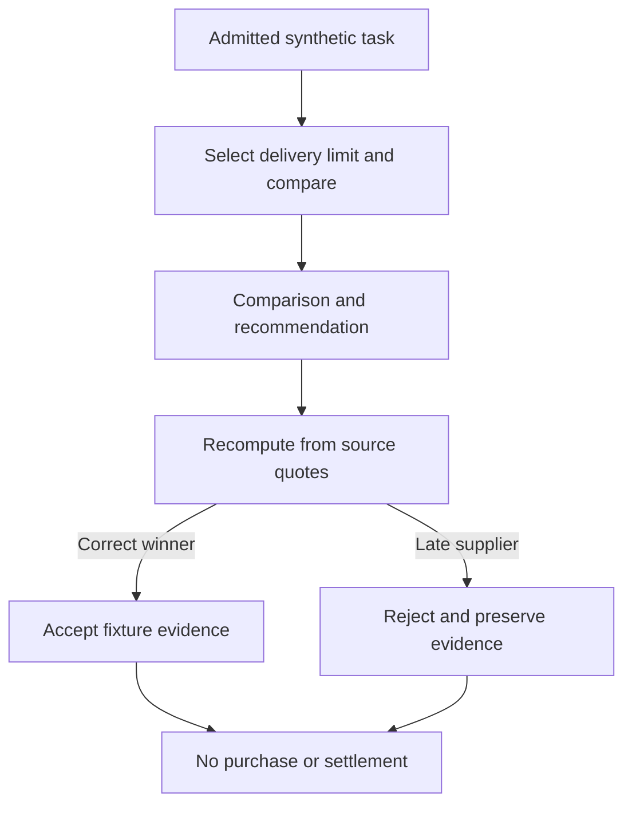

# Computer-work lab: a supplier decision you can verify

**Question:** can a worker use a screen to produce a useful result that a separate reviewer can check?

This lab opens an isolated browser, compares three fictional supplier quotes and writes a recommendation. The browser interactions, HTTP adapter, dispatch journal, artifact hashes and acceptance checks are real. Worker decisions and the OpenClaw-shaped server response are deterministic fixtures; no live model, provider, wallet, order or settlement is involved.

## Run in a few minutes

From the repository root, use the [pinned Node setup](../../../docs/START_HERE.md), install dependencies, then:

```bash
npm run build:orchestrator
npx playwright install chromium
npm run demo:computer-work
```

Linux hosts missing browser system libraries can use `npx playwright install --with-deps chromium` in an environment where installing those libraries is permitted. The lab listens only on an ephemeral loopback port; it does not need a fixed port or API key.

**Expected:** `accepted: true`, `passedChecks: 11`, `totalChecks: 11`, `browserExecuted: true`, `liveProvider: false`, and `settlementApproved: false`. The output includes the exact evidence directory under `reports/computer-work/<unique-run-id>/`.

| Supplier | Total for 40 units | Delivery | Meets 7-day limit? |
| --- | ---: | ---: | --- |
| Boreal | $530.00 | 5 days | Yes |
| Laurentian | $460.00 | 12 days | No |
| Stellar | $490.00 | 7 days | Yes |

Stellar is the correct recommendation: Laurentian's cheaper quote misses the deadline. The arithmetic uses integer cents.

## Follow the evidence

1. Open `desktop.png` or `mobile.png` to see the actual browser after interaction. The worker selects **7 days**, clicks **Compare quotes**, and reads the displayed results.
2. Read `comparison.json` and `recommendation.md`. These are the actual text deliverables returned through the Responses adapter.
3. Inspect `receipt.json`: exact task hash, unique attempt ID, provider response ID, artifact sizes/hashes and required-review status. The synthetic mode comes from operator configuration, not the worker's claims.
4. Open `review.json`. A separate function recomputes totals and eligibility from `quotes.json`, checks artifact integrity, and verifies the recommendation. Its eleven checks are arithmetic/structural acceptance rules, not an independent security audit.
5. Inspect `browser-evidence.json` and `accessibility.json`. They record the actual interaction sequence, screenshot hash, one provider-shaped dispatch, browser errors and Axe findings. The persistent `journal/` prevents a second dispatch for the same admitted job.

## Make it fail meaningfully

```bash
npm run demo:computer-work -- --inject-error
```

The worker now recommends Laurentian. The browser still runs, the output is still well-formed and its hashes are valid, but the independent recommendation checks fail: **9 of 11 checks pass, `accepted: false`, exit status 1**. This is the intended result. Compare the two unique report directories; the earlier evidence is retained.

The reviewer uses explicit fixture rules. For a real task, implement acceptance criteria that check authoritative sources or the actual application state; do not merely ask the same model whether it did a good job.



## Move to your own work

Read [Computer work: setup, admission, recovery and production boundaries](../../../docs/computer-work.md). `task.json` and `worker-profiles.example.json` are reviewable templates. The live command is explicit and requires operator admission plus a protected token; the default lab never turns itself into a live run.

The broader [One-Box mission](../README.md) demonstrates posting, assignment, submission, review, corrections, disputes and finalization in an offline browser model. This lab adds actual screen interaction and a provider-shaped execution boundary. Neither model claims a production deployment has been commissioned.

## Troubleshooting

| Symptom | Fix |
| --- | --- |
| Compiled `computerWork.js` cannot be found | Run `npm run build:orchestrator` from the repository root. |
| Chromium executable is missing | Run the Playwright installation command above. |
| Accessibility or browser check fails | Inspect the report and browser logs; fix the actual UI issue before treating the run as accepted. |
| Injected-error command returns status 1 | Expected: the incorrect recommendation was rejected. |
| Live run says the task is not admitted | Inspect the exact task digest and operator profile; do not weaken admission checks. |
| Live run has unknown outcome | Preserve its journal and reconcile actual effects before a new job. |
