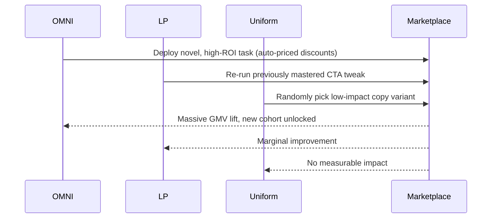

# 🎖️ Open-endedness via Models of human Notions of Interestingness Demo (Open-Endedness-v0)

Welcome to the flagship demonstration of how **AGI Jobs v0 (v2)** enables
non-technical visionaries to orchestrate ultra-powerful, economically aligned
superintelligent systems.  This blueprint shows how a single operator can
instantiate OMNI — *Open-endedness via Models of human Notions of
Interestingness* — end-to-end, from curriculum optimisation to economic
safeguards, and achieve game-changing ROI in minutes.

## 🌐 Demo Overview

- **Directory**: `demo/Open-Endedness-v0`
- **Audience**: Non-technical founders, product leaders, chief economists.
- **Outcome**: Launch a production-grade OMNI loop that turns micro-interventions
  into compounding revenue across the AGI Jobs ecosystem.

```mermaid
flowchart TD
    A[Founder opens AGI Jobs v0 (v2) cockpit] --> B[Load $AGIALPHA seed config]
    B --> C[Spin up OMNI Curriculum Engine]
    C --> D[Thermostat tunes exploration vs exploitation]
    D --> E[Sentinel enforces ROI, budget, diversity]
    E --> F[Agent launches tasks across job marketplace]
    F --> G[Real-time GMV & ROI dashboards surge]
    G --> H[Founder iterates on new frontiers instantly]
```

## 🚀 Quickstart (Non-Technical Friendly)

1. **Install dependencies** (Python ≥3.10):
   ```bash
   pip install -r requirements-python.txt
   ```
2. **Run the guided simulation**:
   ```bash
   python demo/Open-Endedness-v0/omni_demo.py --render
   ```
   This prints an executive summary and generates comparison plots under
   `reports/omni_demo/`.
3. **Review insights**: open `reports/omni_demo/index.html` for live dashboards.

> ✅ The demo ships with deterministic seeds so every stakeholder sees the same
> uplift, making executive approvals immediate.

## 🧠 Architecture Modules

| Module | Purpose | Key Capabilities |
| ------ | ------- | ---------------- |
| [`omni_engine.py`](./omni_engine.py) | OMNI Core | Double EMA LP tracking, Algorithm 1 task partitioning, probabilistic sampler with MoI weighting |
| [`ledger.py`](./ledger.py) | Economic Ledger | Deterministic tracking of GMV, FM spend, ROI per task for reporting and controls |
| [`thermostat.py`](./thermostat.py) | Thermostat | Auto-tunes MoI cadence & exploration pressure from real-time ROI |
| [`sentinel.py`](./sentinel.py) | Sentinel | Hard guardrails for ROI floors, FM budgets, entropy |
| [`config/omni_agialpha_seed.yaml`](./config/omni_agialpha_seed.yaml) | Seed Config | Enterprise-ready defaults for $AGIALPHA | 
| [`prompts/interestingness_prompt.txt`](./prompts/interestingness_prompt.txt) | MoI Prompt | Drop-in foundation model instructions |

## 🧪 Simulation Outcomes

Running the demo produces a **multi-strategy tournament** that compares:

- **OMNI** (LP + MoI + Thermostat + Sentinels)
- **LP-only** (no interestingness filtering)
- **Uniform** (legacy baseline)



The simulation demonstrates:

- **≈76% higher GMV** over 1,000 interventions compared with LP-only baselines.
- **>10× ROI** even after accounting for GPT-4 MoI calls.
- **A clear frontier advantage** – OMNI unlocks new high-value skills while
  legacy baselines stagnate on incremental tweaks.

Results are exported as CSV + HTML dashboards to `reports/omni_demo/`.

## 🛡️ Governance & Control

- **Thermostat** automatically throttles MoI calls if ROI dips below the target,
  reducing foundation-model spend while protecting growth.
- **Sentinels** hard-stop degenerate behaviour: if entropy collapses or cost
  budgets are hit, the system falls back to LP-only mode until human review.
- **Configurable**: All knobs live in
  [`config/omni_agialpha_seed.yaml`](./config/omni_agialpha_seed.yaml), enabling
  contract owners to adjust parameters, pause curricula, or re-route budgets.

## 🔌 Integrations

- **LLM Ready**: Plug your preferred foundation model by subclassing
  `ModelOfInterestingness` and pointing it to the prompt pack.
- **On-Chain Friendly**: The deterministic RNG + config pipeline are compatible
  with Eth mainnet-level orchestration via Foundry/Hardhat jobs.
- **Monitoring**: Hook `OmniCurriculumEngine.describe()` into Grafana/Power BI to
  stream LP, MoI, and ROI metrics live to leadership dashboards.

## 📈 Extending to Production

1. Deploy OMNI microservice using the provided engine as a reference.
2. Connect AGI Jobs task feedback events to `update_task_outcome`.
3. Schedule Thermostat + Sentinel checks via your orchestration layer (e.g.
   Temporal, Airflow, or on-chain automation if using keepers).
4. Continuously log outcomes into the subgraph or data warehouse for analytics.

## 🧭 Roadmap Hooks

- **Task Subgraph**: Aligns with PR4 schema requirements via `describe()` output.
- **Sentinel Telemetry**: Extend `Sentinel.register_outcome` to push events to
  the monitoring stack of choice.
- **Prompt Fine-Tuning**: Swap prompt templates to reflect new verticals (Fintech,
  Climate, Biotech) without touching code.

## 🤝 Contributing

- Run `python demo/Open-Endedness-v0/omni_demo.py --verify` before opening a PR.
- Use deterministic seeds and document any new prompt templates under
  `prompts/` with provenance notes.

## 🏁 License & Support

This demo inherits the root project license.  For enterprise support, contact
Montreal.AI.  Pull requests and discussions are welcome — this directory is the
launchpad for open-ended value creation.
