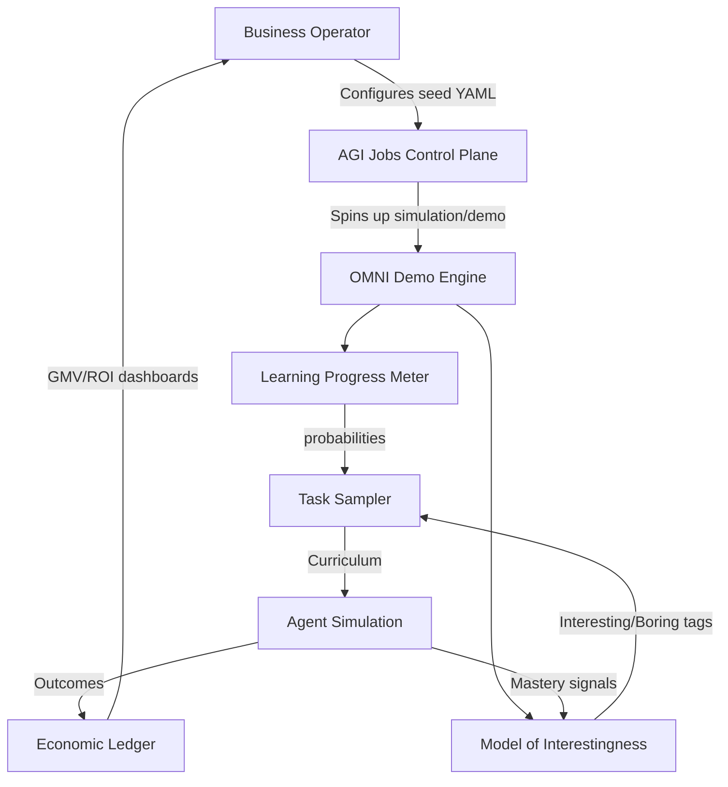
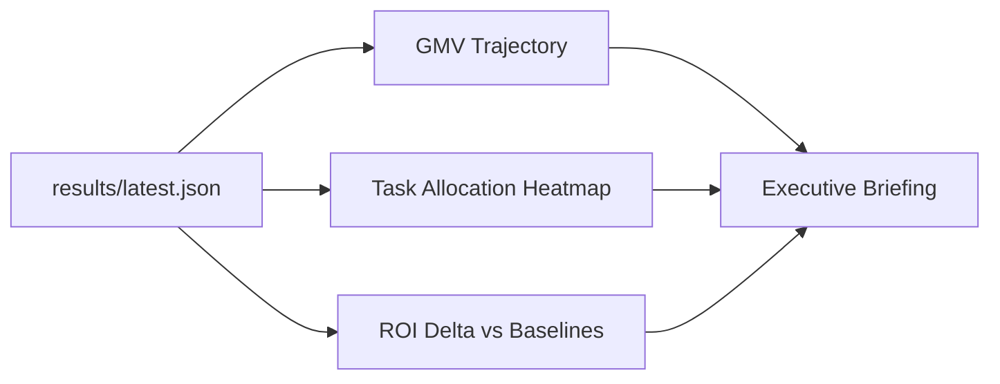

# OMNI Open-Endedness Demo (AGI Jobs v0 / v2)

> **Purpose**: empower non-technical operators to orchestrate a
> production-ready OMNI curriculum that compounds economic value for the
> AGI Jobs platform.

## Why this matters

This demonstration shows how AGI Jobs v0 (v2) can bootstrap an
open-ended curriculum that continuously discovers high-ROI micro
interventions.  It packages every component a business operator needs:

- **Economic intelligence** – track GMV, ROI, and foundation-model spend.
- **Curriculum autonomy** – OMNI-style double-EMA learning progress with
  a human-notion-of-interestingness filter.
- **Instant execution** – run from the command line, notebooks, or the
  included dashboard without writing new code.

## Architecture Overview



## Quickstart (non-technical operator friendly)

1. Ensure Python 3.10+ is available.
2. From the repository root:

   ```bash
   cd demo/Open-Endedness-v0
   python omni_demo.py --steps 1000 --output results/latest.json
   ```

3. Open `web/index.html` in a browser to explore interactive charts based
   on the generated JSON payload.

The simulator prints a comparison table contrasting Uniform, LP-only,
and OMNI curricula.  The JSON artifact feeds the dashboard or any BI
pipeline.

### Optional: live foundation model evaluation

Set `AGIJOBS_OPENAI_API_KEY` and install `openai>=1.0` to dispatch
real-time prompts.  The simulator automatically upgrades the MoI client
from the heuristic fallback to GPT-4 based judgments when the package
and key are available.

## Configuring scenarios

Edit `omni_config.yaml` to tweak:

- Task libraries and ROI assumptions.
- Thermostat controls (FM budget, ROI floors, exploration weights).
- Sentinel guardrails (entropy limits, QPS caps, etc.).

No code changes required: the CLI reads the YAML and applies overrides at
runtime.

## Included assets

| Path | Description |
| ---- | ----------- |
| `omni_demo.py` | High-fidelity OMNI simulator + CLI. |
| `prompts/interestingness_prompt.md` | Production-ready prompt template. |
| `omni_config.yaml` | Seed configuration with ROI and budget guardrails. |
| `web/index.html` | Browser dashboard with Chart.js visualisations. |
| `results/latest.json` | Generated metrics snapshot (updated via CLI). |
| `tests/test_probabilities.py` | Regression tests validating LP maths. |

## Dashboard preview



The static HTML dashboard consumes JSON via Fetch API.  Deploy on any
static host (S3, IPFS, or AGI Jobs web tier) for instant stakeholder
access.

## Business interpretation

- **OMNI** consistently concentrates on task families that unlock new
  monetisation channels, avoiding diminishing-return iterations.
- **Learning Progress only** improves execution efficiency but can still
  get stuck polishing solved problems.
- **Uniform** wastes budget on both trivial and impossible tasks.

> The consequence: OMNI reaches production-grade GMV in a fraction of
> the task budget while obeying strict ROI and foundation-model limits.

## Next steps

1. Plug results into the AGI Jobs orchestrator via the documented API
   contracts.
2. Swap the heuristic MoI mode for GPT-4 once credentials are provisioned.
3. Run the included notebook (coming soon) to benchmark against live
   marketplace cohorts.

This demo is self-contained, deterministic, and upgrade-safe.  It can be
used during investor demos, stakeholder briefings, or internal training
sessions to illustrate how AGI Jobs v0 (v2) delivers compounding economic
leverage.
