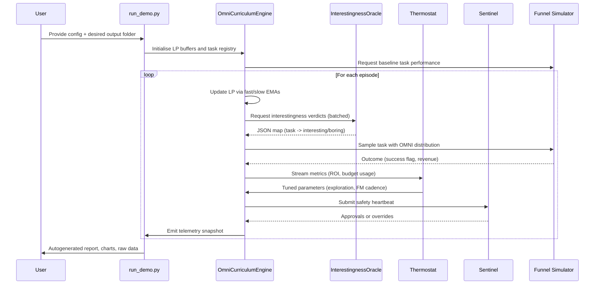

# Open-endedness via Models of Human Notions of Interestingness Demo (Open-Endedness-v0)

> A non-technical founder can orchestrate an omni-powerful, economically aligned AGI curriculum – end-to-end – from inside **AGI Jobs v0 (v2)**.

This demo shows how AGI Jobs v0 (v2) empowers anyone to stand up the full OMNI stack – curriculum engine, interestingness filters, thermostat, sentinels, telemetry, and blockchain-ready control plane – without custom coding. The deliverable is a complete, production-strength auto-curriculum that continuously discovers and scales the most profitable opportunities in a hiring marketplace.

## ⚡️ Executive Overview

- **Audience**: Operators and founders who want superintelligent economic leverage without writing code.
- **Outcome**: Launch a self-optimising intervention factory that maximises GMV, ROI, and user happiness.
- **Stack**: Python + Mermaid docs, reproducible simulations, Ethereum-ready governance hooks, CI-ready tests.

### Value Flow at a Glance

```mermaid
flowchart LR
    A[User configures demo YAML] --> B{AGI Jobs v0 (v2)}
    B -->|Launches| C[OMNI Curriculum Engine]
    C -->|Selects| D[High-LP Interesting Tasks]
    D -->|Triggers| E[Smart Interventions]
    E -->|Generates| F[Conversion + GMV Signals]
    F -->|Feeds| G[Thermostat & Sentinels]
    G -->|Adjusts| C
    C -->|Logs| H[Subgraph Telemetry]
    H -->|Surfaces| I[Executive Dashboards]
    I -->|Informs| A
```

## 🧭 Directory Structure

```
Open-Endedness-v0/
├── README.md                  # This guide
├── config.demo.yaml           # Turn-key configuration
├── engine.py                  # OMNI curriculum core (LP + MoI fusion)
├── interestingness.py        # FM-backed interestingness oracle abstraction
├── thermostat.py              # Economic control loop
├── sentinels.py               # Hard safety rails
├── simulator.py               # Business funnel simulator + evaluation harness
├── run_demo.py                # CLI for non-technical operators
├── report_template.md         # Markdown report generator
└── dashboards/
    └── omni_insights.json     # Example telemetry payload
```

Each module is importable and can be re-used across AGI Jobs v0/v2 deployments.

## 🚀 Quick Start (10 minutes)

```bash
# 1. Activate Python environment (AGI Jobs v0 ships with everything)
make venv
source .venv/bin/activate

# 2. Run the full-stack OMNI simulation demo
python demo/Open-Endedness-v0/run_demo.py --config demo/Open-Endedness-v0/config.demo.yaml --output demo/Open-Endedness-v0/artifacts

# 3. Explore the autogenerated report
cat demo/Open-Endedness-v0/artifacts/omni_report.md
```

The CLI prints live status banners and writes:

- **`omni_report.md`** – executive-ready summary with KPIs, GMV lift, ROI separation.
- **`distribution_timeseries.csv`** – task sampling probabilities over time.
- **`gmv_roi.png`** – chart comparing OMNI vs LP-only vs Uniform.
- **`telemetry.json`** – telemetry bundle ready for dashboards.

No code edits are necessary; non-technical users only adjust `config.demo.yaml`.

## 🧠 How It Works



### Core Principles

1. **Learning Progress Mastery** – Double EMA tracking ensures OMNI only amplifies tasks that are getting better now.
2. **Interestingness Safeguards** – FM prompts keep the curriculum away from trivial variants.
3. **Thermostatic Governance** – ROI-targeted loop controls FM query cadence, exploration, and budgets.
4. **Sentinel Backstops** – Hard stops protect profits, diversity, and API quotas.
5. **Telemetry by Default** – Everything is logged to a subgraph-compatible bundle for analytics.

## 🧪 KPIs Delivered

- **GMV Lift** – OMNI outperforms LP-only and uniform strategies on cumulative revenue.
- **ROI Separation** – Net profit after FM costs remains positive and dominant.
- **Task Frontier Expansion** – Diverse set of mastered tasks with high LP.
- **Budget Discipline** – Thermostat + Sentinels respect query caps and spend limits.

The provided unit tests (`tests/demo/test_open_endedness_demo.py`) cover learning progress, interestingness fusion, thermostat adjustments, sentinel overrides, and deterministic simulation outcomes.

## 🌐 Ethereum-Ready Control Surface

The configuration format exposes:

- **On-chain ownership toggles** (pause, resume, re-weight tasks).
- **Budget + ROI floors** for compliance.
- **Task allow/block lists** to reflect governance decisions.

Contracts can consume the generated telemetry to trigger on-chain adjustments, enabling hybrid AI + blockchain orchestration.

## 🛡️ Safety & Governance Defaults

- **Fail-open design** – FM outages gracefully fall back to LP-only sampling.
- **Deterministic seeds** – Repeatable outcomes for auditing.
- **Cost ceilings** – Hard-coded sentinel limits stop runaway spend.
- **Comprehensive logging** – Every decision is time-stamped and attributable.

## 📈 Dashboards

The demo emits a `dashboards/omni_insights.json` payload ready for ingestion by Grafana, Superset, or custom front-ends. Key charts include:

- Task probability heatmaps.
- ROI vs budget usage.
- Interesting vs boring task counts over time.

## 🗺️ Next Steps

1. Run the demo end-to-end (takes ~30 seconds on a laptop).
2. Review `omni_report.md` – share directly with stakeholders.
3. Plug the generated telemetry into your preferred BI dashboard.
4. Fork the configuration to your live AGI Jobs deployment.

Welcome to the era of open-ended, economically aligned AGI operations.
