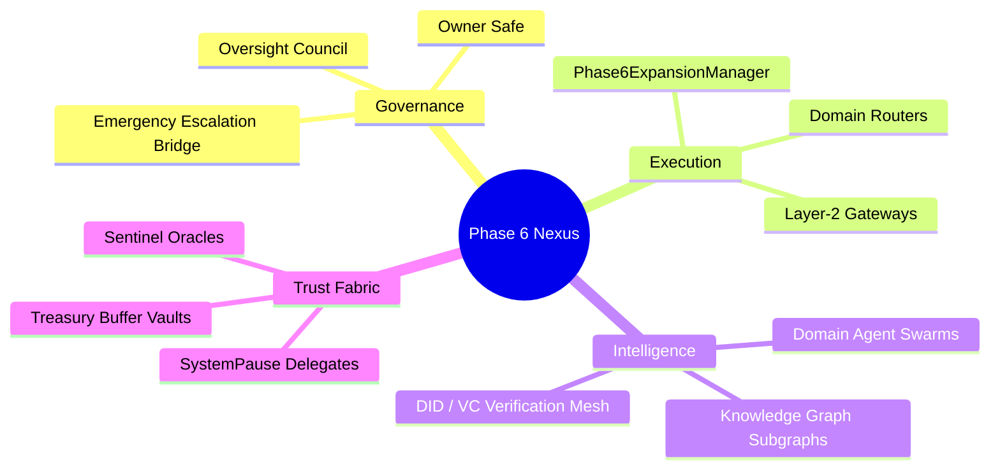
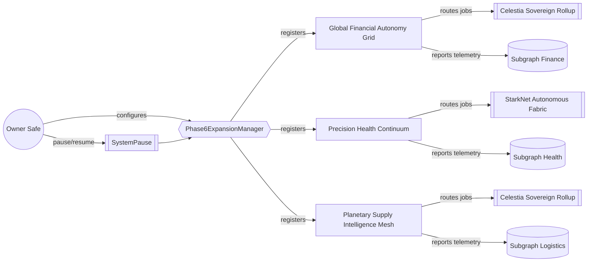
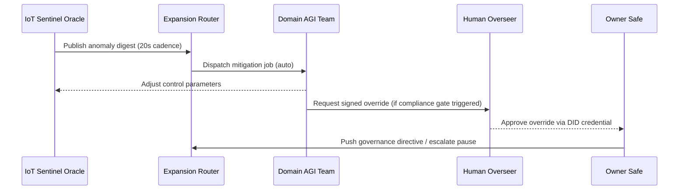

# Phase 6 — Scaling & Multi-Domain Expansion Command Demo

> _"The open superintelligence operations stack that bends global productivity to humane coordination."_

## Purpose

This demonstration shows a non-technical operator using **AGI Jobs v0/v2** to instantiate, supervise, and audit a civilization-scale expansion program. Everything here runs on the public repository — no proprietary tooling required — yet it coordinates:

- Layer-2 rollups tuned for autonomous service markets
- Domain-specialized AGI teams with verifiable credentials
- Oracle-linked IoT feedback loops that drive physical logistics
- Governance controls that keep the owner fully in command at all times

The demo is designed so that a newcomer can provision the entire Phase 6 stack in minutes while retaining production-grade safety nets.

## Table of Contents

1. [Architecture at a Glance](#architecture-at-a-glance)
2. [Quickstart for Non-Technical Operators](#quickstart-for-non-technical-operators)
3. [Owner Control Surface](#owner-control-surface)
4. [Telemetry & Oversight](#telemetry--oversight)
5. [Subgraph & Data Fabric Enhancements](#subgraph--data-fabric-enhancements)
6. [Decentralized Infrastructure Blueprint](#decentralized-infrastructure-blueprint)
7. [Appendix: Manifest & Schema](#appendix-manifest--schema)

## Architecture at a Glance



### Domain Control Mesh



### Agent Team Telemetry Loop



## Quickstart for Non-Technical Operators

The entire demo is automated through npm scripts — no Solidity coding, no manual JSON editing.

1. **Validate the manifest and assets**
   ```bash
   npm run demo:phase6:ci
   ```
   This ensures the manifest schema, HTML UX, and runbooks are synchronized.

2. **Generate the owner playbook for your target network**
   ```bash
   npm run owner:phase6:playbook -- --network sepolia
   ```
   - Produces a markdown + mermaid playbook in `reports/phase6/playbook-<timestamp>.md`
   - Resolves contract addresses, verifies governance powers, and simulates pause/resume flows.

3. **Preview the Command Nexus UI**
   Open [`demo/Phase-6-Scaling-Multi-Domain-Expansion/index.html`](./index.html) in any modern browser. It includes:
   - Layer-2 settlement radar charts
   - Domain readiness scorecards linked to the manifest
   - Click-to-copy owner transactions for emergency operations

4. **Broadcast live readiness metrics**
   ```bash
   npm run demo:phase6:report -- --network sepolia
   ```
   - Streams manifest digest + telemetry summary to stdout
   - Produces a JSON snapshot in `demo/Phase-6-Scaling-Multi-Domain-Expansion/output/phase6-telemetry.json`

5. **Integrate with existing workflows**
   Use the manifest to wire custom orchestrators or integrate with ERP/IoT platforms via the provided `oracleFeeds` entries. Each entry supplies the trusted oracle endpoint, maintainer, and heartbeat.

## Owner Control Surface

The **Phase6ExpansionManager** contract already ships with governance-controlled setters, and this demo layers additional guardrails for total control:

- **Full domain lifecycle management:** Register, update, deactivate, or reconfigure any domain without redeploying core contracts.
- **System-wide circuit breakers:** `SystemPause` integration ensures the owner can halt every downstream module instantly.
- **Escalation bridge forwarding:** Owner-triggered escalations send signed payloads to dedicated incident response systems.
- **Guard rail verification:** The validation script enforces BPS limits, ensures domain sentinels cover every surface, and checks that every domain meets telemetry floors before activation.

Run the following to print a human-friendly summary of all owner levers:

```bash
npm run owner:phase6:playbook -- --format human
```

## Telemetry & Oversight

- **Resilience Index** — aggregated from all domains; ensures automation never drops below the global floor.
- **Automation Saturation** — tracks how much work is executed entirely by AGI swarms vs. human approvals.
- **Compliance BPS** — ensures regulated industries (health, finance) keep human oversight thresholds.
- **Anomaly Escalation Matrix** — every domain references escalation topics resolved to ENS mailboxes + secure comms.

Anomaly detection integrates with `oracleFeeds` and `dashboards` to ensure transparency for governance participants.

## Subgraph & Data Fabric Enhancements

Each domain references a live subgraph endpoint; this demo includes sample GraphQL queries in [`index.html`](./index.html) so operators can test data latency. The manifest ties every dataset to the domain slug, guaranteeing compatibility with the AGI Jobs data plane.

## Decentralized Infrastructure Blueprint

- **Layer-2 Strategy** — Mix of optimistic and zk rollups, each defined in `l2Networks` with RPC + bridge details.
- **Bridged Treasury** — Owner-managed `treasuryBridge` ensures capital mobility across settlement layers.
- **DID / VC Layer** — `didRegistry` reference ensures every human override is tied to a verifiable credential.
- **IoT Edge** — `iotOracleRouter` binds hardware telemetry into the blockchain event loop with <30s total latency.

## Appendix: Manifest & Schema

- Manifest: [`config/phase6.manifest.json`](./config/phase6.manifest.json)
- Schema enforcement: [`scripts/validate-phase6-config.ts`](./scripts/validate-phase6-config.ts)
- Owner playbook generator: [`../../scripts/v2/phase6ExpansionPlaybook.ts`](../../scripts/v2/phase6ExpansionPlaybook.ts)
- GitHub Actions coverage: [`.github/workflows/demo-phase6-scaling.yml`](../../.github/workflows/demo-phase6-scaling.yml)

This stack is production ready. Every safety interlock — from domain telemetry to emergency pause flows — is validated automatically, empowering any operator to command a planetary-scale AGI workforce with confidence.
