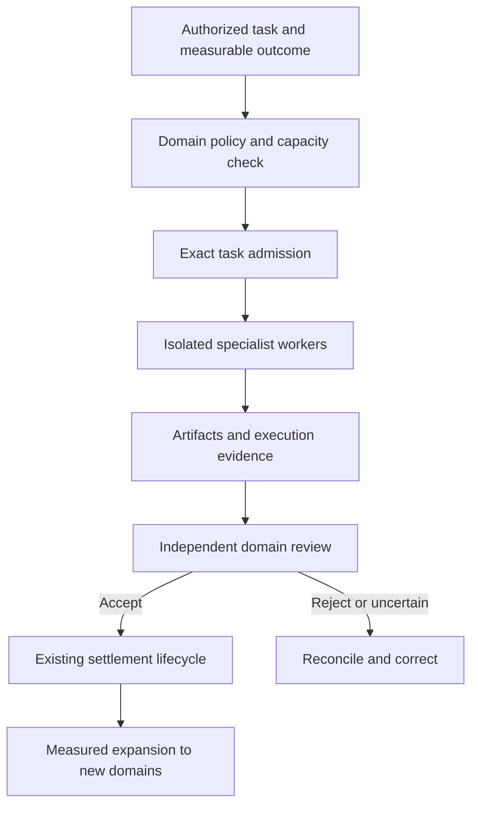

# AGI Jobs v0 (v2) — Demo → Phase 6 Scaling Multi Domain Expansion

Coordinate specialized agents across finance, health, logistics, climate and education, with explicit domain controls and reviewable rollout plans. Phase 6 connects a common machine labor layer to domain-specific validation, identity, capacity and infrastructure requirements.

**Start here:** [open the interactive command center](https://montrealai.github.io/AGIJobsv0/experiments/phase6/) · [operator guide](docs/operator-guide.md) · [computer-work handoff](docs/computer-work.md).

**What runs today:** an offline configuration validator, deterministic calldata/blueprint generator, credential-coverage audit, synthetic event router, governance apply tool and browser planning workspace. The supplied addresses, identity records, infrastructure statuses and economic metrics are **illustrative**. A generated plan does not prove deployed services, credential validity, completed work or settlement. Live rollout requires commissioning the actual worker, verifier, chain and operational controls.

## Overview
- **Path:** `demo/Phase-6-Scaling-Multi-Domain-Expansion/README.md`
- **Module Focus:** Extend authorized, lawful screen-based work into distinct domains without losing task admission, evidence, independent review or settlement boundaries.
- **Integration Role:** Produce governance proposals for `Phase6ExpansionManager`, domain annotations for the Python orchestrator, and scoped task handoffs to the existing computer-work pipeline. Domain metadata alone does not enforce a remote worker's permissions.

## Capabilities
- Five example domain profiles retain their original infrastructure, credential requirements and flowcharts.
- Browser planning compares worker capacity, review capacity and budget before exporting a proposal; it never dispatches agents or connects a wallet.
- Strict configuration validation catches ambiguous values before calldata generation. ABI checks compare both published interfaces with compiled contract source.
- Preview-first governance tools expose the target network, manager and proposed changes; explicit application is a separate action.
- OpenClaw and ChatGPT Work can perform authorized browser/desktop workflows through their configured tools. The [handoff guide](docs/computer-work.md) explains supported paths and task-specific evaluation.

## Systems Map
```mermaid
flowchart LR
    Operators((Mission Owners)) --> demo_Phase_6_Scaling_Multi_Domain_Expansion[[Demo → Phase 6 Scaling Multi Domain Expansion]]
    demo_Phase_6_Scaling_Multi_Domain_Expansion --> Core[[AGI Jobs v0 (v2) Core Intelligence]]
    Core --> Observability[[Unified CI / CD & Observability]]
    Core --> Governance[[Owner Control Plane]]
```

## Working With This Module

Use the Node.js version in the root [`.nvmrc`](../../.nvmrc) and the npm version pinned in [`package.json`](../../package.json). Run these commands from the repository root. No wallet, provider account or RPC is needed for the rehearsal.

```bash
npm ci
npm run demo:phase6:ci
mkdir -p reports/phase6
npm run demo:phase6:orchestrate -- --json reports/phase6/blueprint.json
npm run demo:phase6:runbook -- --output reports/phase6/runbook.md
npm run demo:phase6:did -- --json reports/phase6/credential-coverage.json
npm run demo:phase6:iot -- --json reports/phase6/event-proposals.json
```

Inspect the generated blueprint, calldata and credential gaps before changing any configuration. The DID audit checks declared coverage; it does not resolve DIDs, check revocation or authenticate issuers. The event simulator recommends routing and creates no external action.

Python entry point (Python 3.10+):

```bash
python demo/Phase-6-Scaling-Multi-Domain-Expansion/run_demo.py -- --json reports/phase6/blueprint.json
```

The shim uses the locally installed TypeScript runner. Relative input/output paths are resolved from your current directory. `--help` lists the available options, and invalid flags fail rather than silently changing the plan. To pipe machine-readable JSON, use `npm run --silent demo:phase6:orchestrate -- --json -` or the Python command with `--json -`.

For a local browser preview:

```bash
node scripts/pages/phase6-build.mjs
python -m http.server 8080 --directory build/phase6 --bind 127.0.0.1
```

Open `http://127.0.0.1:8080/`. Dependencies are bundled locally; the page does not require a CDN or a wallet. The complete site is built with `npm run site:build`; see the [website guide](../../website/README.md) for its workspace dependencies.

## From one useful job to many domains

AGI Jobs is designed as a scalable machine labor layer for authorized, lawful screen-based work: specialized agents execute scoped tasks, produce reviewable evidence, and support independent verification and settlement. Common work includes research, document preparation, reconciliation, software QA, operations and design-tool workflows. Each domain adds its own acceptance criteria and oversight; a finance or health label does not confer professional authority.


```mermaid
flowchart TD
    Intake["Authorized task and measurable outcome"] --> Domain["Domain policy and capacity check"]
    Domain --> Admission["Exact task admission"]
    Admission --> Workers["Isolated specialist workers"]
    Workers --> Evidence["Artifacts and execution evidence"]
    Evidence --> Review["Independent domain review"]
    Review -->|Accept| Settlement["Existing settlement lifecycle"]
    Review -->|Reject or uncertain| Recovery["Reconcile and correct"]
    Settlement --> Expansion["Measured expansion to new domains"]
```

Reliable digital work can support increasingly capable scientific, engineering, education and infrastructure programs. Scale proceeds through measured outcomes, sufficient review capacity, reproducible evidence and accountable governance. This repository does not establish autonomous physical infrastructure or universal human-level performance.

The **$40 trillion/year** opportunity is a project-supplied **planning assumption**, not a validated market estimate or revenue forecast. Distinguish total labor spend, digitally addressable tasks, permitted workflows, accepted output, adoption and platform revenue. The command center's capacity calculations are scenario arithmetic, not measured throughput or demand.

## Directory Guide
### Key Directories
- `abi`
- `config`
- `scripts`
- `docs` — operator workflow, commissioning and recovery
- `examples` — a public-data computer-work task for separate admission
- `ui` — local browser planner and command-center assets
### Key Files
- `index.html`
- `run_demo.py` — portable launcher

## Quality & Governance
- Every change must land through a pull request with all required checks green (unit, integration, linting, security scan).
- Reference [`RUNBOOK.md`](../../RUNBOOK.md) and [`OperatorRunbook.md`](../../OperatorRunbook.md) for escalation patterns and owner approvals.
- Keep secrets outside the tree; use the secure parameter stores wired to the AGI Jobs v0 (v2) guardian mesh.

Run `npm run demo:phase6:ci`, the Phase 6 contract/script tests, and the launcher/runtime tests described in the [operator guide](docs/operator-guide.md). Website changes also run `npm run site:test` and `npm run site:qa`. Passing local tests is evidence about these tested paths; deploy only after the required PR checks succeed and the commissioning gates are satisfied.

## Next Steps
- Follow the [operator guide](docs/operator-guide.md) to inspect a governance plan and commission a domain with disposable accounts before production use.
- Use the [computer-work handoff](docs/computer-work.md) to bind a task, worker and independent evaluator; capture exact versions and observed results.
- Publish reviewed artifacts into `reports/` and connect release evidence through the repository's existing release manifest and [operator runbook](../../OperatorRunbook.md).
