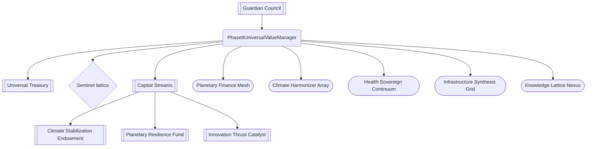

# Phase 8 — Universal Value Dominance Demo

> **Mission**: let a non-technical governor command a superintelligent, DAO-governed economy with a single console. This demo
> packages governance calldata, observability, safety guardrails, and self-improving automation into one copy/paste friendly
> experience powered by **AGI Jobs v0 (v2)**.

---

## 🚀 Quickstart for operators

1. **Install dependencies** (one-time):
   ```bash
   npm ci
   ```
2. **Generate calldata & telemetry**:
   ```bash
   npm run demo:phase8:orchestrate
   ```
   You will receive:
   * Encoded `setGlobalParameters`, `setGuardianCouncil`, `setSystemPause`, and self-improvement plan calldata.
   * A full register/remove multi-call manifest for **every** domain, sentinel, and capital stream — copy/paste ready for
     Safe / timelock batching.
   * A human-readable network telemetry report with resilience, value flow, sentinel coverage, capital coverage, and self-improvement guards.
   * A copy/paste mermaid system map for status updates and incident briefings.
   * Autogenerated files in `demo/Phase-8-Universal-Value-Dominance/output/`:
    * `phase8-governance-calldata.json` — canonical manifest of encoded calls + metrics.
    * `phase8-safe-transaction-batch.json` — Safe Transaction Builder template (set `PHASE8_MANAGER_ADDRESS` / `PHASE8_CHAIN_ID` env vars to customise target).
    * `phase8-telemetry-report.md` — executive briefing markdown for stakeholder distribution.
    * `phase8-mermaid-diagram.mmd` — raw Mermaid blueprint for design docs.
    * `phase8-orchestration-report.txt` — operator runbook summarising governance addresses, guardrails, and execution order.
    * `phase8-governance-directives.md` — guardian-ready briefing distilling oversight actions, emergency levers, and contact points.
    * `phase8-governance-checklist.md` — Safe/timelock execution checklist mapping every calldata label to verification steps and guardian sign-off notes.
    * `phase8-self-improvement-plan.json` — machine-readable self-improvement payload ready for timelock ingestion.
    * `phase8-cycle-report.csv` — per-domain sentinel coverage + capital funding ledger for audit trails.
    * `phase8-dominance-scorecard.json` — analytics-grade snapshot of dominance metrics for dashboards and regulators.
    * `phase8-guardian-response-playbook.md` — scenario-by-scenario guardian response deck with triggers, actions, and communication templates.
    * `phase8-emergency-overrides.json` — circuit-breaker calldata bundle (pause & resume) for instant guardian action.
   > **Tip**: export `PHASE8_MANAGER_ADDRESS=0x…` and `PHASE8_CHAIN_ID=1` (or your deployment chain) before running the script to pre-fill the Safe transaction batch with production parameters.
   > The manifest now includes `global.phase8Manager`, so emergency overrides default to a “ready” state even without environment overrides; customise the target Safe by setting the environment variables above.
3. **Launch the control surface UI** (no build step required):
   ```bash
   npx serve demo/Phase-8-Universal-Value-Dominance
   ```
   Navigate to `http://localhost:3000` to view the live dashboard.
   * The opening **Manifest Command Console** lets you drag-and-drop a custom Phase 8 manifest or paste a remote URL (HTTPS or IPFS gateway). The entire dashboard reconfigures instantly, and you can revert at any moment with the “Use baseline manifest” button.
   * The **Governance Action Deck** auto-loads the orchestrator’s calldata manifest and lays out copy-ready action cards (governance priming, dominion onboarding, sentinel bindings, capital routing, safety kernel, and teardown levers) so a non-technical owner can stage the superintelligence in minutes.
   * Shareable states are supported: append `?manifest=<url>` to the dashboard URL to preload an audited manifest for guardian review.
4. **Enforce readiness in CI**:
   ```bash
   npm run demo:phase8:ci
   ```
   This validates the manifest schema, README sections, and UI mermaid placeholders. The same check is enforced on every PR
   via the `ci (v2) / Phase 8 readiness` workflow.
   * The validator now recomputes the Universal Dominance Score, sentinel coverage, and per-domain funding directly from the
     manifest and compares those values against the autogenerated `phase8-dominance-scorecard.json`. Any drift between the
     manifest and the published scorecard fails CI, so guardians always receive mathematically verified telemetry.

---

## ⚙️ Orchestration flow & troubleshooting

1. **Load + validate** – the CLI parses `config/universal.value.manifest.json` through a strict Zod schema. Any missing slug,
   malformed address, or negative cadence halts execution with a red `Phase 8 orchestration failed` banner and a bullet list of
   the offending paths. Fix the manifest and rerun.
2. **Encode governance calls** – calldata is generated with deterministic `ethers.Interface` encoders. If you see an encoding
   failure, double-check that every address is a 20-byte hex string and that large integers (for TVL or budgets) are expressed
   as base-10 strings or safe integers.
3. **Export artifacts** – the script writes Safe templates, telemetry, and Mermaid diagrams into `output/`. Override
   destinations via `PHASE8_MANAGER_ADDRESS` / `PHASE8_CHAIN_ID`; invalid overrides trigger validation errors instead of
   silently falling back to defaults.
4. **Troubleshoot quickly** – rerun with `DEBUG=*` to inspect encoded calldata, or delete the generated `output/` directory to
   force a clean regeneration if filesystem permissions or stale files cause issues.

> **Tip**: When copying telemetry into wikis, reference the timestamped header in `phase8-telemetry-report.md` to confirm the
latest run. Safe imports should always display the chain ID and manager address injected by the environment variables above.

---

## 🧭 Why this demo matters

* **Universal authority with hard guardrails** – the new `Phase8UniversalValueManager` contract keeps the owner in absolute
  control of domains, sentinel policies, capital streams, and emergency pause forwarding.
* **Planetary telemetry in one command** – governance can read resilience, autonomy, value flow, and sentinel coverage from the
  CLI and UI without touching Solidity or Hardhat.
* **Dominance instrumentation** – a composite Universal Dominance Score rolls value throughput, resilience, sentinel saturation, capital coverage, autonomy discipline, and retraining cadence into a single 0–100 index so governors know instantly if the mesh is outperforming its guardrails.
* **Self-improving and self-checking** – an on-chain self-improvement charter (plan hash + cadence) plus manifest playbooks let
  the operator launch automated retraining and adversarial stress-tests while ensuring autonomy stays bounded.
* **Mermaid-first storytelling** – every run emits a rich diagram to explain how trillions in value flow through the
  superintelligent mesh.
* **Instant circuit breaker** – the emergency overrides pack encodes `forwardPauseCall` payloads so the guardian council can halt or resume every module with a single Safe transaction.
* **Guardian execution checklists** – `phase8-governance-checklist.md` converts the calldata manifest into numbered Safe/timelock instructions so guardians can verify coverage, funding, and autonomy guardrails before signing.

> With the default manifest, the console reports ~$688B in monthly value flow, ~$1.97T annual capital allocation, an average resilience index of 0.925, 45.0 minutes of sentinel coverage per guardian cycle, **100% dominion funding with a $720B/yr floor**, and a Universal Dominance Score of 97.1 / 100 — a direct signal that the network is outperforming its guardrails while staying within human override windows.

---

## 🧱 Smart contract control surface

`contracts/v2/Phase8UniversalValueManager.sol` introduces a governance-only registry for Phase 8:

* **Global parameters** – `setGlobalParameters`, `updateManifesto`, and `updateRiskParameters` let the owner reshape treasury,
  vaults, knowledge graphs, and risk tolerances atomically.
* **Sentinel lattice** – register, update, and toggle sentinels that monitor domains. Each sentinel enforces coverage windows
  and can be routed through the shared `SystemPause` via `forwardPauseCall`. Domain bindings are configured via
  `setSentinelDomains` so every sentinel only monitors approved dominions, and dashboards can query individual profiles with
  `getSentinel`.
* **Capital streams** – register autonomous treasury programs with annual budgets and expansion curves. Governance can pause,
  re-target, or re-bind the domain list at any time with `setCapitalStreamDomains`, while analytics surfaces can fetch a
  single stream’s configuration instantly through `getCapitalStream`.
* **Domain dominion** – configure orchestration endpoints, vault limits, and autonomy bps per domain while guaranteeing slug
  uniqueness and heartbeat invariants. Domains, sentinels, and streams can also be removed entirely (`removeDomain`,
  `removeSentinel`, `removeCapitalStream`) with automatic pruning of bindings.
* **Self-improvement charter** – `setSelfImprovementPlan` and `recordSelfImprovementExecution` keep the cadence, plan hash,
  and audit trail of upgrades under direct governance control.

The contract emits deterministic events so dashboards, subgraphs, and auditors can stream changes. All mutative calls remain
`onlyGovernance`, satisfying the requirement that the owner can reconfigure everything – including pausing – at will.

---

## 🧠 Self-improvement kernel

The manifest + contract encode a self-improvement plan:

* **Charter hash + cadence** – `setSelfImprovementPlan` writes the plan URI, cadence, and cryptographic hash on-chain so every
  upgrade is pre-committed and auditable.
* **Execution receipts** – `recordSelfImprovementExecution(executedAt, reportURI)` appends a tamper-evident log of each training
  and evaluation cycle, binding it to an IPFS report.
* **Playbooks** trigger weekly hyperparameter evolution and hourly stress-tests, each bound by cryptographic guardrails
  (checksum verification, zk-proof-of-alignment, multi-agent cross-checks).
* **Autonomy guard** enforces ≤7,900 bps autonomy, a 15-minute human override window, and escalations through guardian council,
  DAO emergency levers, and sentinel lockdown.
* **Validator feedback loops** reward resilient domains (resilience >0.9) with higher capital allocation while surfacing low
  resilience for governance review.

Running `npm run demo:phase8:orchestrate` surfaces these guardrails alongside calldata so operators never miss a safety step.

---

## 🛡️ Self-improvement cycle operations

### Execute a new cycle

1. **Synthesize the payload** – run `npm run demo:phase8:orchestrate` to regenerate `output/phase8-self-improvement-plan.json`.
   The payload now includes `guardrails.checksum` (sha3-256 digest) and `guardrails.zkProof` (placeholder commitment + URI) so
   every run is tied to a tamper-evident manifest.
2. **Distribute calldata** – load `phase8-governance-calldata.json` into Safe or your timelock. The encoded
   `setSelfImprovementPlan` call already references the checksum + zk-proof placeholders.
3. **Record execution** – after automation completes, capture the execution timestamp and IPFS report URI, then append it via
   `recordSelfImprovementExecution` (present in the generated Safe batch) or the `owner:plan` helpers.

### Monitor guardrails continuously

* **CLI telemetry** – rerun `npm run demo:phase8:orchestrate` or `npx ts-node demo/Phase-8-Universal-Value-Dominance/scripts/run-phase8-demo.ts`
  and confirm the console emits:
  * `Kernel checksum: sha3-256 …` and `Kernel zk-proof: … status pending` so governors know the manifest hash and placeholder proof.
  * `Guardian sentinel coverage` ≥ 12 minutes (720 seconds) with `Minimum coverage per domain` meeting or exceeding the guardian
    review window.
  * `Maximum encoded autonomy` bounded below the guardrail (≤ 7,900 bps).
* **Telemetry markdown** – ship `output/phase8-telemetry-report.md` to ops chat. The Self-Improvement Kernel section includes the
  checksum + zk-proof metadata for passive monitoring and audit trails.
* **Machine checks** – programmatic systems can tail `phase8-self-improvement-plan.json` to verify:

  ```bash
  jq '.guardrails' demo/Phase-8-Universal-Value-Dominance/output/phase8-self-improvement-plan.json
  ```

  The checksum value should match the manifest commit you expect to execute; the zk-proof status remains `pending` until the
  guardian council publishes a proof artifact.

### Emergency rollback & overrides

1. **Load overrides pack** – open `output/phase8-emergency-overrides.json` and copy the `managerCalldata` for `pauseAll` or `unpauseAll` alongside the guardian and pause addresses.
2. **Freeze automation** – paste the calldata into Safe Transaction Builder (or run `npm run owner:system-pause` if wired) to forward the pause signal through the configured `SystemPause` contract. Guardians retain immediate pause authority as a backstop.
3. **Revert the plan** – rerun the orchestrator with a known-good manifest (e.g., previous git tag) to emit a replacement
   `phase8-self-improvement-plan.json`, then submit the encoded `setSelfImprovementPlan` transaction to restore trusted cadence
   and guardrails.
4. **Audit sentinels** – execute `npm run monitoring:sentinels` to dump current coverage assignments and confirm every domain
   still receives ≥ guardian window coverage before resuming automation.
5. **Document the rollback** – append an emergency note to the next `recordSelfImprovementExecution` report so downstream
   analytics capture the interruption and checksum transition.

---

## 🛰️ Demo control surface

Open [`index.html`](./index.html) to explore the fully client-side control room:

* Planetary stats (value flow, budget, resilience, sentinel coverage) plus a **Universal Dominance Score** composite (97.1 / 100 in the demo manifest) blending value flow, resilience, autonomy discipline, sentinel saturation, and self-improvement cadence.
* Domain cards with autonomy bps, resilience, heartbeat, skill badges, **per-domain capital coverage**, and linked funding streams.
* Sentinel lattice view with live coverage, sensitivity, and domain bindings (auto-highlighted when a domain loses coverage).
* Capital stream portfolio with annual budgets, vault routing, and linked dominions.
* Guardian response protocols board summarising coverage %, severity posture, and every protocol scenario with triggers,
  immediate actions, stabilisation playbooks, communication routes, and success criteria — all synced from the manifest.
* Self-improvement plan (hash, cadence, report URI) plus playbooks and guardrails rendered with owner addresses.
* Emergency overrides cards ship with expand/collapse controls so governors can inspect and copy the full `forwardPauseCall` payload without leaving the console.
* A **Governance Action Deck** tiles every critical calldata payload into copy-ready action cards (governance, dominions, sentinels, capital streams, safety kernel, and teardown levers) so the owner can assert universal value dominance without decoding hex.
* An auto-generated Mermaid diagram illustrating governance, sentinels, and capital flow.
* A **Manifest Command Console** that enables instant manifest swaps (file upload, remote URL, or query parameter). Non-technical operators can preview alternative governance states, refresh baselines, or roll back to the orchestrator output with one click.

---

## 📦 Automated exports for governors

Running `npm run demo:phase8:orchestrate` now writes a ready-to-run export kit inside [`output/`](./output/):

* **Calldata manifest** – `phase8-governance-calldata.json` collates every encoded call with accompanying telemetry metrics for audit trails.
* **Safe Transaction batch** – `phase8-safe-transaction-batch.json` drops straight into the Safe Transaction Builder so operators can execute Phase 8 upgrades without editing hex manually.
* **Telemetry briefing** – `phase8-telemetry-report.md` summarises resilience, autonomy, and funding posture for distribution to stakeholders or incident command.
* **Mermaid blueprint** – `phase8-mermaid-diagram.mmd` reproduces the architecture map for docs, wikis, or governance proposals.
* **Operator runbook** – `phase8-orchestration-report.txt` mirrors the UI runbook, listing command order, control addresses, sentinel coverage, and emergency procedures.
* **Guardian directives** – `phase8-governance-directives.md` equips the council with plain-language actions, escalation levers, and verification contacts before execution.
* **Emergency overrides** – `phase8-emergency-overrides.json` captures pre-encoded `forwardPauseCall` payloads (pause + resume) with readiness metrics so the guardian council can flip the circuit breaker without touching Solidity.
* **Self-improvement payload** – `phase8-self-improvement-plan.json` packages the cadence, plan hash, and upcoming playbooks so governance can update the on-chain charter in one paste.
* **Cycle coverage report** – `phase8-cycle-report.csv` exports coverage, capital share, and resilience signals for every domain, enabling spreadsheet driven oversight.
* **Dominance scorecard** – `phase8-dominance-scorecard.json` gives analytics teams a machine-ingestible snapshot of autonomy caps, funding floors, and sentinel coverage for compliance dashboards.
* **Guardian response playbook** – `phase8-guardian-response-playbook.md` exports the scenario deck rendered in the UI so guardians can circulate triggers, immediate/stabilisation actions, comms, and success criteria offline.

These exports ensure a non-technical owner can move from manifest to multisig execution, executive briefing, and architectural storytelling in minutes.

---

## 🧪 Phase 8 CI enforcement

A new job in `.github/workflows/ci.yml` named **Phase 8 readiness** runs on every PR and on `main`:

1. Installs dependencies via `npm ci`.
2. Executes `npm run demo:phase8:ci` to validate the manifest, README, and UI hooks.
3. Asserts that **every** domain has sentinel coverage and surfaces the coverage totals. If any dominion slips without a
   watchdog, the build fails instantly.
4. Verifies that every domain receives capital stream funding (with non-zero annual budgets) so treasury coverage matches
   sentinel coverage.
5. Publishes a summary in the GitHub Checks UI so branch protection (`ci (v2) / Phase 8 readiness`) must be green before
   merging.

---

## 🗺️ Mermaid snapshot



---

## 📚 Related orchestration hooks

* [`demo/Phase-8-Universal-Value-Dominance/scripts/run-phase8-demo.ts`](./scripts/run-phase8-demo.ts) – generates calldata,
  telemetry, and the mermaid diagram. Outputs now include full multi-call batches for registering or removing every domain,
  sentinel, and capital stream so governors can rehearse or execute reconfigurations without editing code.
* [`demo/Phase-8-Universal-Value-Dominance/scripts/validate-phase8-config.ts`](./scripts/validate-phase8-config.ts) – schema
  validation enforced by CI.
* [`orchestrator/extensions/phase8.py`](../../orchestrator/extensions/phase8.py) – runtime adapter so Python orchestrators can
  consume Phase 8 manifests (see below).

---

## 🧠 Orchestrator extension (Python)

The orchestrator gains a `Phase8DominionRuntime` helper that reads the manifest, scores domains, tracks sentinel coverage, and
annotates every step with governance guardrails. This powers non-technical users: they simply point the orchestrator at the JSON
snapshot and receive autonomous routing with human-readable rationales.

---

## ✅ Ready for Universal Value Dominance

* Governance owns every parameter, stream, sentinel, and pause lever.
* Telemetry, calldata, UI, and guardrails are generated via two npm commands.
* CI blocks merges without a validated manifest and UI surface.
* Non-technical operators can command the Phase 8 economy using only this directory.
