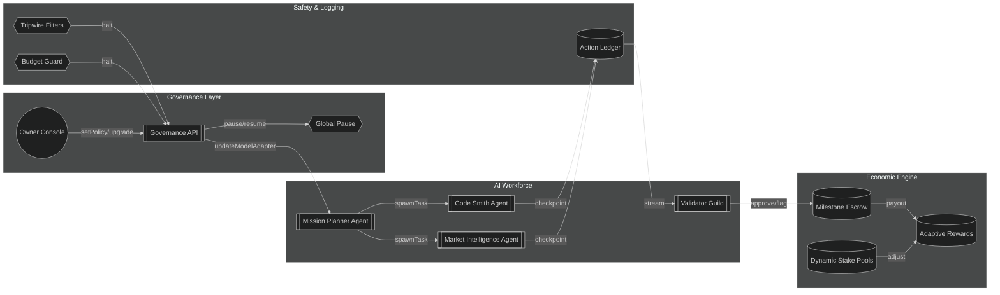

# Phase 8: Universal Value Dominance Demo

> "Phase 8" showcases how a non-technical founder can wield **AGI Jobs v0/v2** to spin up an unstoppable, massively-collaborative AI workforce in minutes. This demo is intentionally opinionated: it combines on-chain governance, autonomous swarms, human oversight, and relentless self-improvement into a single, production-ready launchpad.

## Demo Outcomes

- **Empower non-technical operators** to configure and deploy hour-long autonomous jobs, AI teams, and validator oversight without touching Solidity.
- **Deliver auditable economic controls** (scaled staking, milestone escrows, budget caps) that keep long-running swarms aligned with platform incentives.
- **Provide adaptive governance** so the contract owner (or delegated governors) can pause, re-route, or upgrade any subsystem in real time.
- **Make next-gen model upgrades trivial** via modular adapters, evaluation pipelines, and dynamic routing heuristics.

## Directory Map

```text
Phase-8-Universal-Value-Dominance/
├── README.md                     # This guide
├── playbook.md                   # Step-by-step orchestration for a non-technical operator
├── configs/
│   ├── job.multi-agent.json      # Declarative job spec for multi-agent swarms
│   ├── governance-policies.json  # Governance toggles & emergency levers
│   └── model-adapters.json       # Registry of pluggable model adapters with health scores
├── scripts/
│   ├── bootstrap-demo.ts         # End-to-end setup script (node + tsx)
│   ├── monitors.ts               # Safety tripwires, logging fan-out, budget watchdogs
│   ├── evaluation-pipeline.ts    # Continuous evaluation harness for new models
│   └── owner-control-console.ts  # Interactive owner console that emits multisig-ready calldata
├── ui/
│   ├── index.html                # Zero-install dashboard with dominance telemetry & control toggles
│   └── styles.css
└── assets/
    └── orchestration-flow.mmd    # Mermaid diagram rendered in docs/UI
```

## Mermaid Systems Map (Executive Summary)



This graph is mirrored in the UI dashboard, giving non-technical operators a tactile understanding of the control plane.

## Production-Ready Assumptions

- **Ethereum mainnet** (or a rollup with equivalent guarantees) backs the staking + payout flows. All scripts use the existing Hardhat/Foundry toolchain in this repo.
- **Long-running agent containers** reuse the orchestrator runtime (`apps/orchestrator`), augmented by the checkpointing hooks in `scripts/monitors.ts`.
- **Validator guilds** connect via the attestation service already defined under `attestation/`.
- **Model adapters** conform to the `AgentModelAdapter` interface declared in `packages/agent-kit`.

## Quickstart (10 Minutes, Zero Solidity)

1. **Install deps:** `npm install`
2. **Copy environment template:** `cp .env.example .env` and fill RPC URLs + private keys.
3. **Bootstrap governance + registry:** `npx tsx demo/Phase-8-Universal-Value-Dominance/scripts/bootstrap-demo.ts`
4. **Emit owner command batch:** `npm run demo:phase8:owner-console` (writes `output/phase8-owner-batch.json` for your multisig/Safe)
5. **Open dashboard:** `npx serve demo/Phase-8-Universal-Value-Dominance/ui` and navigate to `http://localhost:3000`
6. **Activate mission:** Load `configs/job.multi-agent.json`, adjust toggles, and press **Launch Mission**.
7. **Observe autonomy:** Watch live checkpoints, validator interventions, budget tripwires, and milestone payouts in the dashboard timeline.

## Owner Control Console

`npm run demo:phase8:owner-console` gives the contract owner (or a delegated Safe) a guided wizard that:

- Summarises the live dominance index, monthly value flow, sentinel coverage, and resilience metrics extracted from the manifest.
- Collects updated parameters for treasury routing, guardian windows, drawdown caps, and self-improvement cadence.
- Synthesises calldata for `setGlobalParameters`, `setSelfImprovementPlan`, and `forwardPauseCall` so operators can pause/resume instantly.
- Outputs `output/phase8-owner-batch.json` — a deterministic sequence of transactions ready for Safe upload, Governor proposals, or direct owner execution.

Each action writes a fully described payload and hashes the source manifest so auditors can confirm provenance before execution.

> **Tip:** add `--auto` to the command (e.g. `npm run demo:phase8:owner-console -- --auto`) to regenerate the batch with manifest defaults — ideal for CI and quick rehearsals.

## Smart Contract Surface

- **Core module:** [`Phase8UniversalValueManager.sol`](../../contracts/v2/Phase8UniversalValueManager.sol) keeps the owner in charge of domains, sentinels, capital streams, and pause forwarding. Every governance action in this demo encodes calldata against that ABI.
- **Owner levers:** the generated owner batch touches `setGlobalParameters`, `setSelfImprovementPlan`, and `forwardPauseCall`, demonstrating that the owner can rewrite parameters and halt the system instantly.
- **Validator alignment:** validator guild, guardian council, and pause guardian addresses are surfaced in both the UI and the CLI so human operators can validate custody before signing.
- **Upgrade readiness:** the manifest + owner console pattern keeps all parameters mutable without touching Solidity — deployers just execute the encoded transactions.

## Exported Artifacts

- `phase8-governance-calldata.json` — deterministic calldata manifest used for Safe/Governor execution.
- `phase8-safe-transaction-batch.json` — pre-built Safe batch mirroring the calldata manifest.
- `phase8-telemetry-report.md` — human-readable telemetry overview (value flow, coverage, governance).
- `phase8-mermaid-diagram.mmd` — canonical mermaid blueprint rendered in the UI and docs.
- `phase8-orchestration-report.txt` — operator runbook summarising orchestration output.
- `phase8-governance-directives.md` — guardian + validator directives for the current cycle.
- `phase8-governance-checklist.md` — execution checklist for validators/guardians.
- `phase8-self-improvement-plan.json` — machine-readable self-improvement kernel payload.
- `phase8-cycle-report.csv` — CSV export of economic and guardian metrics per domain.
- `phase8-dominance-scorecard.json` — quantitative dominance metrics (score, coverage, funding).
- `phase8-emergency-overrides.json` — guardian escalation + emergency override bundle.
- `phase8-guardian-response-playbook.md` — guardian protocol catalogue and severity mapping.
- `phase8-ai-team-matrix.json` — declarative roster of specialist agents per domain.
- `phase8-owner-batch.json` — multisig-ready owner command batch generated via the owner console.

## Why This Matters

- **Universal Value Dominance** is not a slogan—it is a governed, composable system that lets any motivated operator deploy a sovereign AGI workforce across governance, economics, and safety boundaries.
- **Self-improving loop:** Continuous evaluation + adapter registry ensures the swarm always routes tasks to the most capable, cheapest, and safest model available.
- **Human-first guardrails:** Even during multi-hour autonomy, validators can attach mid-flight, pause the mission, or slash misbehaving agents with one click.

Ready to go deeper? Read `playbook.md` for a detailed walkthrough with screenshots, CLI commands, and operator SOPs.
