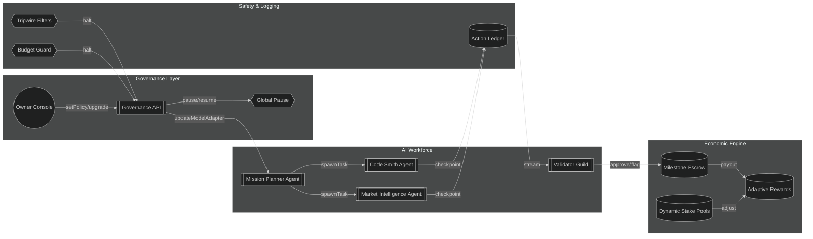

# Phase 8: Universal Value Dominance Demo

> "Phase 8" showcases how a non-technical founder can wield **AGI Jobs v0/v2** to spin up an unstoppable, massively-collaborative AI workforce in minutes. This demo is intentionally opinionated: it combines on-chain governance, autonomous swarms, human oversight, and relentless self-improvement into a single, production-ready launchpad.

## Demo Outcomes

- **Empower non-technical operators** to configure and deploy hour-long autonomous jobs, AI teams, and validator oversight without touching Solidity.
- **Deliver auditable economic controls** (scaled staking, milestone escrows, budget caps) that keep long-running swarms aligned with platform incentives.
- **Provide adaptive governance** so the contract owner (or delegated governors) can pause, re-route, or upgrade any subsystem in real time.
- **Make next-gen model upgrades trivial** via modular adapters, evaluation pipelines, and dynamic routing heuristics.

## Directory Map

```text
Phase-8-Universal-Value-Dominance/
├── README.md                     # This guide
├── playbook.md                   # Step-by-step orchestration for a non-technical operator
├── configs/
│   ├── job.multi-agent.json      # Declarative job spec for multi-agent swarms
│   ├── governance-policies.json  # Governance toggles & emergency levers
│   └── model-adapters.json       # Registry of pluggable model adapters with health scores
├── scripts/
│   ├── bootstrap-demo.ts         # Governance bootstrap planner (dry-run + optional on-chain execution)
│   ├── monitors.ts               # Safety tripwires, logging fan-out, budget watchdogs
│   └── evaluation-pipeline.ts    # Continuous evaluation harness for new models
├── ui/
│   ├── index.html                # Zero-install dashboard for orchestrating & monitoring the demo
│   └── styles.css
└── assets/
    └── orchestration-flow.mmd    # Mermaid diagram rendered in docs/UI
```

## How It Works (Executive Summary)



This graph is mirrored in the UI dashboard, giving non-technical operators a tactile understanding of the control plane.

## Production-Ready Assumptions

- **Ethereum mainnet** (or a rollup with equivalent guarantees) backs the staking + payout flows. All scripts use the existing Hardhat/Foundry toolchain in this repo.
- **Long-running agent containers** reuse the orchestrator runtime (`apps/orchestrator`), augmented by the checkpointing hooks in `scripts/monitors.ts`.
- **Validator guilds** connect via the attestation service already defined under `attestation/`.
- **Model adapters** conform to the `AgentModelAdapter` interface declared in `packages/agent-kit`.

## Quickstart (10 Minutes, Zero Solidity)

1. **Install deps:** `npm install`
2. **Copy environment template:** `cp .env.example .env` and fill RPC URLs + private keys (set `PHASE8_MANAGER_ADDRESS` if the manifest should be overridden).
3. **Run bootstrapper:** `npx tsx demo/Phase-8-Universal-Value-Dominance/scripts/bootstrap-demo.ts`
   - The command performs a dry run, regenerates governance artifacts, and prints call groups. Add `--execute` (optionally `-y`) once you are ready to broadcast transactions with the owner key.
4. **Open dashboard:** `npx serve demo/Phase-8-Universal-Value-Dominance/ui` and navigate to `http://localhost:3000`
5. **Activate mission:** Load `configs/job.multi-agent.json` in the dashboard, toggle governance presets, and press **Launch Mission**.
6. **Observe autonomy:** Watch live checkpoints, validator interventions, budget tripwires, and milestone payouts in the dashboard timeline.

## Why This Matters

- **Universal Value Dominance** is not a slogan—it is a governed, composable system that lets any motivated operator deploy a sovereign AGI workforce across governance, economics, and safety boundaries.
- **Self-improving loop:** Continuous evaluation + adapter registry ensures the swarm always routes tasks to the most capable, cheapest, and safest model available.
- **Human-first guardrails:** Even during multi-hour autonomy, validators can attach mid-flight, pause the mission, or slash misbehaving agents with one click.

Ready to go deeper? Read `playbook.md` for a detailed walkthrough with screenshots, CLI commands, and operator SOPs.
