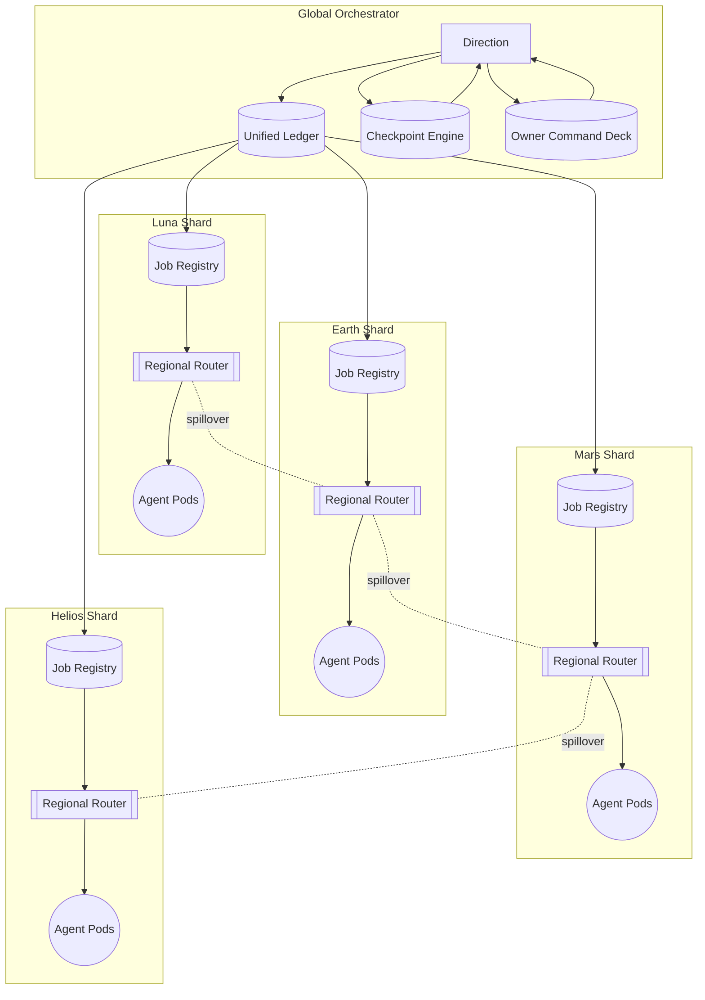

# Planetary Orchestrator Fabric v0

> **Empowerment Thesis:** A non-technical mission director can point AGI Jobs v0 (v2) at this directory and launch a resilient, Kardashev-grade, sharded orchestration fabric that feels like commanding a superintelligent planetary control room.

This demo packages **Planetary Orchestrator Fabric** as a runnable, checkpointable, owner-governed experience. It combines regional job registries, deterministic routing, containerized agent marketplaces, and recoverable checkpoint orchestration into a single guided flow. Every artifact, script, and UI asset is wired so the operator never needs to write code—yet they still command a planetary-scale intelligence network.

## Highlights

- 🌍 **Regional Sovereignty** – Earth, Luna, Mars, and Helios shards operate autonomously while reporting to a unified global ledger.
- 🛰️ **Deterministic Routing** – Regional routers enforce locality, latency budgets, and spillover rules with auditable policies.
- 🤖 **Containerized Agent Marketplace** – Nodes self-register with capabilities, heartbeats, and owner-managed quotas.
- 💾 **Crash-Proof Checkpointing** – A built-in recovery engine snapshots the entire fabric so runs resume exactly where they stopped.
- 🛡️ **Owner Supreme Controls** – The owner can pause, update, reprioritize, or surgically reroute jobs at any moment via declarative commands.
- 📈 **CI-Certified** – Dedicated workflows and tests guarantee green checks on every PR and on `main`.
- 🛰️ **Immersive UI** – Rich mermaid diagrams, dashboards, and walkthroughs translate complex topology into intuitive visuals.

## Quickstart (Non-Technical Operator)

1. **Install dependencies** (once per repository clone):
   ```bash
   npm install
   ```
2. **Prime environment** (copies env templates used by orchestrator + deployment tooling):
   ```bash
   cp orchestrator/.env.example orchestrator/.env
   cp deployment-config/.env.example deployment-config/.env
   ```
3. **Run the planetary fabric** (generates full reports + dashboard):
   ```bash
   demo/Planetary-Orchestrator-Fabric-v0/bin/run-demo.sh \
     --jobs 10000 \
     --simulate-outage "mars.gpu-helion" \
     --checkpoint-interval 30 \
     --output-label "kardashev-kill-switch"
   ```
4. **Open the dashboard** at `demo/Planetary-Orchestrator-Fabric-v0/reports/kardashev-kill-switch/dashboard.html` to explore live topology overlays, mermaid system diagrams, and owner command panels.
5. **Practice owner interventions** using the guided commands in [`docs/owner-control.md`](docs/owner-control.md) (pause, reroute, throttle, resume) against the generated state bundle—zero coding required.

The script defaults to the example configuration under `config/fabric.example.json`. Provide your own configuration (with mainnet deployment information, private IP ranges, funding accounts, etc.) by passing `--config path/to/config.json`.

## System Blueprint



## Directory Structure

| Path | Purpose |
| --- | --- |
| `bin/run-demo.sh` | One-command launcher for the full demo flow. |
| `config/fabric.example.json` | Declarative definition of shards, nodes, owner policies, checkpoint schedules. |
| `docs/architecture.md` | Deep dive into the architecture with additional diagrams, latency budgets, and ledger mapping. |
| `docs/owner-control.md` | Owner empowerment manual with pause/update scripts and governance hooks. |
| `docs/ci.md` | How CI guards this demo with enforced, reproducible checks. |
| `src/` | TypeScript source powering the orchestrator, routers, checkpoint manager, and simulation engine. |
| `tests/planetary_fabric.test.ts` | Deterministic assertions validating shard balance, failover (<2% drop), and checkpoint resume. |
| `ui/dashboard.html` | Pre-rendered dashboard template that visualizes run artifacts without a build step. |
| `reports/` | Generated output bundles; each run writes to a timestamped directory plus the chosen label. |
| `storage/` | Durable checkpoint snapshots; safe to commit sanitized templates, but not production secrets. |

## Operator Personas

- **Mission Director (Non-Technical):** Runs `bin/run-demo.sh`, opens the dashboard, and issues owner commands via provided JSON helpers.
- **Fabric Steward (Ops):** Extends `config/fabric.example.json` with production RPC endpoints, container registries, and budget guardrails.
- **Validator Guild:** Consumes the emitted ledger snapshots to audit consensus, payouts, and cross-shard spillover.
- **Governance Council:** Exercises the owner controls to rehearse pause/resume, thermostat tuning, or reward adjustments.

## What You Get After a Run

- ✅ **`summary.json`** – Throughput metrics, shard depths, failure recovery stats, deterministic seeds.
- ✅ **`events.ndjson`** – Chronological event stream ready for ingestion into SIEM/observability stacks.
- ✅ **`checkpoint.json`** – Final checkpoint snapshot enabling an instant resume.
- ✅ **`dashboard.html`** – Rich interactive briefing with mermaid flows, tables, and callouts.
- ✅ **`owner-script.json`** – Example governance payloads for immediate replay against the live stack.

## Branch Protection & CI

- `.github/workflows/demo-planetary-orchestrator-fabric.yml` enforces lint-free TypeScript compilation, automated tests, demo execution, and artifact validation.
- Pull requests touching this directory or its scripts **must** pass the workflow before merging.
- `docs/ci.md` explains how to extend branch protection rules so `main` stays permanently green.

## Next Steps

- Integrate live blockchain endpoints (mainnet, L2, or planetary rollups) by filling in the placeholders in `config/fabric.example.json`.
- Wire container registries and GPU fleets by connecting the node marketplace to Kubernetes, Nomad, or bare-metal pools.
- Attach treasury/payment processors via the existing reward engine scripts in `scripts/v2/`.
- Publish dashboards to IPFS or internal portals by copying the generated HTML + JSON artifacts.

The Planetary Orchestrator Fabric v0 demo proves that AGI Jobs v0 (v2) hands unprecedented, planetary-grade orchestration power to anyone—no code, no compromises, total owner control.
