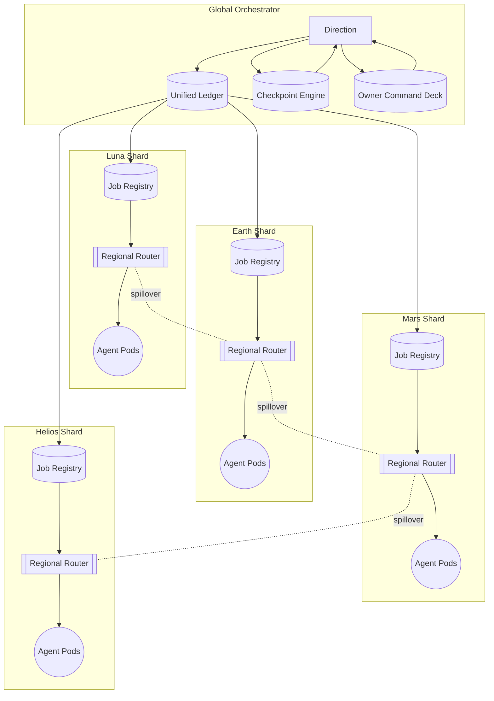
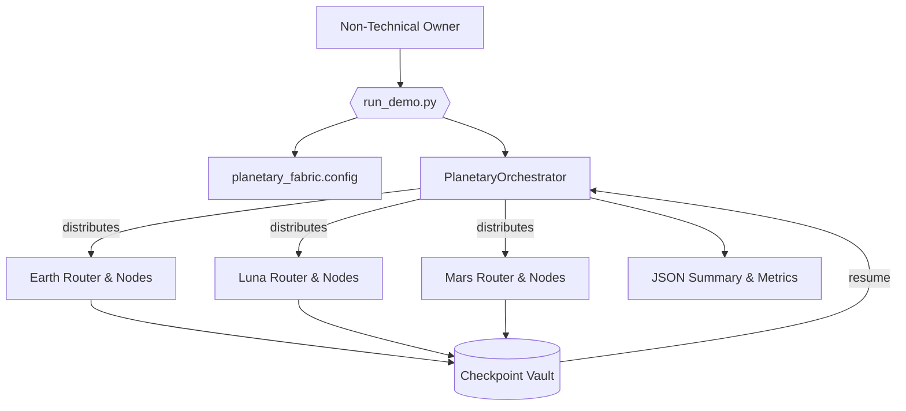

# Planetary Orchestrator Fabric v0

> **Empowerment Thesis:** A non-technical mission director can point AGI Jobs v0 (v2) at this directory and launch a resilient, Kardashev-grade, sharded orchestration fabric that feels like commanding a superintelligent planetary control room.

This demo packages **Planetary Orchestrator Fabric** as a runnable, checkpointable, owner-governed experience. It combines regional job registries, deterministic routing, containerized agent marketplaces, and recoverable checkpoint orchestration into a single guided flow. Every artifact, script, and UI asset is wired so the operator never needs to write code—yet they still command a planetary-scale intelligence network.

## Highlights

- 🌍 **Regional Sovereignty** – Earth, Luna, Mars, and Helios shards operate autonomously while reporting to a unified global ledger.
- 🛰️ **Deterministic Routing** – Regional routers enforce locality, latency budgets, and spillover rules with auditable policies.
- 🤖 **Containerized Agent Marketplace** – Nodes self-register with capabilities, heartbeats, and owner-managed quotas.
- 🧱 **Container DNA & Pricing Telemetry** – Marketplace snapshots expose container images, runtime orchestration, compliance envelopes, and per-job pricing for every node.
- 💾 **Crash-Proof Checkpointing** – A built-in recovery engine snapshots the entire fabric so runs resume exactly where they stopped.
- 🛡️ **Owner Supreme Controls** – The owner can pause, update, reprioritize, or surgically reroute jobs at any moment via declarative commands.
- 🧮 **Dynamic Shard Expansion** – Owners register and retire shards mid-run, spilling queued work into sister regions or cancelling it surgically with a single payload.
- 🧭 **Checkpoint Command Deck** – Owners retarget storage paths, tighten snapshot cadence, and trigger instant saves from the same schedule that drives pauses and reroutes.
- 🗂️ **Adaptive Reporting** – Owners redirect artifact directories and default labels on demand, with changes persisting across checkpoints and resumes.
- 🗺️ **Mission Topology Atlases** – Every run emits \`mission-topology.mmd\` and a ready-to-share HTML atlas that narrates shard health, node posture, and spillover links in living mermaid diagrams.
- 🧭 **Mission Plan Autopilot** – Load a single mission dossier (`config/mission-plan.example.json`) to orchestrate config, workloads, owner schedules, checkpoint cadence, and reporting targets in one declarative file.
- 📜 **Mission Chronicle** – Every execution publishes `mission-chronicle.md`, a narrative control-room briefing summarising metrics, owner interventions, and resilience signals.
- 📈 **CI-Certified** – Dedicated workflows and tests guarantee green checks on every PR and on `main`.
- 🛰️ **Immersive UI** – Rich mermaid diagrams, dashboards, and walkthroughs translate complex topology into intuitive visuals.
- 🖥️ **Zero-Config Mission Console** – Drop any `reports/<label>` folder onto `ui/dashboard.html` to inspect metrics, owner controls, and ledger flows without a build step.
- 🎛️ **Owner Command Schedules** – Load declarative schedules that trigger pause/resume, shard tuning, and node lifecycle actions mid-run.
- ♻️ **Zero-Downtime Restart Drill** – A two-stage launcher halts the orchestrator on command, resumes from checkpoint, and merges telemetry for auditors automatically.
- 🎯 **Surgical Job Control** – Owners reroute hot jobs across shards or cancel redundant work instantly without touching code.
- 📜 **Unified Ledger Telemetry** – A persistent planetary ledger captures shard totals, spillover flows, and audited invariants so operators can prove correctness in seconds.

## Quickstart (Non-Technical Operator)

1. **Install dependencies** (once per repository clone):
   ```bash
   npm install
   ```
2. **Prime environment** (copies env templates used by orchestrator + deployment tooling):
   ```bash
   cp orchestrator/.env.example orchestrator/.env
   cp deployment-config/.env.example deployment-config/.env
   ```
3. **Launch from the mission plan** (single command for config + owner schedule + blueprint):
  ```bash
  demo/Planetary-Orchestrator-Fabric-v0/bin/run-demo.sh \
     --plan demo/Planetary-Orchestrator-Fabric-v0/config/mission-plan.example.json
  ```
  The dossier sets checkpoint cadence, reporting targets, owner command schedules, and the Kardashev workload so non-technical operators can run a full drill without touching flags.
4. **Run the planetary fabric** (generates full reports + dashboard):
  ```bash
  demo/Planetary-Orchestrator-Fabric-v0/bin/run-demo.sh \
     --jobs 10000 \
     --jobs-blueprint demo/Planetary-Orchestrator-Fabric-v0/config/jobs.blueprint.example.json \
     --simulate-outage "mars.gpu-helion" \
     --checkpoint-interval 30 \
     --output-label "kardashev-kill-switch" \
     --owner-commands demo/Planetary-Orchestrator-Fabric-v0/config/owner-commands.example.json
  ```
  Every execution emits a living mermaid atlas at `reports/<label>/mission-topology.mmd` alongside `mission-topology.html` and a mission chronicle at `mission-chronicle.md`, giving non-technical owners a one-click planetary topology view plus an executive briefing.
5. **Execute the restart drill** to rehearse orchestrator kill/resume with merged telemetry:
  ```bash
  demo/Planetary-Orchestrator-Fabric-v0/bin/run-restart-drill.sh \
     --jobs 12000 \
     --stop-after 200 \
     --jobs-blueprint demo/Planetary-Orchestrator-Fabric-v0/config/jobs.blueprint.example.json \
     --label "resume-drill" \
     --owner-commands demo/Planetary-Orchestrator-Fabric-v0/config/owner-commands.example.json
  ```
  This invokes `--stop-after-ticks` under the hood, captures the checkpoint path from `summary.json`, and resumes automatically so non-technical owners see the drill succeed end-to-end.
6. **Launch the acceptance autopilot** to validate Kardashev-grade readiness in one shot:
  ```bash
  npm run demo:planetary-orchestrator-fabric:acceptance -- \
    --label planetary-acceptance \
    --jobs-high-load 10000 \
    --outage-node mars.gpu-helion
  ```
  Add `--jobs-blueprint demo/Planetary-Orchestrator-Fabric-v0/config/jobs.blueprint.example.json` to the command above to replay the curated Kardashev workload during the acceptance suite.
  This executes both the 10k-job load trial and the orchestrator kill/resume drill, fails fast if <98% of work completes, and writes a consolidated JSON verdict alongside all mission artifacts.
7. **Review telemetry in the static mission console** by opening `demo/Planetary-Orchestrator-Fabric-v0/ui/dashboard.html` in your browser and dropping the freshly generated `reports/<label>` folder onto the page. The console renders shard tables, owner command summaries, spillover mermaid diagrams, ledger invariants, and full container/pricing/compliance metadata instantly—even offline.
8. **Open the run-specific dashboard** at `demo/Planetary-Orchestrator-Fabric-v0/reports/<label>/dashboard.html` to explore the same data pre-linked to that execution with zero configuration.
9. **Practice owner interventions** using the guided commands in [`docs/owner-control.md`](docs/owner-control.md) (pause, reroute, throttle, resume) against the generated state bundle—zero coding required.

The script defaults to the example configuration under `config/fabric.example.json`. Provide your own configuration (with mainnet deployment information, private IP ranges, funding accounts, etc.) by passing `--config path/to/config.json`.

## Dynamic Shard Control (Edge Surge Drill)

- **Provision surge capacity:** Rehearse the new `shard.register` command by replaying the `edge-surge` payload from `owner-commands.example.json` or `owner-script.json`. The orchestrator spins up a fresh shard mid-run, routes workloads to it immediately, and checkpoints the topology change.
- **Retire without downtime:** Execute the matching `shard.deregister` payload to spill queued or in-flight jobs into Earth (or the target you specify) with deterministic accounting. Cancel mode is available when you want to evaporate work instead of redistributing it.
- **Dashboard confirmation:** The generated mission atlas highlights the new shard, the spillover arcs, and the retirement event so non-technical directors can prove the choreography without digging into code.

## Superintelligence Empowerment Playbook

- 📘 **Mission Chronicle:** Follow the [`docs/superintelligence-empowerment.md`](docs/superintelligence-empowerment.md) playbook for a step-by-step operator timeline, deterministic verification grid, and pitfall countermeasures tailored to non-technical mission directors.
- 🧠 **Total Owner Supremacy:** Replay the declarative payloads surfaced in `owner-script.json`, reconfigure checkpoints, and redirect report archives on demand—every control is exposed without touching code.
- 🪐 **Shard Shape-Shifting:** Toggle surge shards on and off using the new `shard.register` and `shard.deregister` payloads. Jobs can spill over into neighbouring regions or be retired instantly while the ledger and dashboards stay perfectly synchronized.
- 🛡️ **Self-Auditing Assurance:** Pair the playbook with `npm run demo:planetary-orchestrator-fabric:acceptance` to prove <2% drop rate, checkpoint recovery, and ledger invariants in one command, giving executives irrefutable confidence that they are steering a superintelligent planetary network.

## System Blueprint



## Directory Structure

| Path | Purpose |
| --- | --- |
| `bin/run-demo.sh` | One-command launcher for the full demo flow. |
| `bin/run-restart-drill.sh` | Two-phase orchestrator kill/resume drill that stitches checkpoint + resume artifacts. |
| `config/fabric.example.json` | Declarative definition of shards, nodes, owner policies, checkpoint schedules. |
| `config/jobs.blueprint.example.json` | Declarative workload blueprint empowering non-technical owners to set the planetary agenda. |
| `config/owner-commands.example.json` | Sample schedule of owner commands applied mid-run. |
| `config/mission-plan.example.json` | Unified mission dossier that links config, job blueprints, owner commands, checkpoints, and reporting overrides. |
| `docs/architecture.md` | Deep dive into the architecture with additional diagrams, latency budgets, and ledger mapping. |
| `docs/owner-control.md` | Owner empowerment manual with pause/update scripts and governance hooks. |
| `docs/ci.md` | How CI guards this demo with enforced, reproducible checks. |
| `docs/mission-blueprint.md` | End-to-end planning dossier covering task decomposition, verification matrices, and failure analysis. |
| `docs/restart-drill.md` | Step-by-step walkthrough of the orchestrator restart exercise and artifact interpretation. |
| `src/` | TypeScript source powering the orchestrator, routers, checkpoint manager, and simulation engine. |
| `tests/planetary_fabric.test.ts` | Deterministic assertions validating shard balance, failover (<2% drop), and checkpoint resume. |
| `ui/dashboard.html` | Drag-and-drop mission console that ingests `reports/<label>` bundles and renders metrics, owner controls, and ledger flows. |
| `reports/` | Generated output bundles; each run writes to a timestamped directory plus the chosen label. |
| `storage/` | Durable checkpoint snapshots; safe to commit sanitized templates, but not production secrets. |

## Operator Personas

- **Mission Director (Non-Technical):** Runs `bin/run-demo.sh`, opens the dashboard, and issues owner commands via provided JSON helpers.
- **Fabric Steward (Ops):** Extends `config/fabric.example.json` with production RPC endpoints, container registries, and budget guardrails.
- **Validator Guild:** Consumes the emitted ledger snapshots to audit consensus, payouts, and cross-shard spillover.
- **Governance Council:** Exercises the owner controls to rehearse pause/resume, thermostat tuning, or reward adjustments.

## What You Get After a Run

- ✅ **`summary.json`** – Throughput metrics (including cancellations), shard depths, failure recovery stats, deterministic seeds.
  - Includes a `run` object showing whether the run resumed from checkpoint, stopped early, or completed.
- ✅ **`events.ndjson`** – Chronological event stream ready for ingestion into SIEM/observability stacks.
- ✅ **`checkpoint.json`** – Owner-governed snapshot reflecting any retargeted path/interval updates for instant resume.
- ✅ **`dashboard.html`** – Rich interactive briefing with mermaid flows, tables, and callouts.
- ✅ **`owner-script.json`** – Example governance payloads for immediate replay against the live stack.
- ✅ **`owner-commands-executed.json`** – Ledger of scheduled, executed, skipped, and pending owner commands.
- ✅ **`ledger.json`** – Snapshot of the planetary ledger, including totals, spillover maps, invariant status, and an event sample for auditors.

## Branch Protection & CI

- `.github/workflows/demo-planetary-orchestrator-fabric.yml` enforces lint-free TypeScript compilation, automated tests, demo execution, and artifact validation.
- Pull requests touching this directory or its scripts **must** pass the workflow before merging.
- `docs/ci.md` explains how to extend branch protection rules so `main` stays permanently green.

## Next Steps

- Integrate live blockchain endpoints (mainnet, L2, or planetary rollups) by filling in the placeholders in `config/fabric.example.json`.
- Clone `config/jobs.blueprint.example.json` to define your own workload mix—adjust shard counts, skills, and durations, then pass the new file via `--jobs-blueprint`.
- Wire container registries and GPU fleets by connecting the node marketplace to Kubernetes, Nomad, or bare-metal pools.
- Attach treasury/payment processors via the existing reward engine scripts in `scripts/v2/`.
- Publish dashboards to IPFS or internal portals by copying the generated HTML + JSON artifacts.

The Planetary Orchestrator Fabric v0 demo proves that AGI Jobs v0 (v2) hands unprecedented, planetary-grade orchestration power to anyone—no code, no compromises, total owner control.

## Planetary Fabric Python Simulation Harness (AGI Jobs v0/v2 Empowerment)

To let non-technical owners rehearse the planetary workload without touching Node.js or container stacks, this demo now ships a fully self-contained Python orchestration harness inside [`planetary_fabric/`](planetary_fabric/). It mirrors the sharded registry, router, node marketplace, and checkpoint logic described above and can be executed with a single command.

### Quick interactive run

```bash
python demo/Planetary-Orchestrator-Fabric-v0/run_demo.py
```

The script provisions Earth/Luna/Mars shards, enqueues 10,000 planetary jobs, simulates an orchestrator crash, reloads from checkpoint, and prints a JSON control-room summary that highlights completion rate, shard balance, reassignment counts, and runtime. Non-technical operators only need Python 3.11+; the script auto-configures its import path and persists checkpoints under the chosen base directory.

### Deterministic acceptance tests

The new harness is covered by high-load and restart regression tests that run in CI alongside the existing TypeScript suite:

```bash
pytest demo/Planetary-Orchestrator-Fabric-v0/tests/test_simulation.py -q
```

Both tests simulate the 10k-job flood across shards. The second test forcefully kills the orchestrator mid-run, reloads from the saved checkpoint, and verifies that at least 98% of jobs succeed while the shard queues stay balanced. These runs complete in ~40 seconds on a laptop and emit human-readable telemetry that can be archived with the mission reports.

### Python package layout

```
planetary_fabric/
├── config.py          # Shard, node, checkpoint, and simulation dataclasses
├── jobs.py            # Job serialization helpers for persistence
├── nodes.py           # Containerized agent marketplace + heartbeat logic
├── orchestrator.py    # Global coordinator with checkpoint/restart
├── router.py          # Regional routers that isolate failures
└── simulation.py      # High-load scenarios and CLI integration
```

The harness is intentionally configuration-driven, so contract owners can edit [`planetary_fabric/config.py`](planetary_fabric/config.py) to add shards, upgrade nodes, or tighten checkpoint cadences without editing any other file. All governance knobs described earlier (pause, resume, reroute, spillover) remain under owner control.

### Mermaid overview (Python harness focus)



This Python layer coexists with the existing TypeScript and UI components: operators can use the lightweight harness for rapid drills, then graduate to the full containerized flow when ready.
