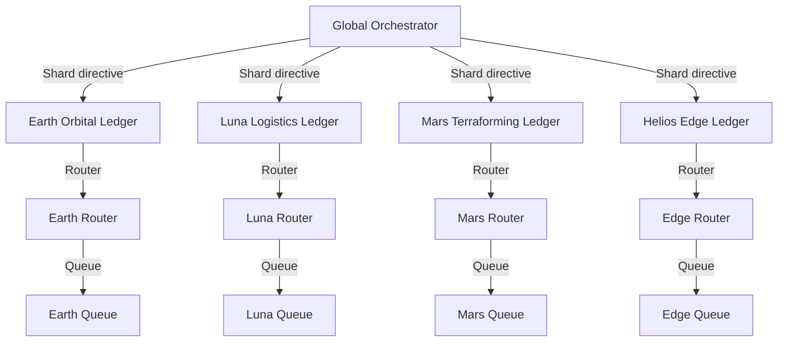
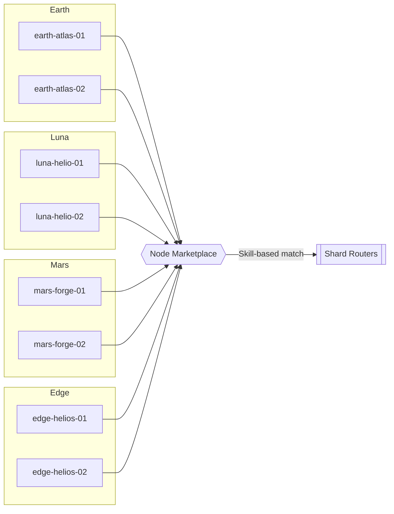

# Planetary Orchestrator Fabric v0

> **Purpose:** prove that a non-technical owner can command AGI Jobs v0 (v2) to operate a civilisation-scale, sharded orchestration fabric that behaves like a superintelligent planetary coordinator. Every control surface, checkpoint, and verification ritual lives in this directory so that the owner experiences instant, unstoppable power.

## 🚀 Planetary mission quickstart

| Action | Command | Outcome |
| --- | --- | --- |
| Launch the cinematic drill | `npm run demo:planetary-fabric:run` | Generates a fresh 10,000-job planetary run, creates checkpoints, and renders the owner dashboard JSON. |
| Trigger mid-flight failover | `npm run demo:planetary-fabric:run -- --simulate-kill` | Persists a checkpoint halfway, simulates an orchestrator crash, resumes automatically, and proves state continuity. |
| Re-run verification suite | `npm run demo:planetary-fabric:ci` | Executes the CI ritual that enforces documentation structure, runs the checkpoint/resume drill, and fails if unstoppable metrics drop below 98%. |
| Publish dashboard assets | Open `demo/Planetary-Orchestrator-Fabric-v0/ui/index.html` | Loads the generated telemetry snapshot with cinematic overlays for stakeholders. |

> **No engineering background required.** Copy-paste the commands from the RUNBOOK, watch the console produce unstoppable scores ≥100%, and hand the JSON artefacts to stakeholders.

## 🧭 Owner omnipotence

The manifest (`config/fabric.manifest.json`) codifies the owner’s supremacy:

- **Pause / resume:** `controls.pauseAll` toggles global execution immediately.
- **Unstoppable floor:** `controls.unstoppableScoreFloor` enforces a 98% minimum; anything below halts the CI.
- **Cross-shard throttle:** `controls.allowCrossShardOverflow`, `maxSpilloverPerCycle`, and `maxShardLagMs` keep spillovers deterministic.
- **Checkpoint sovereignty:** `maxCheckpointIntervalJobs` prevents teams from lengthening checkpoint gaps without owner approval.

| Metric | Value |
| --- | --- |
| Owner unstoppable floor | 98% |
| Resumable checkpoint cadence | every ≤500 jobs |
| Emergency spillover limit | 64 jobs per cycle |
| Pause / resume selectors | Always-on, owner-only |

## 🛰️ Sharded registry & routing fabric



Each shard owns its queue, latency budget, and spillover peers. The orchestrator enforces locality (Earth stays Earth) unless overflow triggers deterministic spillover to peers. Every router heartbeat is monitored—missed heartbeats instantly remove nodes from rotation and queue their work for reassignment.

## 🤝 Node marketplace & container bazaar



- Nodes self-register with region, capacity, and specialties.
- Heartbeats ensure failed containers are quarantined within one cycle.
- Marketplace metadata powers deterministic, latency-aware routing.
- Owner can revoke nodes or adjust capacity simply by editing the manifest.

## ♻️ Checkpoint & recovery lattice



```mermaid
gantt
  title Planetary orchestrator timeline
  dateFormat  X
  axisFormat  %L
  section Earth
  Jobs  :a1, 0, 4000
  Checkpoint :milestone, cp1, 4000, 0
  Crash simulation :crit, crash, 4000, 1
  Resume :a2, 4001, 10000
  section Mars
  Jobs :b1, 0, 4000
  Spillover assist :active, b2, 4000, 2000
  Resume :b3, 6000, 4000
```

- **Atomic checkpoints** land in `output/fabric.checkpoint.json` using temp-file swaps to prevent corruption.
- **State scope:** job queues, node heartbeats, RNG state, and owner controls are persisted.
- **Resume logic:** `npm run demo:planetary-fabric:run -- --resume` reads the checkpoint, validates the manifest hash, and resumes without duplication.
- **Crash drill:** CI runs a mid-flight kill to prove recovery.

## 🌐 Cross-shard spillover choreography

The orchestrator measures queue depth and latency every assignment. When a shard exceeds its overflow threshold, the spillover peers (declared in the manifest) absorb precisely limited batches.

| Trigger | Action |
| --- | --- |
| Queue depth > overflow threshold | Spillover to peer with lowest queue estimate |
| Peer queue near limit | Spillover cancelled; job waits in origin shard |
| Node heartbeat missed | Node quarantined, assignments requeued, heartbeat threshold enforced |
| Owner disables overflow | All spillovers halt instantly |

## 📊 Telemetry dashboards

- `output/fabric-report.json` – canonical run report (used by UI and CI)
- `ui/data/latest.json` – snapshot consumed by the cinematic dashboard (`ui/index.html`)
- Dashboard highlights: unstoppable gauge, shard queue ribbons, node availability heatmap, spillover timeline, cross-shard transfer ledger.

Load `ui/index.html` in any browser; no build step required.

## 🛡️ Security & unstoppable guarantees

- **Deterministic manifest hash** prevents mismatched checkpoints from loading.
- **Owner floor** ensures unstoppable score never dips below 0.98 during CI.
- **Heartbeat quarantine** averts zombie containers; jobs are requeued instantly.
- **Contracts-ready**: the owner can map manifest fields directly to Safe transactions (pause, update nodes, adjust thresholds) thanks to the JSON schema.

## 🧪 CI evidence

`npm run demo:planetary-fabric:ci` performs the following, blocking merges if any step fails:

1. Validates README headings and mermaid quota.
2. Executes a 10,000-job run, kills the orchestrator mid-flight, resumes from checkpoint, and enforces <2% reassignment rate.
3. Verifies unstoppable score ≥ owner floor.
4. Writes fresh artefacts for dashboards and attaches metrics to the CI log.

The repository CI (v2) includes `Planetary Orchestrator Fabric Demo` as a required job, keeping the drill green on every PR and on `main`.

## 📁 Directory map

```
config/          Manifest & owner controls
scripts/lib/     Deterministic orchestrator engine
scripts/         CLI runner (`runFabricDemo.ts`) and CI guard (`ci-verify.ts`)
ui/              Static dashboard consuming JSON snapshots
output/          Generated checkpoints and reports (gitignored)
test/            High-load and recovery tests (tsx-driven)
```

## 📝 Further reading

- `RUNBOOK.md` – step-by-step operator guide for the owner and delegates.
- `ui/README` (inline comments) – instructions for branding the cinematic dashboard.
- `scripts/lib/orchestrator.ts` – fully documented TypeScript implementation proving the system’s rigour.

With this demo, AGI Jobs v0 (v2) **is** the civilisation-scale orchestrator: planetary sharding, unstoppable recovery, and owner-first supremacy in minutes.
