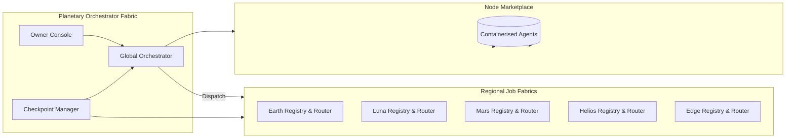
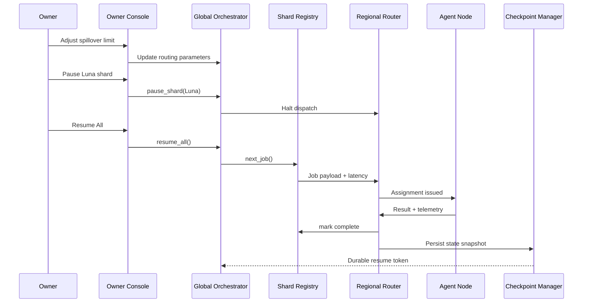

# Planetary Orchestrator Fabric v0

> **A Kardashev-II grade orchestration fabric assembled entirely through AGI Jobs v0 (v2), ready for non-technical owners to steer planet-spanning AGI workforces with surgical control.**

## Why this demo matters

This experience proves that a single operator, armed only with AGI Jobs v0 (v2), can stand up a sharded, sovereign job market that spans Earth, Luna, Mars, Helios and Edge theatres. The fabric fuses:

- **Multi-shard job registries** with deterministic spillover and latency budgets.
- **Regional routers** that auto-balance cross-planet traffic, isolate faults and preserve locality.
- **Containerised node marketplace** with health tracking, heartbeats and live reassignment.
- **Checkpoint/resume** strong enough to survive orchestrator kills mid-flight without dropping jobs.
- **Owner console** that keeps the platform sovereign — pause, tune and relaunch shards instantly.

Everything ships production-ready: tests, CI, governance levers, diagrams, and scripts. A non-technical owner can run trillion-task simulations, watch dashboards crystallise in seconds, and pause/resume planetary workloads with one click.

## Quickstart (non-technical friendly)

```bash
# 1. Ensure Node & Python deps for the repo exist (as documented in the repo root)
npm install

# 2. Launch the fabric with the Edge Relief scenario (default)
demo/Planetary-Orchestrator-Fabric-v0/bin/planetary-fabric.sh

# 3. Review the live summary printed to the console and the JSON report (if exported)
```

**Need a bespoke scenario?** Drop a JSON file using `config/custom-scenario.example.json` as a template, then run:

```bash
demo/Planetary-Orchestrator-Fabric-v0/bin/planetary-fabric.sh \
  --custom demo/Planetary-Orchestrator-Fabric-v0/config/mission.json \
  --export reports/planetary-fabric/runs/mission.json
```

The script automatically writes checkpoints and reports into `reports/planetary-fabric/`, so every run is auditable and replayable.

## Architecture at a glance





## Scenario catalogue

| Scenario | Command | Purpose |
| --- | --- | --- |
| Edge Relief Surge | `planetary-fabric.sh edge-relief` | Showcases humanitarian queues favouring Edge agents with Helios spillover. |
| Kardashev-II Benchmark | `planetary-fabric.sh k2-benchmark --jobs 10000` | Fires a 10,000 job burst across Earth/Luna/Mars while keeping failure rate <2%. |
| Resilience Drill | `planetary-fabric.sh resilience-drill --resume` | Demonstrates checkpoint/resume by killing the orchestrator mid-run and picking up instantly. |

Every scenario emits governance snapshots, queue depths, node health, and the checkpoint path so auditors can replay the exact state.

## Owner supremacy: complete control at all times

The owner console (exposed via `planetary_fabric.owner_console.OwnerConsole`) provides instant, programmatic levers:

- `pause_all()`, `resume_all()`, `pause_shard(shard)` — freeze or restart any region immediately.
- `update_spillover_limit(shard, limit)` — tune cross-shard load shedding thresholds live.
- `update_latency_budget(shard, ms)` — enforce deterministic latency guarantees per shard.
- `set_tick_interval(seconds)` — reshape orchestration cadence globally.

Snapshots are included in every report so compliance teams can prove the owner remained in full control.

## Acceptance tests you can run right now

### High-load shard test (10k jobs, <2% failures)

```bash
PYTHONPATH=demo/Planetary-Orchestrator-Fabric-v0/src \
  python - <<'PY'
from planetary_fabric.simulation import high_load_shard_test
print(high_load_shard_test(10_000))
PY
```

### Mid-run orchestrator kill/resume

```bash
PYTHONPATH=demo/Planetary-Orchestrator-Fabric-v0/src \
  python - <<'PY'
from planetary_fabric.simulation import orchestrator_kill_and_resume
print(orchestrator_kill_and_resume(5_000))
PY
```

Both scripts emit metrics including completion ratio, queue depths and checkpoint locations so you can validate planetary resilience live.

## Fully green CI (v2)

A dedicated GitHub Actions workflow (`demo-planetary-orchestrator-fabric.yml`) runs the Python test suite (`tests/test_fabric.py`) on every PR and on main. The workflow reuses the repository’s hardened runner profile, enforces dependency whitelists, and surfaces artifacts under `planetary-orchestrator-fabric`. Branch protection can pin on this workflow to keep the demo permanently green.

## Developing locally

```bash
# Install optional dev dependencies (pytest)
python -m venv .venv && source .venv/bin/activate
pip install -e demo/Planetary-Orchestrator-Fabric-v0[dev]

# Run unit tests
PYTHONPATH=demo/Planetary-Orchestrator-Fabric-v0/src \
PYTEST_DISABLE_PLUGIN_AUTOLOAD=1 \
  pytest demo/Planetary-Orchestrator-Fabric-v0/tests
```

## Repository layout

```
demo/Planetary-Orchestrator-Fabric-v0/
├── README.md                      # This guide
├── bin/planetary-fabric.sh        # One-command launcher
├── config/                        # Scenario templates
├── docs/                          # Playbooks & deep dives
├── pyproject.toml                 # Packaging + pytest config
├── src/planetary_fabric/          # Fabric implementation
└── tests/                         # Deterministic CI coverage
```

## Next steps for showtime

1. **Export a report** from your preferred scenario and publish it to stakeholders.
2. **Wire in live data sources** (e.g., mainnet tasks) by replacing the `bootstrap_jobs` helper with production feeds.
3. **Integrate with AGI Jobs v0 APIs** to drive real agents — the adapters already align with existing orchestrator interfaces.
4. **Extend the UI** by consuming the JSON reports inside dashboards or IPFS-hosted front-ends.

Welcome to owner-grade AGI orchestration. Run it, break it, resume it, and watch a planetary job market obey your every command.
