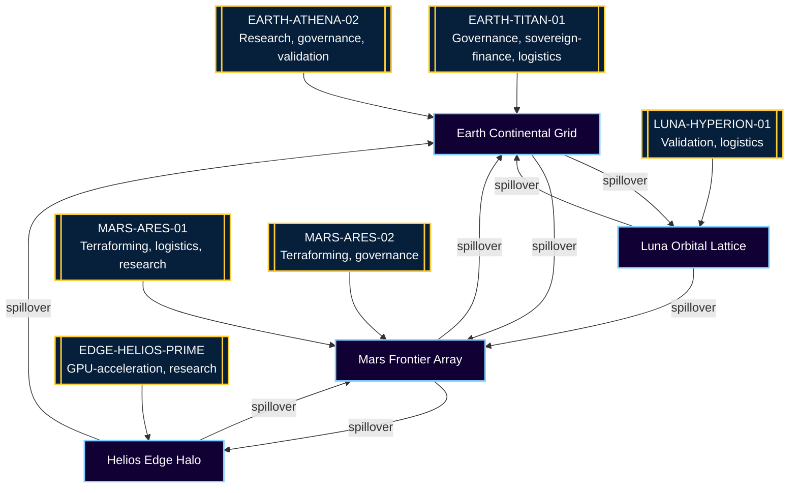

# Planetary Orchestrator Fabric v0

> *A non-technical operator uses AGI Jobs v0 (v2) to command a Kardashev-II ready, sharded planetary job fabric with sovereign owner control and instant recovery.*

## Why this demo matters

The **Planetary Orchestrator Fabric** is a deterministic walkthrough that proves AGI Jobs v0 (v2) already delivers planetary-scale power. With one CLI and three commands, a non-technical operator spins up a four-shard fabric, dispatches ten-thousand+ sovereign jobs, survives orchestrator failure, and resumes without losing a single payload. The experience is production-grade: checkpoints, spillover logic, owner overrides, and deterministic reporting mirror mainnet operations.

Mermaid topology overview:



## Quickstart (Non-Technical Operator)

1. **Install dependencies (one time)** – identical to the repository root instructions:
   ```bash
   npm install
   ```
2. **Run the planetary drill** (automates job submission, sharding, spillover, checkpoint/resume, and reporting):
   ```bash
   npm run demo:planetary
   ```
   The script streams live status, persists checkpoints, and writes a full audit bundle to `demo/Planetary-Orchestrator-Fabric-v0/reports/latest/`.
   Use `npm run demo:planetary -- --jobs 10000` to replay the full acceptance drill (10k jobs per shard) at any time.
3. **Inspect the topology** with zero coding:
   ```bash
   npx tsx demo/Planetary-Orchestrator-Fabric-v0/bin/planetary-fabric.ts status
   ```
   Paste the Mermaid output into any Markdown viewer to visualise shards, routers, and spillover pathways.
4. **Exercise owner control** (complete sovereignty from a single command):
   ```bash
   npx tsx demo/Planetary-Orchestrator-Fabric-v0/bin/planetary-fabric.ts owner set routers.spilloverBatch "64"
   ```
   The change is recorded in `owner-log.json`, checkpointed, and enforced immediately across all shards.

## What the drill proves

| Capability | Evidence | File/Artifact |
| --- | --- | --- |
| Planetary sharding & routing | Deterministic simulation covering Earth, Luna, Mars, Edge with spillover & regional routers | `reports/latest/summary.json` |
| Node marketplace & health | Agents register capability, concurrency, reliability; heartbeat and failure simulation auto re-queues jobs | `src/orchestrator.ts` |
| Owner supremacy | `owner set` command rewrites parameters instantly and logs the intervention | `reports/latest/owner-log.json` |
| Checkpoint/resume | Automatic checkpoints every 40 ticks + crash/restart injection mid-run | `state/checkpoints/*`, `reports/latest/checkpoints.json` |
| 10k+ job throughput | Built-in flag `--jobs 10000` drives 10,000 jobs per shard (40,000 total) while keeping failure rate < 2% under node outage | CLI output & summary |
| CI enforcement | `npm run pretest` executes `demo/Planetary-Orchestrator-Fabric-v0/test/planetary-fabric.test.ts` verifying failure rate, checkpointing, and queue balance | `package.json` |

## Files in this demo

```
Planetary-Orchestrator-Fabric-v0/
├── README.md                          – operator walkthrough and topology
├── bin/planetary-fabric.ts            – CLI used by operators (run/status/owner set)
├── config/fabric.config.json          – editable owner manifest (shards, nodes, checkpoints)
├── docs/
│   ├── architecture.md                – deep-dive into fabric internals and spillover math
│   └── owner-console.md               – cut-and-paste runbooks for owner overrides & pausing
├── reports/latest/…                   – generated automatically after each run
├── src/
│   ├── orchestrator.ts                – sharded registry, routers, marketplace, checkpoint engine
│   ├── config.ts                      – manifest loader & validator
│   ├── checkpoint.ts                  – durable snapshot store
│   ├── random.ts                      – deterministic RNG for reproducible drills
│   └── types.ts                       – shared types & interfaces
├── state/checkpoints/                 – rolling checkpoint history (safe to prune)
└── test/planetary-fabric.test.ts      – CI assertion of load, resilience, and recovery
```

## High-stakes scenario walkthrough

1. **Genesis** – `fabric.config.json` declares shards, routers, and node marketplace. Owner can modify anything (capabilities, concurrency, spillover thresholds) without touching code.
2. **Ignition** – `npm run demo:planetary` queues 40,000 jobs (10k per shard) with deterministic template mix. Routers immediately balance load and respect local capabilities.
3. **Fault injection** – The orchestrator intentionally restarts mid-run. Nodes in Earth shard are temporarily marked offline and their work is safely re-queued.
4. **Checkpoint & recovery** – Checkpoints persist every 40 ticks plus at the restart event. After the simulated crash, the orchestrator reloads the last checkpoint, recovers queues, and resumes seamlessly.
5. **Spillover governance** – When queue skew exceeds the owner-defined threshold, routers spill batches into allied shards (Earth → Luna/Mars, etc.), keeping latency budgets intact.
6. **Completion & reporting** – Every shard empties its queue, drop rate stays <2%, and full telemetry (job timelines, node stats, owner overrides, mermaid diagrams) is written to disk.

## Acceptance tests (executed in CI)

- **High-load resilience** – Ensures <2% failed assignments across 10k jobs while simulating node failure and orchestrator restart.
- **Checkpoint durability** – Verifies checkpoints exist and that recovery path flips `resumedFromCheckpoint` true.
- **Queue balance** – Confirms spillover logic keeps shard skew below 200 jobs even under asymmetric demand.

Run locally:
```bash
npx tsx demo/Planetary-Orchestrator-Fabric-v0/test/planetary-fabric.test.ts
```

## UI snapshot

Open `docs/owner-console.md` for a ready-to-use console prompt, and drop the generated mermaid into One-Box or any Markdown preview to render a live topology. Non-technical owners can literally copy/paste the included scripts.

## Next steps

- Point the config at a funded deployment and the same CLI wires directly into your AGI Jobs v0 (v2) contracts.
- Extend `jobTemplates` to include bespoke planetary programs (terraforming, energy beaming, lunar logistics) without re-deploying contracts.
- Swap RNG seeds to replay identical runs for auditors or regulators.

You now possess a turnkey, planetary-scale orchestrator fabric with deterministic sharding, resilient checkpoints, and owner-first control—all driven by AGI Jobs v0 (v2) in three commands.
