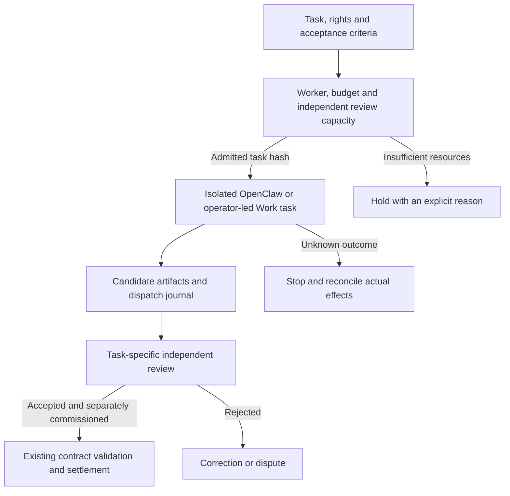

# Planetary Orchestrator Fabric

**A planetary coordination vision, built from scoped, verifiable computer work.** Coordinate skill-based job routing across Earth, Luna, Mars and Helios; rehearse outages, owner interventions and restarts; then produce a reviewable allocation through OpenClaw or ChatGPT Work.

The fabric's two simulators model scheduling. They do not deploy containers, contact advertised node endpoints, authenticate a multisig, run a live workforce or settle payments. The new **computer-work workbench** makes one practical task executable: create a resource-constrained allocation and independently verify its exported files. Original flowcharts, mission configurations, owner controls, PDF and PowerPoint remain available.

## Start here

From the repository root, use **Node 22.23.3** (`.nvmrc`) and **npm 10.x**. The workbench needs no installed dependencies:

```bash
npm run demo:planetary-orchestrator-fabric:workbench
```

Open **http://127.0.0.1:18791/**. Choose English or French, explore budget/reviewer limits and outages, and download `allocation.json` and `brief.md`. Stop the local server with **Ctrl+C**. It serves only the bundled public fixture files and does not execute work or accept writes. It must run on the computer that hosts the worker's browser.

To run the simulations and independent reviewer, install the repository's locked dependencies once:

```bash
npm ci
npm run demo:planetary-orchestrator-fabric -- --jobs 2000 --output-label first-mission
```

**View the result:** open [`ui/dashboard.html`](ui/dashboard.html) locally and choose the generated `reports/first-mission` folder. This avoids browsers blocking `fetch` on `file://` URLs. The generated `dashboard.html` can also be served over localhost; the bundled drag-and-drop viewer is the simplest path. Mermaid diagrams use the existing external renderer; raw `.mmd` sources remain in every report if that renderer is unavailable.

## Choose your route

| Goal | Route | Evidence |
| --- | --- | --- |
| Understand ten computer-work categories | Workbench above | Exact six-decimal USDC budget, independent-review capacity, explicit holds |
| Have OpenClaw or ChatGPT Work produce the allocation | [Computer-work runbook](docs/computer-work.md) | Exact task, exported files, task-bound receipt checks, local verdict |
| Rehearse 2,000 jobs and a node outage | `npm run demo:planetary-orchestrator-fabric:ci` | Simulated metrics, ledger, topology and chronicle |
| Rehearse shutdown and resume | `npm run demo:planetary-orchestrator-fabric:restart -- --jobs 2000 --stop-after 20 --label restart-demo` | Restored checkpoint and completion state; requires `jq` |
| Run load and recovery acceptance | `npm run demo:planetary-orchestrator-fabric:acceptance -- --label acceptance` | Scenario-specific acceptance assertions |
| Use a curated mission plan | `bash demo/Planetary-Orchestrator-Fabric-v0/bin/run-demo.sh --plan demo/Planetary-Orchestrator-Fabric-v0/config/mission-plan.example.json` | Blueprint, owner schedule and plan metadata |
| Explore the separate Python teaching model | `python demo/Planetary-Orchestrator-Fabric-v0/run_demo.py --base-dir /tmp/planetary-python --jobs 3000` | Async simulation metrics; not interchangeable with TypeScript checkpoints |

Use a new output label for each rehearsal you want to preserve. Labels accept letters, digits, dots, underscores and hyphens, without `..` or directory separators. Explicit configuration/report paths are operator-owned local destinations. Do not point them at source files or unrelated working folders. A normal rerun replaces named generated artifacts but preserves unrelated files. Use one process per checkpoint/report directory.

## Computer work: the practical unit

The workbench covers performance optimization, open-source features, API/SDK tooling, automated tests, AI evaluations, public-data dashboards, interactive demos, vendor research, executable documentation and scientific reproduction. Each real job needs approved inputs, an observable deliverable, a task-specific evaluator, suitable worker tools, spending/run limits and independent review.

The baseline **planning task** admits five hypothetical jobs, holds five, reserves **10,600.000000 USDC**, estimates **2,980.000000 USDC** in provider/review costs and uses **50 review minutes**. These are fixture assumptions. They are not observed execution costs, paid balances or settlement receipts. Worker slots are sequential jobs in a planning batch, not concurrent access to one desktop. The existing large-scale simulator's `value` fields remain abstract weights, not a USDC payment ledger.

OpenClaw's native Codex Computer Use and the ChatGPT Work desktop/browser surfaces can expand the kinds of lawful screen-based tasks an agent attempts. Capability depends on installed tools, account access, OS permissions and measured task performance. The integration retains explicit task admission, persistent replay protection and independent evaluation; a completed model turn does not prove the work is correct.

The **$40 trillion/year** opportunity is preserved as the project's **unverified planning assumption** for screen-based labor. The workbench makes illustrative capture fractions explorable. Gross work value, actual addressable demand, reliable fulfillment, customer adoption and platform revenue are different quantities.

## Systems Map

```mermaid
flowchart LR
    Operators((Mission Owners)) --> demo_Planetary_Orchestrator_Fabric_v0[[Demo → Planetary Orchestrator Fabric v0]]
    demo_Planetary_Orchestrator_Fabric_v0 --> Core[[AGI Jobs v0 (v2) Core Intelligence]]
    Core --> Observability[[Unified CI / CD & Observability]]
    Core --> Governance[[Owner Control Plane]]
```

## From a mission to accepted work


```mermaid
flowchart TD
    Mission["Task, rights and acceptance criteria"] --> Capacity["Worker, budget and independent review capacity"]
    Capacity -->|Admitted task hash| Worker["Isolated OpenClaw or operator-led Work task"]
    Capacity -->|Insufficient resources| Hold["Hold with an explicit reason"]
    Worker --> Evidence["Candidate artifacts and dispatch journal"]
    Worker -->|Unknown outcome| Reconcile["Stop and reconcile actual effects"]
    Evidence --> Review["Task-specific independent review"]
    Review -->|Accepted and separately commissioned| Settlement["Existing contract validation and settlement"]
    Review -->|Rejected| Correction["Correction or dispute"]
```

## Reliability and limits

- Launchers now resolve the repository correctly, work from other directories, reject unknown options and finish a mission plan's second restart stage without inheriting its earlier stop limit.
- Resume requires a real checkpoint. Versioned TypeScript checkpoints use SHA-256 corruption detection and atomic replacement. A hash is **not a signature**. Earlier unversioned snapshots fail closed; preserve them and start a separately labeled simulation. Never use simulator recovery to retry unknown real-world effects.
- Report labels, timing, configurations and blueprints are checked before starting output. Duplicate jobs and execution before `submissionTick` are rejected. The automatic tick budget includes the latest pending submission, including after checkpoint resume; an explicit stop limit still takes precedence. Unserviceable jobs remain pending without hanging the router.
- Shard and node registrations and updates validate the prospective topology before mutation. Spillover targets must identify another existing shard, and node regions must identify an existing shard, so rejected commands leave recoverable state unchanged.
- Simulated owner commands remain local commands, not signed on-chain authorization. Node images, endpoints, prices and compliance labels are illustrative metadata. Planetary regions are scenario names.
- The Python model is an asynchronous teaching implementation. It does not enforce the TypeScript model's full scheduling policy, and its `--seed` controls payload generation, not all timing/failure interleavings. It is not the production worker scheduler.
- Production requires deployment-specific live-provider trials, remote enforcement of permissions and budgets, unrelated validators, durable storage/stop controls, and verified contract settlement. No simulation or fixture pass establishes those results.

## Verify changes

```bash
npm run lint:planetary-orchestrator-fabric
npm run test:planetary-orchestrator-fabric
npm run test:planetary-orchestrator-fabric:regressions
python -m pytest demo/Planetary-Orchestrator-Fabric-v0/tests/test_simulation.py -q
```

The [dedicated workflow](../../.github/workflows/demo-planetary-orchestrator-fabric.yml) runs the relevant checks and acceptance rehearsal. Changes land through a pull request with required checks green. Repository-wide contract/deployment procedures remain in [RUNBOOK.md](../../RUNBOOK.md) and [OperatorRunbook.md](../../OperatorRunbook.md).

## Explore the preserved fabric

- [Architecture and planetary topology](docs/architecture.md)
- [Owner controls](docs/owner-control.md) · [Mission plans](docs/mission-plan.md) · [Job blueprints](docs/mission-blueprint.md)
- [Restart drill](docs/restart-drill.md) · [Ledger verification](docs/ledger-verification.md) · [CI](docs/ci.md)
- [Empowerment playbook](docs/superintelligence-empowerment.md)
- [Original presentation PDF](presentation/Planetary_Orchestrator_Fabric_v0.pdf) · [Original PowerPoint](presentation/Planetary_Orchestrator_Fabric_v0.pptx)

The presentation files are preserved design material. Current runnable behavior and qualification limits are documented here and in the computer-work runbook.
