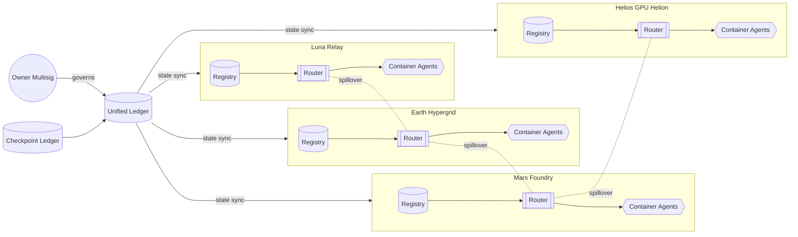

# Planetary Orchestrator Fabric – Architecture Dossier

The Planetary Orchestrator Fabric is engineered to give a single owner deterministic command over a multi-region AGI workforce. This dossier decomposes the fabric into its core building blocks and exposes the telemetry, routing policies, and failure domains.

## Planetary Topology

## Shard Specification

| Shard | Queue Budget | Latency Budget | Spillover Rules | Primary Specialties |
| --- | --- | --- | --- | --- |
| Earth | 6000 | 120 ms | Favors Luna, then Mars | Finance, compliance, high-trust orchestration |
| Luna | 2400 | 180 ms | Spill back to Earth | Navigation, orbital logistics |
| Mars | 4000 | 420 ms | Spill to Earth or Helios | Manufacturing, terraforming |
| Helios | 2200 | 850 ms | Spill to Mars | GPU-intensive analytics, solar observation |

## Node Marketplace

Nodes register declaratively. The orchestrator enforces owner-set maximum concurrency, latency windows, and heartbeat intervals.

| Node ID | Region | Capacity | Max Concurrency | Heartbeat | Capabilities |
| --- | --- | --- | --- | --- | --- |
| `earth.core-alpha` | Earth | 24 | 24 | 12 s | general, finance, compliance |
| `earth.edge-europa` | Earth | 16 | 12 | 18 s | logistics, iot, edge |
| `luna.nav-station` | Luna | 12 | 10 | 18 s | navigation, observation |
| `mars.regolith-cradle` | Mars | 18 | 14 | 20 s | manufacturing, terraforming |
| `mars.gpu-helion` | Mars | 32 | 20 | 10 s | gpu, vision, simulation |
| `helios.solaris-array` | Helios | 28 | 18 | 9 s | gpu, astronomy |

## Event Loop

1. **Job Intake** – Jobs flow into shard registries with metadata: region, deadline, skills, budget.
2. **Routing** – Regional routers perform deterministic matching using weighted capacity, skill alignment, and latency budgets.
3. **Assignment** – Nodes accept workloads up to `maxConcurrency`. Overflow triggers deterministic spillover to configured shards.
4. **Heartbeat Audit** – The orchestrator expects heartbeats within the configured interval. Missed heartbeats mark the node unhealthy.
5. **Failure Recovery** – Jobs running on failed nodes are re-queued in the originating shard. If backlog > `maxQueue`, spillover engages.
6. **Checkpoint** – Every `intervalTicks` the orchestrator writes a full snapshot (shards, jobs, node health, metrics).
7. **Owner Hooks** – Owner commands modify shard budgets, pause/resume, or inject governance payloads in real-time.

## Persistence

- **Checkpoint Ledger** (`storage/checkpoint.json`) stores deterministic snapshots.
- **Event Stream** (`reports/<label>/events.ndjson`) provides chronological telemetry for observability.
- **Summary** (`reports/<label>/summary.json`) aggregates throughput, latency, failure statistics, and deterministic seeds.
- **Owner Scripts** (`reports/<label>/owner-script.json`) enumerates ready-to-run governance payloads.

## Security Considerations

- Owner multisig is the only actor authorized to modify shard weights, pause the system, or apply thermostat changes.
- Spillover routes are deterministic and signed. Unauthorized shards cannot inject tasks without owner-approved credentials.
- Checkpoints include integrity hashes to detect tampering before resuming a run.
- Node marketplace requires authenticated heartbeats; the demo provides local signing stubs that operators replace with production wallets or TPM-backed keys.

## Extensibility Hooks

- **Blockchain Integration:** Replace the mock ledger in `src/orchestrator.ts` with actual contract calls using `ethers` or Hardhat runners.
- **Container Backend:** Attach `src/nodeMarketplace.ts` to Kubernetes, Nomad, or bare metal by implementing the `NodeProvider` interface.
- **Reward Engine:** Connect to `scripts/v2/rewardEngineReport.ts` for real payout calculations.
- **Observability:** Stream `events.ndjson` into the observability stack via Fluent Bit or Loki.

The architecture is tuned so a single operator—without writing a single line of code—can command a planetary intelligence fabric while retaining full custodial control.
