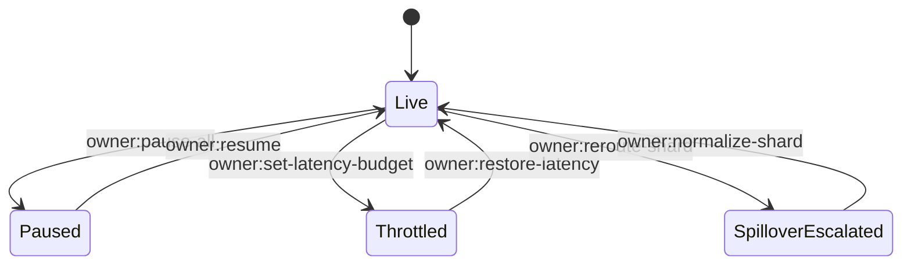

# Owner Command Deck – Planetary Orchestrator Fabric

The owner wields absolute authority over the fabric. This manual demonstrates how non-technical operators execute pause/resume, reroute workloads, and adjust shard policies without modifying code.

## Golden Rules

1. **Single source of truth:** Only the owner multisig defined in `config/fabric.example.json` can push changes.
2. **Declarative commands:** All interventions are JSON payloads replayed via `scripts/v2/` or the orchestrator owner console.
3. **Auditability first:** Every command writes to `reports/<label>/owner-script.json` and `events.ndjson`.

## Control Surface



## Core Commands

### Pause Everything

```bash
npm run owner:system-pause -- \
  --network sepolia \
  --pause-contract 0xSystemPauseAddress \
  --reason "Drill: Helios spillover protection"
```

The demo generates an equivalent payload inside `reports/<label>/owner-script.json` under `"pauseAll"` so you can replay it verbatim.

### Update Latency Budgets

```bash
node scripts/v2/ownerControlSurface.ts \
  --action set-latency-budget \
  --shard mars \
  --latency-ms 350 \
  --multisig 0xFABR1C00000000000000000000000000000000MS
```

The orchestrator instantly applies the change and persists the update inside `summary.json`.

### Force Spillover to Helios

```bash
node scripts/v2/ownerControlSurface.ts \
  --action reroute-shard \
  --source earth \
  --target helios \
  --reason "Earth backlog > 90%"
```

### Command the Checkpoint Engine

- **Trigger an immediate checkpoint** when you want a golden snapshot before governance actions:

  ```bash
  node scripts/v2/ownerControlSurface.ts \
    --action checkpoint-save \
    --reason "Archive state before Helios redeployment"
  ```

- **Retarget checkpoint cadence & storage** without restarting the orchestrator:

  ```bash
  node scripts/v2/ownerControlSurface.ts \
    --action checkpoint-configure \
    --interval 20 \
    --path demo/Planetary-Orchestrator-Fabric-v0/storage/checkpoints/mainnet-governance.json \
    --reason "Mainnet launch hardening"
  ```

- The orchestrator immediately persists the new settings and records them under `ownerState.checkpoint` and the next `checkpoint.json` artifact.

### Resume From Checkpoint

1. Stop the orchestrator (or simulate a crash with `Ctrl+C`).
2. Run `demo/Planetary-Orchestrator-Fabric-v0/bin/run-demo.sh --resume --checkpoint demo/Planetary-Orchestrator-Fabric-v0/storage/checkpoint.json`.
3. Confirm the resume log prints `"checkpointRestored": true`.

## Customizing for Production

| Control | Demo Implementation | Production Hook |
| --- | --- | --- |
| Pause / Resume | `owner:system-pause` script | Gnosis Safe transaction or multisig contract call |
| Latency Budgets | JSON patch in orchestrator runtime | On-chain parameter update via `SystemPause.executeGovernanceCall` |
| Spillover | Deterministic router rule update | Emission of governance event consumed by routers |
| Thermostat | JSON payload in `owner-script.json` | `owner:update-thermostat` script hitting RewardEngineMB |
| Node Quotas | Config patch + heartbeat filter | Kubernetes/HashiCorp Nomad autopilot APIs |

## Scheduling Commands Ahead of Time

- **Load declarative schedules** by passing `--owner-commands demo/Planetary-Orchestrator-Fabric-v0/config/owner-commands.example.json` to `bin/run-demo.sh`. The orchestrator will automatically execute each entry at the specified tick.
- The schedule format mirrors `OwnerCommand` payloads. Example excerpt:

  ```json
  {
    "tick": 155,
    "note": "Boost Earth queue budget to handle backlog",
    "command": {
      "type": "shard.update",
      "shard": "earth",
      "update": {
        "maxQueue": 6400,
        "router": { "queueAlertThreshold": 3600 }
      }
    }
  }
  ```

- After each run, `owner-commands-executed.json` reports which commands executed, which were skipped (e.g., resumed from checkpoint), and which remain pending.
- Schedule payloads may include `checkpoint.save` (instant snapshot) and `checkpoint.configure` (update interval/path) entries; CI validates both commands execute cleanly.

## Direct Owner Command Payloads

`owner-script.json` now emits two complementary blocks:

1. **Legacy payloads** (`pauseAll`, `rerouteMarsToHelios`, `adjustLatency`, `resumeAll`) for existing on-chain command surfaces.
2. **Direct owner commands** aligned with the orchestrator’s runtime (`system.pause`, `shard.update`, `node.register`, etc.) so operators can patch configuration mid-flight. Example:

   ```json
   {
     "directOwnerCommands": {
       "registerHeliosBackup": {
         "type": "node.register",
         "reason": "Spin up backup GPU helion",
         "node": {
           "id": "helios.solaris-backup",
           "region": "helios",
           "capacity": 20,
           "specialties": ["gpu", "astronomy"],
           "heartbeatIntervalSec": 9,
           "maxConcurrency": 12
         }
       }
     }
   }
   ```

Use these payloads with `run-demo.sh --owner-commands`, or apply them interactively by piping JSON into your governance tooling.

## Safety Net Checklist

- ✅ `owner-script.json` contains the exact command payloads for replay.
- ✅ `summary.json` echoes the updated policies so auditors can verify intent vs effect.
- ✅ `events.ndjson` logs the change with timestamp, owner signature, and hash.
- ✅ `checkpoint.json` records the new state so restarts never revert policies.

Use this manual to keep the owner in full command across planetary distances without touching a code editor.
