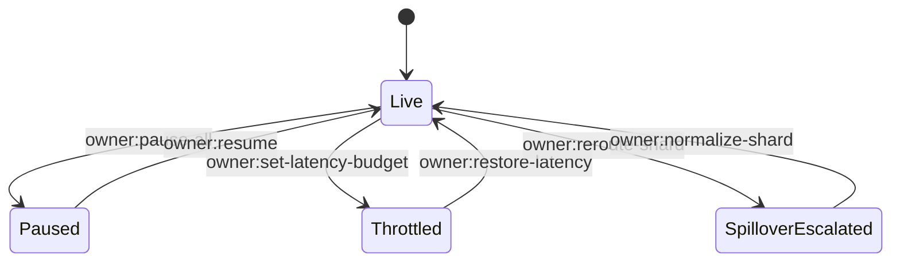

# Owner Command Deck – Planetary Orchestrator Fabric

The owner wields absolute authority over the fabric. This manual demonstrates how non-technical operators execute pause/resume, reroute workloads, and adjust shard policies without modifying code.

## Golden Rules

1. **Single source of truth:** Only the owner multisig defined in `config/fabric.example.json` can push changes.
2. **Declarative commands:** All interventions are JSON payloads replayed via `scripts/v2/` or the orchestrator owner console.
3. **Auditability first:** Every command writes to `reports/<label>/owner-script.json` and `events.ndjson`.

## Control Surface



## Core Commands

### Pause Everything

```bash
npm run owner:system-pause -- \
  --network sepolia \
  --pause-contract 0xSystemPauseAddress \
  --reason "Drill: Helios spillover protection"
```

The demo generates an equivalent payload inside `reports/<label>/owner-script.json` under `"pauseAll"` so you can replay it verbatim.

### Update Latency Budgets

```bash
node scripts/v2/ownerControlSurface.ts \
  --action set-latency-budget \
  --shard mars \
  --latency-ms 350 \
  --multisig 0xFABR1C00000000000000000000000000000000MS
```

The orchestrator instantly applies the change and persists the update inside `summary.json`.

### Force Spillover to Helios

```bash
node scripts/v2/ownerControlSurface.ts \
  --action reroute-shard \
  --source earth \
  --target helios \
  --reason "Earth backlog > 90%"
```

### Resume From Checkpoint

1. Stop the orchestrator (or simulate a crash with `Ctrl+C`).
2. Run `demo/Planetary-Orchestrator-Fabric-v0/bin/run-demo.sh --resume --checkpoint demo/Planetary-Orchestrator-Fabric-v0/storage/checkpoint.json`.
3. Confirm the resume log prints `"checkpointRestored": true`.

## Customizing for Production

| Control | Demo Implementation | Production Hook |
| --- | --- | --- |
| Pause / Resume | `owner:system-pause` script | Gnosis Safe transaction or multisig contract call |
| Latency Budgets | JSON patch in orchestrator runtime | On-chain parameter update via `SystemPause.executeGovernanceCall` |
| Spillover | Deterministic router rule update | Emission of governance event consumed by routers |
| Thermostat | JSON payload in `owner-script.json` | `owner:update-thermostat` script hitting RewardEngineMB |
| Node Quotas | Config patch + heartbeat filter | Kubernetes/HashiCorp Nomad autopilot APIs |

## Safety Net Checklist

- ✅ `owner-script.json` contains the exact command payloads for replay.
- ✅ `summary.json` echoes the updated policies so auditors can verify intent vs effect.
- ✅ `events.ndjson` logs the change with timestamp, owner signature, and hash.
- ✅ `checkpoint.json` records the new state so restarts never revert policies.

Use this manual to keep the owner in full command across planetary distances without touching a code editor.
