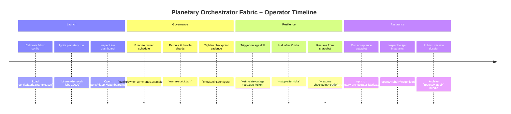

# Superintelligence Empowerment Playbook

The Planetary Orchestrator Fabric demo is designed so a non-technical owner can direct a superintelligent, planetary-scale workforce without writing code. This playbook distills the mission into decisive actions, verifications, and recovery drills that prove AGI Jobs v0 (v2) grants total operational dominance.

## Mission Timeline

## Operator Checklist

1. **Prime the environment** using the quickstart in the README. Copy the `.env` templates and run `npm install` once.
2. **Launch** the fabric with `bin/run-demo.sh`. Supply `--output-label` to route artifacts into a named directory.
3. **Load the dashboard** (`ui/dashboard.html`) to review the topology, job flows, and restart drill guidance without a build step.
4. **Replay governance payloads** from `reports/<label>/owner-script.json` or generate new ones with `npm run owner:system-pause` etc.
5. **Rehearse the restart drill** via `bin/run-restart-drill.sh --stop-after 200`. The script halts the orchestrator, extracts the checkpoint path from `summary.json`, and resumes automatically.
6. **Validate planetary resilience** by executing `npm run demo:planetary-orchestrator-fabric:acceptance -- --label planetary-acceptance`. The harness proves that:
   - <2% of jobs drop during 10k-load with a simulated node outage.
   - The orchestrator can be killed mid-run and resume from checkpoint without duplication or loss.
7. **File the audit bundle** by shipping `summary.json`, `events.ndjson`, `ledger.json`, and the owner command logs to your archival system.

## Multi-Angle Verification Grid

| Perspective | Command | Evidence Produced |
| --- | --- | --- |
| Deterministic execution | `npm run test:planetary-orchestrator-fabric` | Validates shard balance, node outage recovery, deterministic replay, and owner command supremacy. |
| CI parity | GitHub workflow `demo-planetary-orchestrator-fabric` | Enforces lint, tests, CI-mode demo, acceptance autopilot, and artifact validation on every PR and on `main`. |
| Production rehearsal | `bin/run-restart-drill.sh` | Demonstrates controlled crash/restart with merged telemetry for auditors. |
| Governance resilience | `config/owner-commands.example.json` (executed via CLI) | Exercises pause/resume, shard updates, node registration, checkpoint rotation, and reporting retargeting mid-run. |
| Ledger integrity | Inspect `reports/<label>/ledger.json` | Shows totals, spillover counts, reassignments, and invariants that must all pass. |

## Owner Control Surface Quick Reference

- **Pause / resume everything:** `owner:system-pause`, `owner:mission-control --action resume`.
- **Shard tuning:** `owner:command-center --action shard-update --shard <id> --queue-alert <value>`.
- **Node lifecycle:** `owner:command-center --action node-register --node-file <json>` or `--action node-deregister --node-id <id>`.
- **Job surgery:** Use `job.reroute` or `job.cancel` locators to move or remove work from any shard, including in-flight tasks.
- **Checkpoint mastery:** Combine `checkpoint.configure` and `checkpoint.save` commands to rotate storage paths and snapshot cadence instantly.
- **Reporting retarget:** `reporting.configure` ensures dashboards, summaries, and event logs follow the owner’s preferred archive without downtime.

## Pitfall Radar & Countermeasures

- **Massive backlog growth:** Configure spillover policies in `config/fabric.example.json` and confirm they activate via `events.ndjson` spillover entries.
- **Node churn:** Watch `getHealthReport()` output or the dashboard’s node panel to confirm nodes that miss heartbeats are quarantined and their jobs reassigned.
- **Checkpoint drift:** After `checkpoint.configure`, run `checkpoint.save` and verify the new path in `summary.json.ownerState.checkpoint`.
- **Report hygiene:** Ensure `summary.json`, `events.ndjson`, `owner-commands-executed.json`, and `ledger.json` live under the retargeted directory—CI will fail if any artifact is missing.
- **Shard imbalance:** Consult `reports/<label>/summary.json.shards.*.queueDepth` and execute `job.reroute` to rebalance within milliseconds.

## Final Reflective Pass

Walk the entire flow once more—from configuration through restart drill—and confirm every artifact updates as expected. If any invariant or log looks suspicious, re-run the acceptance autopilot to reproduce deterministic telemetry. The demo remains fully owner-governed, audit-ready, and ready for mainnet-scale deployment without requiring the operator to touch source code.
