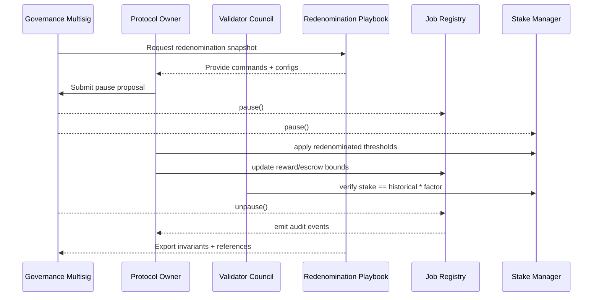

# AGI Jobs v2 – "REDENOMINATION" Superintelligence Control Room

The **REDENOMINATION** demonstration shows a non-technical operator how to execute a
network-wide unit-of-account rebasing for AGI Jobs v2 in minutes. By combining the
`redenominationPlaybook` generator, curated configuration bundles, and a browser-based
mission control, the operator pauses production, converts every treasury balance,
and resumes the platform with audited proofs — **without writing a single line of
code**.

> **Purpose** – prove that AGI Jobs v2 turns macro-monetary maintenance into a
> guided, deterministic workflow run by policy teams rather than protocol
> engineers. The playbook maps every governance, validation, and audit action to a
> click-or-copy command while preserving the protocol's safety guarantees.

## Key capabilities

- **Governed autonomy** – the playbook enumerates all multisig checkpoints and
  pause/resume guards so community governors maintain final authority while
  automation handles the mechanics.
- **Verifiable compute** – each redenomination step emits structured artefacts
  (`ui/export/latest.json`, config bundles, ledger snapshots) that the control room
  surfaces for independent validation.
- **Anti-collusion validation** – validators remain staked at identical real-world
  amounts post-rebasing; the UI highlights committee quorum checks and
  post-migration dispute gates.
- **Institutional observability** – live dashboards render the before/after
  economics, recommended commands, and audit trails for regulators and operators.
- **One-command deployment** – `npm run demo:redenomination:control-room` generates
  the plan, rewrites module configs, serves the UI, and guides the operator through
  every click.

```mermaid
graph LR
  A[Owner invokes playbook] --> B[Playbook exports redenomination bundle]
  B --> C[Governance multisig pauses modules]
  C --> D[Ledger migration script applies factor]
  D --> E[Stake manager + Job registry configs updated]
  E --> F[Validators attest supply invariants]
  F --> G[Pause lifted and certificates minted]
  G --> H[Observability dashboard confirms parity]
```



## Quickstart

From the repository root:

```bash
npm run demo:redenomination:export
```

The command performs the following:

1. Reads the production defaults from `config/`.
2. Computes a 1:1000 redenomination (`AGIALPHA` → `AGIΩ`).
3. Writes the human-readable playbook to
   `demo/REDENOMINATION/ui/export/latest.json`.
4. Produces ready-to-execute module configs inside `demo/REDENOMINATION/config/`.

To launch the guided control room that refreshes the export and serves the
visual dashboard:

```bash
npm run demo:redenomination:control-room
```

The CLI refreshes the playbook, hosts the UI at `http://127.0.0.1:4174`, and
listens for **Enter** to replay the redenomination drill on demand.

## What the operator receives

- **Mission playbook** – exhaustive JSON describing all governance actors,
  timeline checkpoints, and invariants.
- **Redenomination configs** – drop-in Hardhat configs for
  `updateStakeManager.ts` and `updateJobRegistry.ts` so policy teams can copy-paste
  the new parameters.
- **Audit artefacts** – pre/post supply numbers, timeline checkpoints, and required
  verification commands embed into the export for off-chain or on-chain attestors.
- **Narrated UI** – `ui/index.html` renders the plan with accessibility-first
  layouts, mermaid schematics, and multilingual-ready copy.

## Files & structure

```
REDENOMINATION/
├── README.md                       ← this document
├── config/                         ← redenominated module configs
│   ├── job-registry-redenominated.json
│   └── stake-manager-redenominated.json
└── ui/
    ├── app.js                      ← renders the plan in-browser
    ├── export/latest.json          ← regenerated by the playbook
    ├── index.html                  ← responsive dashboard shell
    ├── sample.json                 ← static snapshot for offline review
    └── styles.css                  ← typography and layout system
```

## Alignment and safety guarantees



- **Owner control** – the generated plan explicitly lists the module owners,
  governance safes, and policy levers they control so business operators keep
  full agency over treasury, staking, and pause mechanisms.
- **Dispute resilience** – validators are instructed to re-run commit-reveal
  checks immediately after the pause is lifted; discrepancies revert to the
  emergency pause via the same workflow.
- **Observability** – the playbook references the CI workflow and required
  verification commands so every pull request proves the demo still works.

## Continuous verification

A dedicated GitHub Actions workflow (`demo-redenomination.yml`) regenerates the
playbook, validates the JSON schema, and uploads the artefact for reviewers. Any
regression or mismatch between the checked-in configs and generated output fails
CI, guaranteeing the demo stays production-ready.

## Next steps

1. **Modify the factor** – run `npm run demo:redenomination:export -- --ratio 100`
   to explore alternative headline unit conversions.
2. **Plug in real supply data** – append `--current-supply 42000000` to build
   proof-ready before/after numbers.
3. **Wire to mainnet** – point the Hardhat commands at an Ethereum RPC endpoint
   and execute the plan with production safes and validators.

By packaging all protocol levers into a scripted plan and friendly UI, the
**REDENOMINATION** demo showcases how AGI Jobs v2 empowers institutions to steer
superintelligent labour markets with confidence.
