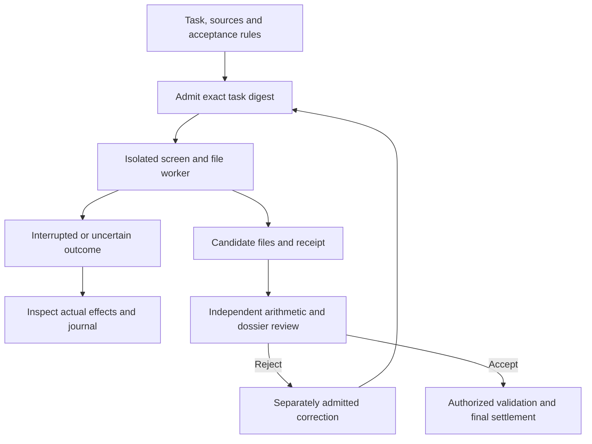

# REDENOMINATION — exact units, reviewable work, governed execution

This demo turns a proposed token redenomination into an **exact, reviewable plan**. It includes a visual mission, two dashboards, before/after configuration, source hashes, a guided owner console, incident rehearsals and a computer-work task with an independent arithmetic checker.

**Start here:** run the local control room below. These commands need no wallet, API key or dependency installation. They do not deploy contracts, migrate balances, call a worker or authorize payments. A production migration is a separate, deployment-specific project; the acceptance requirements below identify what remains.

## Start in two minutes

Use the repository's [pinned Node version](../../.nvmrc) and run from the repository root:

```bash
npm run demo:redenomination:control-room
```

Open **http://127.0.0.1:4174/** for the mission, original architecture graph, phase navigator and English/French interface labels. Open **http://127.0.0.1:4174/ui/** for exact before/after values, source hashes, governance configuration, rounding remainders and review commands. The scenario prose and terminal output remain English.

The server binds only to loopback. Browser **Refresh** or **R** reloads the saved export; **Enter in the server terminal** regenerates it. **Ctrl+C** stops the server. To choose another port, set `PORT=4175`. The worker task template uses port 4174; changing it requires reviewing and re-admitting the updated task.

The planner and both dashboards operate without a provider connection. Diagram rendering optionally loads pinned Mermaid **12.1.0** from jsDelivr; fonts use Google Fonts. Blocked or unavailable CDNs leave the rest of the interface usable and show the checked-in SVG flowchart with expandable Mermaid source. Modern ES2024 browsers support the renderer; the local SVG also handles older browsers. For an air-gapped deployment, mirror the reviewed assets and change their URLs and the local server's CSP. Do not expose this development server as an authenticated production service.

## Commands and outputs

| Command | What it actually does |
| --- | --- |
| `npm run demo:redenomination` | Prints the mission transcript and original graph; does not execute its narrative |
| `npm run demo:redenomination:control-room` | Generates a plan, then serves both dashboards locally |
| `npm run demo:redenomination:export -- --current-supply 42000000` | Generates proposed configurations and a JSON plan with an illustrative supply conversion |
| `npm run demo:redenomination:verify` | Checks assets, exact arithmetic, input hashes, preserved policies and agreement between the plan and drafts |
| `npm run demo:redenomination:owner-console` | Presents draft parameters, safe preview commands and approval requirements |
| `npm run demo:redenomination:mission-control` | Presents the mission, phases, governance, timeline, invariants, graph and verification steps |
| `npm run demo:redenomination:guardian-drill` | Checks saved artifacts and prints pause, parameter and dispute rehearsals; does not perform them |
| `node --test demo/REDENOMINATION/tests/*.test.cjs` | Runs regression and negative-path tests without external dependencies |

The consoles print their complete review when stdin/stdout is not a terminal or `NON_INTERACTIVE=1`. Script paths are anchored to the repository, so direct `node /absolute/path/to/script` invocation works from other directories. Root `package.json` retains all existing command names; the two older TypeScript entry points remain compatibility wrappers.

Outputs are `ui/export/latest.json`, `config/stake-manager-redenominated.json` and `config/job-registry-redenominated.json`, all under this demo. They are **drafts**, not deployed state. Both dashboards read the report's embedded configuration snapshots so values and symbols belong to the same generation. The verifier detects stale source hashes or a mismatched separate draft. Individual files are replaced atomically, with the report written last; a process failure between files can still require regeneration. Source `config/` files are protected against accidental overwrite, including through symlinked output paths.

## Correct conversion and rounding

A factor of **1,000 means 1,000 old tokens = 1 new token**. It does not mean multiplication of balances by 1,000.

```text
targetRaw = sourceRaw × 10^targetDecimals ÷ (factor × 10^currentDecimals)
```

All arithmetic uses `BigInt`. Amounts in JSON are decimal strings. Fields ending in `Tokens` contain human token amounts; raw fallback fields contain integer base units. Conflicting raw and human-unit values are rejected. Percentages, addresses, duration limits, slashing splits, stake caps, role minimums, recommendations and auto-stake bounds are preserved or converted according to their units.

For example, **42,000,000 AGIALPHA → 42,000 AGIΩ** with factor 1,000. If precision changes from 18 to 6, the resulting supply is `42000000000` new base units. The default source configuration produces a `0.001 AGIΩ` job bond, `0.1 AGIΩ` agent-role minimum and `1.0 AGIΩ` validator-role minimum. These are illustrative local configuration values, not chain observations.

```bash
npm run demo:redenomination:export -- --ratio 1000 --new-decimals 6 --symbol AGIOMEGA --current-supply 42000000
npm run demo:redenomination:verify
```

Run `node demo/REDENOMINATION/scripts/playbook.cjs --help` for all options, including `--out`, `--config-dir`, `--name`, `--scenario` and `--compact`.

**Precision loss fails by default.** An intentional `--rounding floor` records every exact remainder numerator and denominator in fractions of one target base unit. A positive configured threshold may never silently become zero. Reject/floor policy applies to proposed values, not an actual account migration. Per-account floors can sum to less than the floor of aggregate supply; a production migration must reconcile all balances, escrow, stakes, pending withdrawals, rewards, disputes and residual claims. An aggregate supply example cannot do that reconciliation. Redenomination alone does not guarantee purchasing power or fiat-value invariance.

Changing a symbol or precision here does **not** replace the token address, alter the existing contracts' configured `TOKEN_SCALE`, rewrite escrow or change settlement currency. Do not apply a new-token draft to old-token contracts. The demo contains no ledger-migration implementation.

## Computer work: realize the broader mission

The opportunity includes lawful work performed through a keyboard, mouse and screen: research, spreadsheets, document preparation, software QA, reconciliation and business application workflows. Redenomination is one concrete job category. Measure success through accepted outcomes, task-specific quality, cost, duration and recovery evidence; the ability to operate a UI alone does not prove reliable completion of every human job.

| Execution surface | Supported path |
| --- | --- |
| OpenClaw with native Codex Computer Use, managed browser, code, files and approved integrations | Use the existing repository Responses adapter, dedicated worker profile, exact-task admission and persistent dispatch journal |
| ChatGPT Work with enabled Computer Use | An operator carries out the scoped task and exports the candidate files for independent review; no remote Work API or automated login is invented |
| OpenAI API computer-use tools | Commission a separate runtime that supplies the environment and handles tool actions, exposed through an approved worker endpoint |

Read [the integration and recovery guide](../../docs/computer-work.md) and [the working browser lab](../One-Box/computer-work/README.md). The lab exercises real browser interactions with deterministic worker decisions; it is not a live-provider benchmark. Work tools and OpenClaw tools depend on actual versions, account access, plugins and OS permissions. OpenClaw sandboxing is not automatically enabled by describing a task as isolated. Use dedicated accounts/profiles, enforced app/origin policy, bounded execution and explicit approval controls in the worker environment. Never put signing keys in that environment.

### Try the redenomination acceptance contract

[computer-work/task.json](computer-work/task.json) is a schema-compatible task for the existing adapter. It embeds an approved synthetic ledger, its exact SHA-256 and measurable acceptance criteria. Its five accounts include pending escrow, pending withdrawal and a zero balance. The worker must produce `conversion.json` and `dossier.md`, including the difference between aggregate and per-account rounding.

First run the independent checker against the supplied, explicitly labeled example:

```bash
node demo/REDENOMINATION/computer-work/review.cjs demo/REDENOMINATION/computer-work/conversion.example.json demo/REDENOMINATION/computer-work/dossier.example.md
```

Expected: `accepted: true`, `accountsChecked: 5`, `productionApproved: false`, `settlementApproved: false`. Edit a **copy** of an account's `targetRaw`, remove a pending liability, or discard a remainder and run the checker on that copy: it must reject with exit status 1. The suite exercises these cases. The checker independently recomputes arithmetic without importing the planner; dossier substance, source rights, provider provenance and live effects still require separate review.

To commission a live worker, follow [the exact setup procedure](../../docs/computer-work.md#commission-a-real-worker). Use this demo's [worker profile template](computer-work/worker-profiles.example.json), which deliberately admits no jobs. Start the control room in the worker's own network environment so its loopback origin resolves correctly. Set a protected `COMPUTER_WORK_REDENOMINATION_TOKEN`, an absolute `COMPUTER_WORK_PROFILES_FILE`, a durable `COMPUTER_WORK_STATE_DIR`, the actual agent endpoint and a unique deployment identity. After installing the repository dependencies and building the orchestrator, inspect the normalized task:

```bash
npm run build:orchestrator
node demo/One-Box/computer-work/run.cjs inspect demo/REDENOMINATION/computer-work/task.json
```

An operator reviews the exact task and adds its digest and job ID to `approvedJobs`. Then the existing explicit `run` command can commission that admitted task. It performs real worker actions and may incur provider cost; it is intentionally absent from the offline quickstart. Collect the adapter receipt and exact deliverable bytes, verify their hashes, save the two UTF-8 files and run this demo's checker on them. Independently review the dossier and actual application state before passing accepted evidence into the marketplace's validator lifecycle. Do not substitute the example files for evidence of a live run. Screenshots and binary documents require a separately commissioned artifact store; the current adapter's inline deliverables are bounded UTF-8 text.


```mermaid
flowchart TD
    Brief["Task, sources and acceptance rules"] --> Admit["Admit exact task digest"]
    Admit --> Worker["Isolated screen and file worker"]
    Worker --> Evidence["Candidate files and receipt"]
    Worker --> Unknown["Interrupted or uncertain outcome"]
    Unknown --> Reconcile["Inspect actual effects and journal"]
    Evidence --> Check["Independent arithmetic and dossier review"]
    Check -->|Reject| Correct["Separately admitted correction"]
    Correct --> Admit
    Check -->|Accept| Govern["Authorized validation and final settlement"]
```

A provider completion is not acceptance, and acceptance is not transaction authority. Existing identity, tax acknowledgement, stake, validation, dispute and finality requirements remain in force. Stop and reconcile unknown outcomes; never erase journals to force a retry.

### Opportunity assumption

The **$40 trillion/year** vision is retained as a **project planning assumption**, not a verified market estimate, demonstrated serviceable market or platform revenue forecast. Track separately total labor spending, digitally accessible tasks, licensed and reachable workflows, reliable accepted work, actual customer demand and marketplace revenue. A USDC-denominated job budget is separate from this AGIALPHA token-conversion example; no settlement token migration is implemented here.

## Systems map — preserved original

```mermaid
flowchart LR
    Operators((Mission Owners)) --> demo_REDENOMINATION[[Demo → Redenomination]]
    demo_REDENOMINATION --> Core[[AGI Jobs v0 (v2) Core Intelligence]]
    Core --> Observability[[Unified CI / CD & Observability]]
    Core --> Governance[[Owner Control Plane]]
```

The larger original job-lifecycle flowchart remains verbatim in [scenario.json](scenario.json), rendered by the storyboard and printed by both mission CLIs. It is a **conceptual vision**. In particular, its Chainlink VRF, encrypted-verdict, immediate NFT/payout and moderator override/pause/slash labels are not claims of implemented or verified behavior in this demo. The current worker-review graph above and deployed contracts are the authoritative guides for actual integration.

## Production acceptance requirements

| Area | Evidence required before live approval |
| --- | --- |
| Source of truth | Chain ID, token address and precision, snapshot block, byte-hashed input ledger and independently reconciled liabilities |
| Migration | Reviewed token/contract strategy, account-level allocation and dust policy, supply conservation, replay/idempotency controls, audited migration code and recovery plan |
| Authority | Actual owner, multisig, timelock and contract permissions; independent signers and recorded authorization |
| Worker | Commissioned versions, isolated accounts, tool/network policy, cancellation, cost/time limits, prompt-injection and interruption tests |
| Acceptance | Task-specific independent reviewer, artifact integrity, source/application verification, rejection/correction and dispute procedure |
| Settlement | Actual transaction receipts, final contract outcomes and chain finality; no inference from a local report or provider response |
| Operations | Monitored events, durable dispatch/settlement journals, backups, incident rehearsal and a staged rollout with named operators |

The local tests establish bounded arithmetic, interface and fixture behavior. They do not establish live-provider reliability, security-audit completion, a funded marketplace, deployed migration correctness or universal job capability. All changes land through a PR with the repository's required checks green before merge. See [RUNBOOK.md](../../RUNBOOK.md), [OperatorRunbook.md](../../OperatorRunbook.md), [governance](../../docs/governance.md), [system pause](../../docs/system-pause.md) and [observability](../../docs/institutional-observability.md).

Safe pause/unpause examples in the generated plan call the actual `systemPauseAction.ts` with `--dry-run` against an already prepared `localhost` deployment. Those optional previews require the root dependencies, local RPC and deployed contracts. They neither prepare that deployment nor broadcast a transaction. Removed fictional command names have been replaced with working offline checks or explicit deployment-specific review steps.

## Troubleshooting

| Symptom | Action |
| --- | --- |
| `Non-exact conversion` | Increase target precision or explicitly review `--rounding floor` and every residual; never suppress the error blindly |
| Positive threshold would become zero | Choose a representable ratio/precision or separately redesign the policy |
| Verifier reports mismatched source/draft | Review source changes, regenerate the plan, then rerun verification |
| Missing export or unsupported plan version | Run `npm run demo:redenomination:export` and reload the dashboard |
| Port in use | Stop the old server or choose `PORT`; update and re-admit any task using the old origin |
| Diagram does not render | Open the bundled SVG or preserved source; allow or locally mirror the pinned renderer if desired |
| CLI waits for input | Use `NON_INTERACTIVE=1` for automation; all consoles also detect non-terminal input |
| Worker not admitted | Inspect the exact normalized task hash and protected profile; do not weaken admission |
| Worker outcome unknown | Preserve its journal and inspect actual effects before authorizing a new attempt |

## Files and validation

`index.html`, `scenario.json` and `i18n/` hold the visual mission. `ui/` holds the exact-value dashboard and export. `config/` contains generated drafts. `scripts/` holds the dependency-free planner, local server, consoles and consistency checks. `computer-work/` contains the synthetic task, worker-profile template and independent checker. `tests/` covers arithmetic, unit changes, rounding, malformed inputs, provenance, filesystem boundaries, routing, CLI behavior and deliberately incorrect worker outputs. `tests/browser-smoke.cjs` exercises both dashboards in real Chromium when Playwright is installed:

```bash
node demo/REDENOMINATION/tests/browser-smoke.cjs
```

The original graph also ships as `ui/architecture.svg` with source/render hashes in `ui/architecture.provenance.json`. To rebuild after an intentional graph edit, install Mermaid 12.1.0 and Playwright in a separate maintainer environment and run `scripts/render-diagram.cjs` with `MERMAID_DIST_DIR` pointing to that Mermaid package's `dist` directory. Optional `PLAYWRIGHT_MODULE_PATH` and `PLAYWRIGHT_CHROMIUM_EXECUTABLE_PATH` select an existing browser installation. The generator uses local module assets and does not contact a provider.

When source configuration changes, refresh the committed default example as well as the export before running the tests:

```bash
npm run demo:redenomination:export -- --current-supply 42000000
cp demo/REDENOMINATION/ui/export/latest.json demo/REDENOMINATION/ui/sample.json
npm run demo:redenomination:verify
node --test demo/REDENOMINATION/tests/*.test.cjs
```

The `demo-redenomination` workflow runs the focused tests, validates checked-in artifacts before regeneration, generates a fresh plan and uploads it. Keep the original diagrams and useful mission surfaces when extending the demo.

Current external capabilities reviewed **2026-10-05** using primary documentation: [ChatGPT Work](https://learn.chatgpt.com/docs/use-chatgpt), [OpenAI computer use](https://developers.openai.com/api/docs/guides/tools-computer-use), [OpenClaw browser](https://docs.openclaw.ai/tools/browser), [OpenClaw sandboxing](https://docs.openclaw.ai/gateway/sandboxing), [OpenClaw Codex Computer Use](https://docs.openclaw.ai/plugins/codex-computer-use), [OpenClaw OpenAI provider](https://docs.openclaw.ai/providers/openai) and [Mermaid releases](https://github.com/mermaid-js/mermaid/releases/tag/mermaid%4012.1.0). Pin and record the versions actually commissioned; these external capabilities do not make this demo a production deployment.
