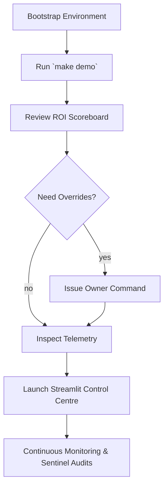

# 🎛️ Operator Playbook — Tiny Recursive Model Demo

This playbook is a zero-to-hero checklist for non-technical stewards who want to wield the Tiny Recursive Model (TRM) demo as a production-grade intelligence core. Follow the steps in order; each stage includes verification cues so you can confirm that the AI, economic guardrails, and telemetry channels are behaving exactly as expected.



---

## 1. Environment Bootstrap

1. Open a terminal at `demo/Tiny-Recursive-Model-v0`.
2. Provision an isolated toolchain (virtual environment + dependencies):

   ```bash
   make install
   ```

   *Verification:* A `.venv/` folder is created and the command concludes with the Streamlit, PyTorch, and pytest packages installed.

---

## 2. One-Command Demo Run

Execute the full demo pipeline — TRM training, recursive inference, thermostat updates, sentinel enforcement, and ROI summarisation:

```bash
make demo
```

*Verification checklist*
- Console banner “Launching Tiny Recursive Model Demo” appears.
- Final panel reports GMV, total cost, and ROI (expect ROI far above 1.0).
- File `assets/telemetry.jsonl` is created and populated with events.

If telemetry is missing, re-run `make telemetry` and rerun the demo; the writer will create the directory automatically.

---

## 3. Inspect ROI & Guardrails

1. Review the rich table printed by `make demo`; it shows the TRM ledger totals in real time.
2. Confirm sentinel supervision by searching the telemetry log for `SentinelStatus` entries:

   ```bash
   jq 'select(.event_type == "SentinelStatus")' assets/telemetry.jsonl | head
   ```

   You should see JSON records with `healthy`, `paused`, `reason`, and the instantaneous ROI, proving that the guardrail loop is active.

3. Examine thermostat adjustments to confirm adaptive tuning:

   ```bash
   jq 'select(.event_type == "ThermostatUpdate")' assets/telemetry.jsonl | tail
   ```

   Look for `inner_cycles`, `outer_steps`, and `halt_threshold` changes responding to ROI fluctuations.

---

## 4. Owner Overrides & Governance

Change TRM parameters live using the built-in owner console (no smart-contract coding required):

```bash
. .venv/bin/activate
python demo_runner.py owner trm halt_threshold 0.65
```

*Verification:* The CLI prints a yellow “Governance” panel describing the new value and persists the update back to `config/trm_demo_config.yaml`. Re-run `make demo` to observe the effect — sentinel and thermostat events in telemetry should reflect the new halt policy.

To pause TRM entirely, edit the config’s sentinel section or use the Streamlit sidebar pause controls (see next section).

---

## 5. Streamlit Control Centre

Launch the web UI for executives who prefer dashboards:

```bash
make ui
```

*Verification cues*
- Browser (or forwarded port) displays the “🎖️ Tiny Recursive Model Demo Control Centre”.
- Press **Run Simulation** to produce the same metrics rendered on the CLI.
- Sidebar override pushes configuration updates and immediately surfaces success toasts.

---

## 6. Telemetry & Ethereum Hooks

- Every demo run writes auditable JSONL events. Use `python -m json.tool` or the `jq` command above to inspect.
- The orchestrator emits an `EthereumLog` entry with RPC URL, target contract, and ROI payload; this is the staging point for mainnet-grade event logging.
- For compliance reporting, archive the telemetry file after each run (e.g., copy to cold storage or pin to IPFS).

---

## 7. Regression Testing

Guarantee that training, inference, thermostat, sentinel, and telemetry logic remain healthy:

```bash
make test
```

This command automatically disables third-party pytest auto-plugins and runs all unit tests (`test_engine.py`, `test_thermostat.py`, `test_sentinel.py`, and the integration-style `test_simulation.py`).

*Verification:* Expect “6 passed” on fresh environments. Warnings about NumPy initialisation are benign on CPU-only installs.

---

## 8. Troubleshooting Signals

| Symptom | Diagnostic | Resolution |
|---------|------------|------------|
| Telemetry log empty | Check write permissions on `assets/` | Run `make telemetry` and ensure the filesystem is writable |
| ROI below target repeatedly | Inspect `ThermostatUpdate` events to ensure recursion depth is being trimmed | Consider reducing `min_inner_cycles` or increasing `value_per_success` in the config |
| Sentinel pauses immediately | Open the latest `SentinelStatus` entry to read the `reason` (e.g., ROI floor violation) | Adjust sentinel thresholds or re-run training to improve accuracy |
| UI fails to launch | Verify the virtual environment is active and Streamlit installed | Run `make install` and re-launch `make ui` |

---

## 9. Ready for Production Experiments

Once the dry run is satisfactory:
- Update `config/trm_demo_config.yaml` with production RPC endpoints, owner addresses, and budgets.
- Wire the Ethereum logger to a real logging contract (ABI integration hook in `governance.py`).
- Feed real conversion data into the TRM training loop via `demo_runner.py` or by extending the orchestrator.

This playbook is designed to be looped daily: bootstrap, run, audit, iterate. With these controls in place, AGI Jobs v0/v2 transforms a tiny recursive network into a business-defining intelligence asset.
