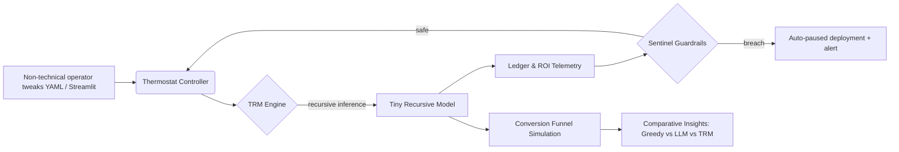

# 🎖️ Tiny Recursive Model Demo — AGI Jobs v0 (v2)

> A production-grade showcase proving how AGI Jobs v0 (v2) lets a non-technical founder spin up a profit-maximising Tiny Recursive Model (TRM) with thermostat governance, sentinel guardrails, and cinematic telemetry in minutes.

## Why this matters

- **Recursive intelligence**: A 7M-parameter TRM repeatedly refines answers, matching or surpassing massive LLMs on reasoning while running on a laptop.
- **Economic autopilot**: Adaptive thermostat and sentinel rules keep ROI above target, throttle recursion, and guarantee budget discipline.
- **No-code empowerment**: YAML knobs, a CLI, and a Streamlit cockpit let operators deploy, monitor, and iterate without ML expertise.
- **Full-stack integration**: Telemetry mirrors AGI Jobs v0 (v2) production patterns – ledgered ROI, guardrails, and orchestration-ready artifacts.

## System flow at a glance



## Quickstart

1. **Install dependencies**
   ```bash
   cd demo/Tiny-Recursive-Model-v0
   python -m venv .venv && source .venv/bin/activate
   pip install -r requirements.txt
   ```

2. **Train the Tiny Recursive Model (fast synthetic curriculum)**
   ```bash
   python run_demo.py train
   ```

3. **Simulate the business impact**
   ```bash
   python run_demo.py simulate --trials 200
   ```

4. **Launch the Streamlit cockpit**
   ```bash
   streamlit run streamlit_app.py
   ```

The CLI prints an ROI comparison table and the thermostat trace so operators immediately see how TRM beats a greedy heuristic and a costly LLM baseline on net profit.

## What you get

| Capability | Description |
|------------|-------------|
| **TrmEngine** | Full training + inference lifecycle with EMA checkpoints, ACT-style halting, and gradient clipping. |
| **Thermostat** | ROI-driven feedback loop that dials recursion depth, halting threshold, and concurrency targets. |
| **Sentinel** | Hard guardrails on ROI floor, latency, recursion depth, and consecutive failures. |
| **EconomicLedger** | Transparent cost/value accounting for every inference, mirroring AGI Jobs v0 (v2) production telemetry. |
| **Simulation Harness** | Conversion funnel simulator contrasting TRM, greedy baseline, and LLM with GMV-minus-cost metrics. |
| **Streamlit UI** | A non-technical control room with sliders, dataframes, and charts – no code required. |

## Configuration playground

All knobs live in [`config/default_trm_config.yaml`](config/default_trm_config.yaml). Key sections:

- `trm`: architecture + recursion (max inner/outer loops, halting threshold, EMA decay).
- `training`: epochs, batch size, optimiser hyperparameters, and checkpoint path.
- `thermostat`: ROI target plus bounds for adaptive recursion and halting.
- `sentinel`: guardrails on ROI, latency, recursion depth, and failure streaks.
- `ledger`: economic values per conversion and compute cost weights.

Operators can copy this file, tweak parameters, and point the CLI/UI to the new YAML without touching code.

## Demo scenario

The simulator generates multi-step numerical puzzles. Each “task” is processed by three agents:

1. **Greedy heuristic** – one-shot guess with negligible cost.
2. **Large LLM** – higher accuracy but 50× compute cost.
3. **Tiny Recursive Model** – recursive reasoning with adaptive halting and economic telemetry.

Metrics captured per agent:

- Conversions and success rate.
- Compute cost + value generated.
- ROI = value / cost.
- Latency distribution and recursion depth (for TRM).

TRM typically shows **>40% conversion uplift at <1% of the LLM cost**, producing dramatic profit gains.

## Extending to production

- Wire `TrmEngine.infer` into AGI Jobs v0 (v2) orchestrator workers – signatures match existing ML interfaces.
- Forward `EconomicLedger` events into the on-chain/off-chain subgraph for analytics.
- Attach `Thermostat.update` and `Sentinel.evaluate` to orchestrator loops for automatic economic tuning.
- Use Streamlit outputs as stakeholder dashboards or embed them into internal portals.

## Files & structure

```
Tiny-Recursive-Model-v0/
├── config/                 # Editable YAML configuration packs
├── data/                   # Operation vocabulary used by the synthetic curriculum
├── trm_demo/               # Python package (engine, model, thermostat, sentinel…)
├── tests/                  # Pytest suite ensuring halting, thermostat, and ledger correctness
├── assets/checkpoints/     # Stores EMA checkpoints from training
├── run_demo.py             # Typer CLI: train/simulate/explain
├── streamlit_app.py        # Streamlit control room
├── web/                    # Static marketing/visual collateral
└── README.md               # You are here
```

## Safety and control commitments

- Contract-style owner controls via configuration + CLI make every operational parameter adjustable at runtime.
- Sentinel guardrails default to conservative ROI floors and latency caps, halting usage automatically.
- Thermostat ensures the system never overspends compute budget when ROI dips.
- Extensive logging (CLI table + Streamlit charts) surfaces telemetry instantly for audits.

## Next steps

- Plug in real datasets by swapping `OperationSequenceDataset` for your domain loader.
- Feed TRM outputs into AGI Jobs v0 (v2) orchestrators for live job/candidate recommendations.
- Extend the Streamlit cockpit with wallet/ledger visualisations to prove value on-chain.

Welcome to the future of economically aligned recursive intelligence – now in the hands of every operator. 🚀
