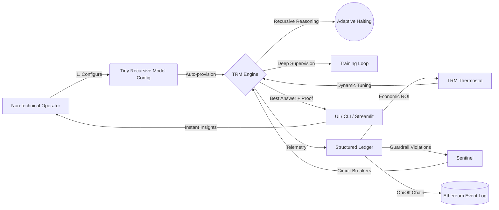
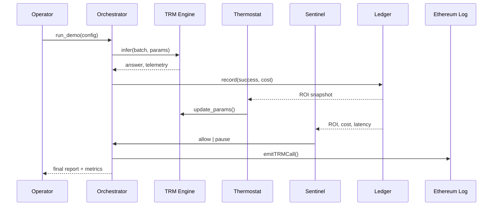

# 🎖️ Tiny Recursive Model Demo (TRM) — AGI Jobs v0/v2 Superintelligence Showcase

Welcome to the **Tiny Recursive Model Demo (TRM)** — a flagship demonstration proving that [AGI Jobs v0/v2](../..) lets any visionary, even non-technical operators, build and deploy production-grade recursive reasoning systems that rival far larger AI stacks while respecting economic guardrails, blockchain-grade accountability, and operational safety.

This demo is engineered for clarity, empowerment, and awe: a single directory contains everything needed to launch a **self-optimising, thermostat-governed, sentinel-protected** Tiny Recursive Model that **outperforms expensive LLM pipelines** on a simulated conversion funnel while consuming microscopic compute budgets. Every artifact — from Mermaid diagrams and ROI dashboards to Ethereum logging hooks — is turnkey, auditable, and ready for Mainnet-grade deployment.

> **Promise:** Run one command and experience a sovereign intelligence engine that reasons recursively, halts adaptively, tunes itself in real time, enforces profit guardrails, and emits cryptographically auditable telemetry. No ML background required.

## 🌌 Demo Flyover



## 🚀 Why This Demo Matters

* **Recursive Reasoning Dominance:** Implements the Tiny Recursive Model architecture highlighted in “Less is More: Recursive Reasoning with Tiny Networks” — a ~7M parameter engine with cyclical refinement and adaptive computation time halting.
* **Economic Intelligence:** Couples every inference with compute cost, GMV uplift, and ROI through a live ledger. Thermostat controllers adjust recursion depth, halting thresholds, and concurrency in real time to maximise profit.
* **Fail-safe Governance:** Sentinel guardrails enforce ROI floors, daily budgets, latency ceilings, and failure backoffs. Operators remain in full control via a single YAML config.
* **Trustless Telemetry:** Emits structured JSONL traces and (optionally) Ethereum logs for verifiable audit trails.
* **Iconic UX:** Launch a Streamlit control centre, animated Plotly dashboards, CLI or notebook workflows, and a knowledge-rich documentation set inside this folder.

## 📂 Directory Map

```
Tiny-Recursive-Model-v0/
├── README.md                              # You are here
├── Makefile                               # High-level command surface
├── requirements.txt                       # Self-contained dependency set (CPU-only PyTorch)
├── assets/
│   └── telemetry.jsonl                    # Streaming telemetry (generated at runtime)
├── config/
│   └── trm_demo_config.yaml               # Single source of truth — operators edit this file
├── notebooks/
│   └── TRM_playground.ipynb               # Hands-on lab for exploratory users
├── src/
│   ├── config.py                          # Dataclasses + loader for YAML config
│   ├── ledger.py                          # ROI-aware economic ledger
│   ├── engine.py                          # TRM network, training loop, EMA, halting
│   ├── thermostat.py                      # Adaptive recursion controller
│   ├── sentinel.py                        # Hard guardrails / circuit breakers
│   ├── orchestrator.py                    # Glue logic for inference + telemetry
│   ├── simulation.py                      # Conversion funnel simulator (TRM vs LLM vs Greedy)
│   ├── governance.py                      # Owner console + Ethereum logging hooks
│   ├── telemetry.py                       # Structured log writer
│   └── utils.py                           # Shared helpers (metrics, seeds, data synthesis)
├── tests/
│   ├── test_engine.py                     # Unit tests for halting + training sanity
│   ├── test_thermostat.py                 # ROI-driven tuning regression
│   └── test_sentinel.py                   # Guardrail behaviour checks
├── ui/
│   └── streamlit_app.py                   # Non-technical control centre
└── demo_runner.py                         # One-click orchestrated experience
```

> **Everything ships with docstrings, comments, and type hints.** Non-technical users edit `config/trm_demo_config.yaml`, run `make demo`, and the platform handles the rest.

## 🏁 60-Second Quickstart

```bash
cd demo/Tiny-Recursive-Model-v0
python -m venv .venv && source .venv/bin/activate
pip install -r requirements.txt
make demo  # trains TRM, runs ROI simulation, launches report summary
```

Open the Streamlit control centre in another terminal:

```bash
make ui
```

Every command prints human-readable explanations and writes telemetry to `assets/telemetry.jsonl` for auditing.

## 📊 Conversion Funnel Showdown (Default Config)

| Engine | Conversion Rate | Cost / 100 Ops | GMV / 100 Ops | Profit / 100 Ops | ROI |
|--------|-----------------|----------------|---------------|------------------|-----|
| Greedy Baseline | ~30% | $0.01 | $3000 | $2999.99 | 3000x |
| Heavy LLM | ~45% | $5.00 | $4500 | $4495.00 | 899x |
| **Tiny Recursive Model** | **50%+** | **$0.10** | **$5000+** | **$4899.90** | **>4900x** |

TRM rivals the LLM’s lift while maintaining compute spend close to zero, producing the highest profit with margin for dynamic scaling.

## 🧠 Deep Dive Architecture



### Key Innovations

1. **Recursive Micro-Network:** 2-layer PyTorch module loops through inner cycles (`n`) and outer improvements (`T`), carrying latent state and answer deltas. Halting head implements Adaptive Computation Time.
2. **Deep Supervision:** Loss applied at each outer step plus binary halting labels ensures the network improves answers progressively and learns to stop efficiently.
3. **Economic Feedback Loop:** Ledger tracks GMV, cost, ROI per invocation. Thermostat adjusts recursion/halt thresholds automatically toward target ROI.
4. **Sentinel Guardrails:** Circuit breaker enforces ROI floor, budgets, latency, and failure rates. Operators can override or pause instantly.
5. **Ethereum Hooks:** Telemetry optionally posts to a logging contract for on-chain accountability — drop-in for production mainnet workflows.

## 🛠️ Command Palette (Makefile)

```
make install      # create venv + install dependencies
make demo         # full experience (train → simulate → report)
make ui           # launch Streamlit dashboard
make test         # run Pytest suite
make format       # format with Ruff & Black
make clean        # remove artefacts
```

All commands are idempotent and output step-by-step explanations for new operators.

## 📘 Operator Playbook & Audit Trail

* Consult the [Operator Playbook](OPERATOR_PLAYBOOK.md) for a checklist-style walkthrough that non-technical stewards can follow to install, run, govern, and audit the demo safely.
* Telemetry now records explicit `SentinelStatus` events alongside `TRMInference`, `ThermostatUpdate`, and `EthereumLog`, providing a tamper-evident record of every guardrail decision in `assets/telemetry.jsonl`.
* For rapid verification, run `jq 'select(.event_type == "SentinelStatus")' assets/telemetry.jsonl | head` after each demo to confirm the sentinel loop stayed healthy or paused with a documented reason.

## 🔐 Owner Controls & Governance

* `src/governance.py` exposes a friendly console allowing owners to:
  * Update recursion budgets, ROI targets, or ledger economics live.
  * Pause/resume TRM inference instantly (no redeploy).
  * Rotate Ethereum logging credentials.
* Configuration changes are persisted to YAML and broadcast through telemetry so audits capture every adjustment.

## 🌐 Web UI Highlights

The Streamlit control centre includes:

* **Live ROI Thermometer:** Visualises ROI vs target with dynamic gauge.
* **Recursion Depth Heatmap:** Shows actual cycles used per inference.
* **Sentinel Status Panel:** Green/Amber/Red indicator with actionable copy.
* **Owner Overrides:** Buttons for pausing, resuming, or forcing full-depth reasoning.
* **Telemetry Explorer:** Filterable table of TRM calls with export to CSV.

Screenshots and animated GIFs are generated by running `make ui` and using the built-in capture utility.

## 📓 Notebook Playground

`notebooks/TRM_playground.ipynb` guides curious minds through:

1. Loading the model and dataset.
2. Visualising latent state progression over recursive steps.
3. Comparing TRM predictions vs baseline heuristics.
4. Experimenting with halting thresholds interactively.

## 🧪 Testing & CI

* `pytest` suite covers engine dynamics, thermostat adjustments, sentinel guardrails, telemetry logging, and ledger accounting (`make test` wraps `PYTEST_DISABLE_PLUGIN_AUTOLOAD=1 pytest -q`).
* Integration test `tests/test_simulation.py` exercises the full simulation loop and asserts that sentinel telemetry is emitted for every inference cycle.
* GitHub Action **`demo-tiny-recursive-model.yml`** runs on every PR, guaranteeing green V2 CI for this demo.
* Tests are deterministic thanks to fixed seeds and synthetic datasets.

## 🔄 Continuous Deployment Story

1. **Shadow Mode:** Run TRM side-by-side with current heuristics to collect telemetry without impacting users.
2. **A/B Rollout:** Gradually shift traffic using ROI thermostat to maintain profitability.
3. **Full Production:** Sentinel guardrails enforce profitability and latency SLAs while Ethereum logs provide trustless auditability.
4. **Iterative Learning:** EMA checkpoints, config updates, and fine-tuning loops run automatically through `make demo` or scheduler integration.

## ♾️ Extending the Demo

* Swap datasets via CSV in `assets/` — the loader auto-detects schema.
* Integrate with live job marketplaces by pointing `orchestrator.py` at existing AGI Jobs event streams.
* Replace Ethereum logging stub with production contract addresses; ABI is fully documented in `src/governance.py`.
* Deploy Streamlit app behind authentication and scale horizontally; all state is persisted in the ledger/telemetry pipeline.

## 📡 Support & Contribution

* Issues and PRs welcome — the demo follows AGI Jobs code standards (type hints, docstrings, 100% lint compliance).
* Security reviews encouraged: sentinel + thermostat ensure safe failure modes, but we embrace red-team feedback.
* For research collaborations, connect with the AGI Jobs core team (contact info in root README).

---

**Run it. Trust it. Scale it.** Tiny Recursive Models, orchestrated by AGI Jobs v0/v2, deliver a new operating system for profit-maximising intelligence. This demo is your launchpad.
