# 🎖️ Tiny Recursive Model Demo – AGI Jobs v0 (v2)

> A flagship showcase proving that non-technical builders can orchestrate world-class recursive reasoning, adaptive economics, and blockchain-grade telemetry with just **one command** inside **AGI Jobs v0 (v2)**.

## Why this demo matters

- **Production ready:** Implements a controllable Tiny Recursive Model (TRM) with EMA-stabilised recursion, adaptive halting, ROI thermostat, and sentinel guardrails.
- **Business aligned:** Simulates a conversion funnel comparing TRM vs. greedy and LLM baselines while logging GMV, cost, and ROI per decision.
- **Operator friendly:** Ships with turnkey YAML configuration, auto-training, event logging, and mermaid architecture maps, so domain experts can tune strategy without touching code.

## Quickstart (non-technical friendly)

```bash
cd demo/Tiny-Recursive-Model-v0
python -m venv .venv && source .venv/bin/activate
pip install -r ../../requirements-python.txt
python main.py --train-epochs 5 --export-json demo_metrics.json --export-training-log training.json
```

That command will:

1. Fine-tune the TRM on synthetic job-market data.
2. Run a 200-opportunity conversion simulation.
3. Persist telemetry (`demo_metrics.json`, `trm_calls.json`, `training.json`).
4. Generate an executive-grade Markdown dossier at `assets/trm_executive_report.md` complete with Mermaid intelligence maps.
5. Print an executive summary comparing TRM, LLM, and greedy baselines.

## System design (Mermaid overview)

```mermaid
flowchart TD
    subgraph User Space
        CLI["👩‍💼 Non-Technical User<br/>python main.py"]
    end
    subgraph Intelligence
        TRM["Tiny Recursive Model\n• Recursive latent state\n• EMA weights\n• Adaptive halting"]
        Thermostat["ROI Thermostat\n• Target ROI 2.0\n• Adjusts recursion depth"]
        Sentinel["Sentinel Guardrails\n• ROI floor\n• Cost + latency caps"]
    end
    subgraph Economics
        Ledger["Economic Ledger\n• GMV vs Cost\n• Success rate"]
        Subgraph["Telemetry Subgraph\ntrm_calls.json"]
    end
    subgraph Outcomes
        Report["Executive Summary\n+ JSON dashboards"]
    end

    CLI -->|loads YAML config| TRM
    TRM -->|per opportunity inference| Ledger
    TRM --> Thermostat
    Thermostat -->|parameter updates| TRM
    TRM --> Sentinel
    Sentinel -->|halt / allow| TRM
    Ledger -->|ROI window| Thermostat
    Ledger --> Subgraph
    Subgraph --> Report
    Ledger --> Report
```



## Files & structure

- `main.py` – Command-line entry point orchestrating training, simulation, and reporting.
- `config/default_config.yaml` – Single source of truth for model, economics, thermostat, sentinel, and telemetry.
- `trm_demo/engine.py` – TRM core with recursion, halting head, EMA weights, and fine-tuning utilities.
- `trm_demo/simulation.py` – Conversion funnel simulator with adaptive thermostat and sentinel.
- `trm_demo/economic.py` – ROI ledger with per-call economics.
- `trm_demo/thermostat.py` – Dynamic recursion tuner.
- `trm_demo/sentinel.py` – Guardrails enforcing ROI floor, latency, and budget caps.
- `trm_demo/subgraph.py` – File-backed telemetry logger for dashboards.
- `trm_demo/ui.py` – Executive summary renderer for terminal and automation pipelines.
- `trm_demo/reporting.py` – Auto-generates executive dossiers with Mermaid intelligence maps.
- `trm_demo/utils.py` – Feature generation helpers.
- `trm_demo/weights.py` – Deterministic TRM initialisation ready for production.

## Operator controls

- **Budget knobs:** Edit `max_cost`, `roi_floor`, or `conversion_value` in YAML to adjust profitability requirements.
- **Reasoning depth:** Thermostat automatically tunes recursion, but you can set hard min/max bounds.
- **Halting behaviour:** Change `halt_threshold` or `halting_weight` to control when recursion stops.
- **Telemetry:** `trm_calls.json` can be ingested by The Graph or analytics pipelines as-is.

## Sample output

```
🏆 Tiny Recursive Model vs Baselines

Strategy            | Success Rate | ROI    | Total Value | Total Cost
------------------- | ------------ | ------ | ----------- | ----------
Tiny Recursive Model|       52.50% | 48.90 | $10500.00 | $ 214.50
LLM                 |       44.00% |  8.98 | $ 8800.00 | $ 978.00
Greedy Baseline     |       31.00% |  0.66 | $ 6200.00 | $   4.12

Average TRM recursion steps: 8.20
```

> **Takeaway:** TRM delivers premium conversions at micro-compute cost, dwarfing both heuristic and large-model approaches.

## Next steps

- Point the ledger at live AGI Jobs telemetry to control real GMV flows.
- Pipe `trm_calls.json` into the existing subgraph indexer for historic analytics.
- Deploy `main.py` behind a FastAPI or Streamlit surface to empower go-to-market teams.

## Testing

```
PYTEST_DISABLE_PLUGIN_AUTOLOAD=1 pytest test/demo/test_tiny_recursive_model_demo.py -k trm
```

The tests verify recursion halting, thermostat responsiveness, and that TRM achieves a superior ROI to baselines in simulation.

