# Tiny Recursive Model Demo (AGI Jobs v0/v2)

> An iconic, production-ready Tiny Recursive Model (TRM) showcase proving that AGI Jobs v0 (v2) lets non-technical builders orchestrate world-class recursive reasoning, ROI governance, and blockchain-ready telemetry without touching low-level infrastructure.

## 🎯 Mission

This demo empowers any operator to:

- Train and deploy a **Tiny Recursive Model** with deep supervision, adaptive halting, and EMA-stabilised weights.
- Orchestrate live reasoning sessions that automatically log GMV, compute cost, ROI, and downstream business signals.
- Dynamically tune recursion budgets with a **Thermostat ROI controller** while maintaining profitability and latency guardrails through **Sentinel rules**.
- Produce transparent telemetry that can be mirrored on-chain or in data lakes for compliance and auditability.

All artefacts live in `demo/Tiny-Recursive-Model-v0/` and are runnable end-to-end with a single command. No prior ML or blockchain expertise is required.

---

## 🗺️ System Topology


---

## 🚀 Quickstart (non-technical friendly)

```bash
cd demo/Tiny-Recursive-Model-v0
python -m venv .venv
source .venv/bin/activate
pip install -r requirements.txt
python run_demo.py bootstrap
```

The `bootstrap` command performs three user-facing steps:

1. **Train** a TRM on a reasoning micro-curriculum (minutes on CPU).
2. **Simulate** 1,000 production decisions vs. greedy and heavyweight LLM baselines.
3. **Generate** a human-readable ROI dossier (`artifacts/report.json`, `artifacts/report.md`, and a dashboard-ready CSV).

Open `web/index.html` in any browser to explore the interactive story with Mermaid diagrams, ROI charts, and drill-downs. The page automatically consumes the generated artefacts.

> ✨ Tip: rerun `python run_demo.py simulate --budget 500 --trials 5000` anytime to stress-test different operating envelopes.

---

## 🧠 Tiny Recursive Model Highlights

- **7M-parameter equivalent** two-layer network implemented with differentiable recursion.
- **Adaptive Computation Time** (ACT) halting head that stops early when confidence is high.
- **Deep supervision** at every outer step to accelerate convergence and curb error drift.
- **Exponential Moving Average** (EMA, decay=0.999) for production-grade stability.
- **Checkpoints** saved in `artifacts/checkpoints/` with both raw and EMA weights.

```mermaid
sequenceDiagram
    participant X as Input Embedding
    participant Z as Latent State z
    participant Y as Answer y
    participant H as Halting Head
    X->>Z: n inner recurrences (6 default)
    Z->>Y: update logits & confidence
    Y-->>H: uncertainty probe
    H-->>Y: Halt if P(halt) > τ
    Y-->>Operator: Final decision & metadata
```



---

## 💹 Economics, Thermostat & Sentinel

- **EconomicLedger** tracks every inference with cost, value, ROI, and provenance.
- **Thermostat ROI Controller** gently adjusts recursion depth, halting thresholds, and concurrency to stay at the configured ROI target.
- **Sentinel Guardrails** enforce ROI floors, latency ceilings, and daily cost caps with automatic pause/resume toggles for the orchestrator.
- **Ethereum-ready controls**: configuration changes emit structured payloads that a contract owner can mirror on-chain for end-to-end governance. Owner override methods are exposed in `tiny_recursive_model.blockchain.LedgerGovernor`.

---

## 📦 Repository Layout

```
Tiny-Recursive-Model-v0/
├── README.md
├── requirements.txt
├── config/
│   └── defaults.yaml
├── run_demo.py               # Typer CLI for bootstrap/train/simulate/report
├── tiny_recursive_model/
│   ├── __init__.py
│   ├── blockchain.py         # Contract-owner controls & payload schemas
│   ├── config.py             # Pydantic config loader
│   ├── dataset.py            # Synthetic curriculum & eval loaders
│   ├── engine.py             # Core TRM implementation
│   ├── economic.py           # Ledger + ROI utilities
│   ├── orchestrator.py       # Worker loop and baseline/LLM comparators
│   ├── reporting.py          # Markdown/CSV dashboard generation
│   ├── sentinel.py           # Guardrail policies
│   ├── thermostat.py         # Adaptive recursion tuning
│   └── tests/                # Pytest suite (fast)
├── web/
│   └── index.html            # Interactive Mermaid + ROI visual story
└── artifacts/                # Auto-generated outputs (gitignored)
```

---

## ✅ Continuous Validation

Run the dedicated tests (they execute in < 5 seconds on CPU):

```bash
pytest demo/Tiny-Recursive-Model-v0/tiny_recursive_model/tests -q
```

These cover recursion dynamics, thermostat tuning, sentinel guardrails, and ledger ROI math. The repo’s V2 CI matrix already picks them up automatically because the path follows the standard discovery rules.

---

## 🏁 Next Steps

1. **Deploy** the generated TRM checkpoint to any AGI Jobs v0/v2 environment using `python run_demo.py deploy --registry http://...`.
2. **Mirror** the telemetry payloads to your on-chain or off-chain subgraph for deep analytics.
3. **Customise** the `config/defaults.yaml` file with domain-specific economics, budgets, and concurrency plans.

This demo is engineered to let visionary operators wield recursive reasoning at super-intelligent scale while maintaining provable economic control.
