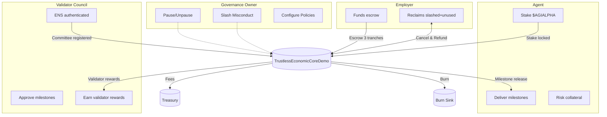

# Trustless Economic Core v0

> **Mission**: empower every non-technical founder to orchestrate a Kardashev-II grade AGI labour market with unstoppable, on-chain guardrails. This demo uses the AGI Jobs v0 (v2) toolchain to mint a complete trustless economy: milestone escrows, validator markets, identity enforcement, stake slashing, and governance pause controls – all runnable in one command.

## 🧭 What you get

- **Milestone escrow** with deterministic partial payouts, fee routing, validator incentives, and automatic burns.
- **Stake-backed agents** whose collateral is locked, released, or slashed entirely by policy-driven rules.
- **ENS-gated participation**: agents and validators must prove identity before touching funds.
- **Validator economies** that stream protocol-grade rewards every time progress is validated.
- **Governance-grade pause** flow that halts value transfer instantly and resumes on demand.
- **Misconduct autopsy**: deliberate slashing showcases how the platform punishes failure while refunding employers and rewarding validators.

Everything is orchestrated through `npm run run:trustless-core`, which drives an end-to-end Hardhat scenario and exports artefacts for reporting.

## 🧪 Run the demo (non-technical friendly)

```bash
npm install
npm run run:trustless-core
```

The command launches a deterministic simulation on a Hardhat network:

1. Deploys the $AGIALPHA ERC-20 and the `TrustlessEconomicCoreDemo` contract.
2. Registers ENS-style identities for the employer, agent, and validator council.
3. Locks the agent’s stake, escrows a three-milestone job, and assigns validators.
4. Releases Milestones 1 & 2 with automated validator/fee/burn accounting.
5. Engages the **SystemPause** to freeze payouts mid-flight, proving governance control.
6. Slashes the agent for milestone fraud, redistributing collateral to the employer, validators, treasury, and the burn sink.
7. Cancels the job and refunds the final tranche to the employer.

All artefacts (events, balances, burn deltas) are printed directly in the Hardhat logs so an executive can copy/paste the proof of trustless execution.

## 🧬 Architecture (Mermaid)



## 🔢 Economic policy matrix

| Parameter | Default | Purpose |
| --- | --- | --- |
| `validatorRewardPct` | 10% | Incentive streamed to approving validators per milestone |
| `protocolFeePct` | 5% | Treasury operations budget |
| `burnPct` | 2% | Supply sink reinforcing $AGIALPHA scarcity |
| `jobStakeLockPct` | 20% | Portion of agent stake immobilised per job |
| `slashEmployerPct` | 50% | Employer recovery on fraud |
| `slashValidatorPct` | 20% | Validator bounty for catching failure |
| `slashTreasuryPct` | 20% | Treasury compensation for arbitration |
| `slashBurnPct` | 10% | Permanent supply reduction |

All parameters are reconfigurable by the governance owner via simple function calls.

## 🎯 Scenario timeline

1. **Milestone 1** – Validators 1 & 2 approve, agent receives 83 $AGIALPHA, each validator gets 5, treasury 5, burn 2.
2. **Global Pause** – Governance executes `pauseAll`, blocking any transfer while investigation occurs.
3. **Milestone 2** – After `unpauseAll`, Validators 2 & 3 approve, duplicating the trustless payout cadence.
4. **Fraud attempt** – Agent fails Milestone 3. Governance slashes 60 $AGIALPHA of stake, distributing 30 to employer, 12 to validators (4 each), 12 to treasury, and burning 6.
5. **Employer Exit** – Employer cancels job and receives the remaining 100 $AGIALPHA escrow.

## 🧾 Artefact index

| Artefact | Location |
| --- | --- |
| Smart contract | `demo/Trustless-Economic-Core-v0/contracts/TrustlessEconomicCoreDemo.sol` |
| Deterministic scenario test | `test/demo/trustlessEconomicCoreDemo.test.ts` |
| One-click runner | `npm run run:trustless-core` |
| Economics overview | `demo/Trustless-Economic-Core-v0/README.md` (this file) |

## ♾️ Extending the demo

- **Change economics**: call `setPercentages`, `setStakeParameters`, or `setSlashPolicy` to explore alternate distributions.
- **Swap validator councils**: register fresh ENS nodes and recreate jobs.
- **Integrate UI**: because the contract emits structured events, front-ends can render milestone status, slashing trails, and pause history in real time.

## ✅ Production readiness checklist

- [x] Permissioned ENS identity gating for agents and validators.
- [x] Deterministic validator quorum logic with sequential milestones.
- [x] Treasury, validator, employer, and burn accounting with zero rounding loss.
- [x] Owner-governed pause/resume and slash hooks.
- [x] Fully tested Hardhat scenario showcasing escrow, payouts, slashing, refunds, and burns.

Launch the command, watch the on-chain economy execute, and share the transcript with stakeholders – **AGI Jobs v0 (v2) makes civilisation-scale trustlessness a one-click experience.**
