# Trustless Economic Core v0

> **Mission**: empower every non-technical founder to orchestrate a Kardashev-II grade AGI labour market with unstoppable, on-chain guardrails. This demo uses the AGI Jobs v0 (v2) toolchain to mint a complete trustless economy: milestone escrows, validator markets, identity enforcement, stake slashing, and governance pause controls – all runnable in one command.

## 🧭 What you get

- **Milestone escrow** with deterministic partial payouts, fee routing, validator incentives, and automatic burns.
- **Stake-backed agents** whose collateral is locked, released, or slashed entirely by policy-driven rules.
- **ENS-gated participation**: agents and validators must prove identity before touching funds.
- **Validator economies** that stream protocol-grade rewards every time progress is validated.
- **Dual-layer pause controls** for job-specific halts and system-wide emergency freezes.
- **Misconduct autopsy**: deliberate slashing showcases how the platform punishes failure while refunding employers and rewarding validators.
- **Zero-residual ledger** capturing the core contract’s balance so operators can prove nothing remains trapped on-chain.

Everything is orchestrated through `npm run run:trustless-core`, which drives an end-to-end Hardhat scenario and exports artefacts for reporting.

## 🧪 Run the demo (non-technical friendly)

```bash
npm install
npm run run:trustless-core
```

The command launches a deterministic simulation on a Hardhat network and emits executive-ready artefacts in `demo/Trustless-Economic-Core-v0/reports/`:

1. Deploys the $AGIALPHA ERC-20 and the `TrustlessEconomicCoreDemo` contract.
2. Registers ENS-style identities for the employer, agent, and validator council.
3. Locks the agent’s stake, escrows a three-milestone job, and assigns validators.
4. Releases Milestones 1 & 2 with automated validator/fee/burn accounting.
5. Engages the **SystemPause** to freeze payouts mid-flight, proving governance control.
6. Slashes the agent for milestone fraud, redistributing collateral to the employer, validators, treasury, and the burn sink.
7. Cancels the job and refunds the final tranche to the employer.
8. Releases the remaining agent stake so they can reclaim honest collateral instantly.

You can re-run the deterministic unit test with `npm run test:trustless-core` for CI-grade verification.

### 📦 Generated artefacts

| Artefact | Purpose |
| --- | --- |
| `trustless-core-report.json` | Machine-readable ledger of balances, milestones, slashing distribution, and supply deltas |
| `trustless-core-report.md` | Markdown debrief with tables + Mermaid diagram for executive briefings |
| `trustless-core-dashboard.html` | Night-mode visual dashboard ready to forward to stakeholders |

## 🧬 Architecture (Mermaid)


### 🔁 Timeline sequence

```mermaid
sequenceDiagram
  participant GOV as Governance Owner
  participant EMP as Employer
  participant AGT as Agent
  participant VAL as Validator Council
  participant TRE as Treasury
  participant BURN as Burn Sink
  GOV->>GOV: Deploy $AGIALPHA + demo core
  GOV->>AGT: Register ENS + demand stake
  AGT->>GOV: Stake 200 $AGIALPHA
  EMP->>GOV: Escrow 3×100 $AGIALPHA
  VAL->>GOV: Approve Milestone 1
  GOV->>AGT: Release tranche + validator rewards
  GOV-->>GOV: Pause all modules
  VAL-xGOV: Milestone attempt reverted (paused)
  GOV-->>GOV: Unpause modules
  VAL->>GOV: Approve Milestone 2
  GOV->>AGT: Release tranche + validator rewards
  GOV->>AGT: Slash 60 $AGIALPHA stake
  GOV->>EMP: Refund unused escrow + slash reward
  GOV->>TRE: Route protocol fees + slash share
  GOV->>BURN: Burn policy allocations
  AGT->>AGT: Withdraw released stake
```



## 🔢 Economic policy matrix

| Parameter | Default | Purpose |
| --- | --- | --- |
| `validatorRewardPct` | 10% | Incentive streamed to approving validators per milestone |
| `protocolFeePct` | 5% | Treasury operations budget |
| `burnPct` | 2% | Supply sink reinforcing $AGIALPHA scarcity |
| `jobStakeLockPct` | 20% | Portion of agent stake immobilised per job |
| `slashEmployerPct` | 50% | Employer recovery on fraud |
| `slashValidatorPct` | 20% | Validator bounty for catching failure |
| `slashTreasuryPct` | 20% | Treasury compensation for arbitration |
| `slashBurnPct` | 10% | Permanent supply reduction |

All parameters are reconfigurable by the governance owner via simple function calls.

## 🎯 Scenario timeline

1. **Targeted job pause** – Governance halts the specific job, proving per-job control before any milestone work.
2. **Milestone 1** – Validators 1 & 2 approve, agent receives 83 $AGIALPHA, each validator gets 5, treasury 5, burn 2.
3. **Global Pause** – Governance executes `pauseAll`, blocking any transfer while investigation occurs.
4. **Milestone 2** – After `unpauseAll`, Validators 2 & 3 approve, duplicating the trustless payout cadence.
5. **Fraud attempt** – Agent fails Milestone 3. Governance slashes 60 $AGIALPHA of stake, distributing 30 to employer, 12 to validators (4 each), 12 to treasury, and burning 6.
6. **Employer Exit** – Employer cancels job and receives the remaining 100 $AGIALPHA escrow.
7. **Agent stake release** – Agent withdraws 140 $AGIALPHA of unlocked collateral (60 remained slashed forever).

## 🧾 Artefact index

| Artefact | Location |
| --- | --- |
| Smart contract | `demo/Trustless-Economic-Core-v0/contracts/TrustlessEconomicCoreDemo.sol` |
| Deterministic scenario test | `test/demo/trustlessEconomicCoreDemo.test.ts` |
| Scenario runner | `demo/Trustless-Economic-Core-v0/scripts/runScenario.ts` (via `npm run run:trustless-core`) |
| JSON ledger output | `demo/Trustless-Economic-Core-v0/reports/trustless-core-report.json` |
| Markdown executive deck | `demo/Trustless-Economic-Core-v0/reports/trustless-core-report.md` |
| HTML dashboard | `demo/Trustless-Economic-Core-v0/reports/trustless-core-dashboard.html` |
| Economics overview | `demo/Trustless-Economic-Core-v0/README.md` (this file) |

## ♾️ Extending the demo

- **Change economics**: call `setPercentages`, `setStakeParameters`, or `setSlashPolicy` to explore alternate distributions.
- **Swap validator councils**: register fresh ENS nodes and recreate jobs.
- **Integrate UI**: because the contract emits structured events, front-ends can render milestone status, slashing trails, and pause history in real time.

## ✅ Production readiness checklist

- [x] Permissioned ENS identity gating for agents and validators.
- [x] Deterministic validator quorum logic with sequential milestones.
- [x] Treasury, validator, employer, and burn accounting with zero rounding loss.
- [x] Owner-governed pause/resume and slash hooks.
- [x] Fully tested Hardhat scenario showcasing escrow, payouts, slashing, refunds, and burns.

Launch the command, watch the on-chain economy execute, and share the transcript with stakeholders – **AGI Jobs v0 (v2) makes civilisation-scale trustlessness a one-click experience.**
