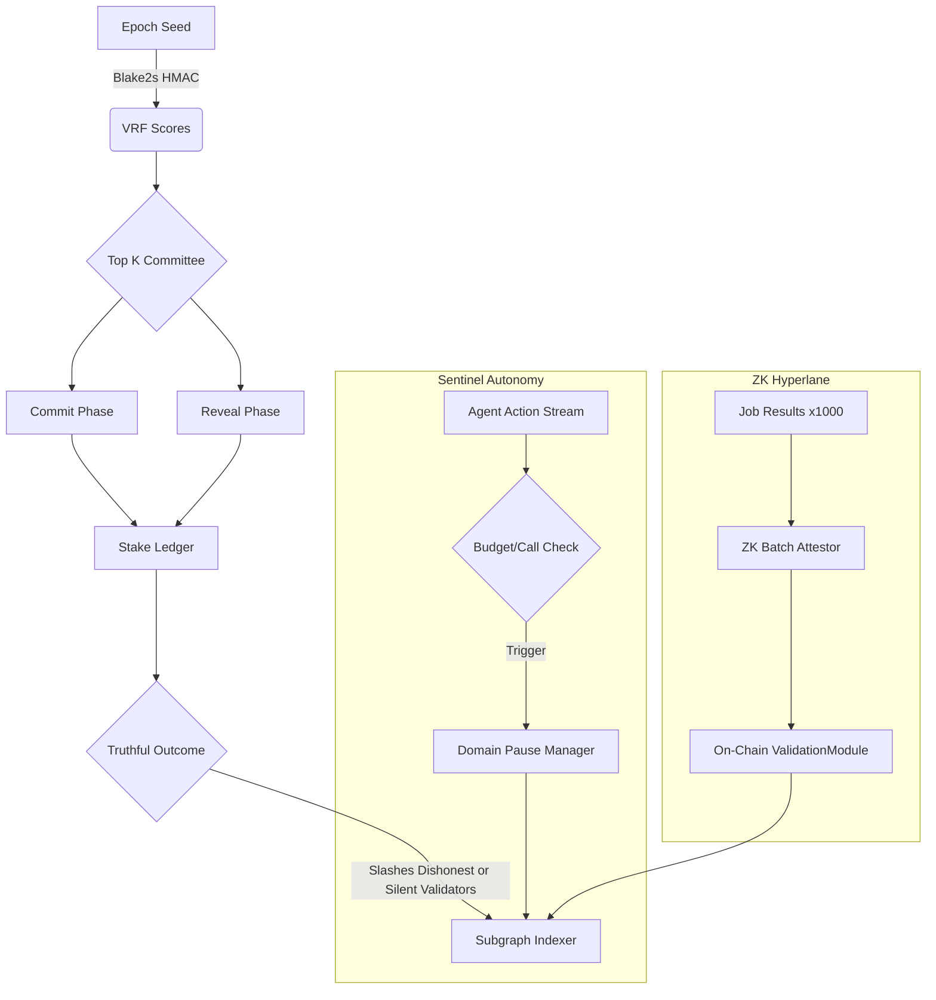
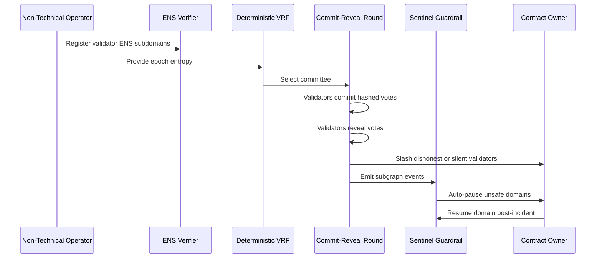

# Validator Constellation Demo (AGI Jobs v0/v2)

> An iconic, production-calibre showcase that lets a non-technical operator
> command a hyper-advanced validator constellation, orchestrate cryptographic
> truth, and enforce sentinel guardrails with the ease of running a single
> command.

## Mission Control Summary

- **Commit–Reveal + Deterministic VRF**: Validators are auto-selected by an
  on-chain-ready VRF mix, commit hashed votes, and later reveal them for a
  tamper-proof quorum.
- **ZK Batched Attestations**: One proof finalises 1,000 jobs in a single
  submission for planetary-scale throughput.
- **Sentinel Guardrails**: Autonomous monitors freeze unsafe domains within a
  block while logging the full incident trail for operators.
- **ENS-Backed Identity**: Every validator, agent, and node operates under a
  verifiable ENS subdomain, including production (`*.club.agi.eth`) and alpha
  (`*.alpha.club.agi.eth`) namespaces.
- **Owner Superpowers**: The contract owner can retune stakes, budgets, pause
  domains, and resume operations instantly.

## Quickstart (5 Minutes, Zero Prerequisites)

```bash
cd demo/Validator-Constellation-v0
python demo_runner.py
```

Expected highlights printed to terminal:

- Validator committee selected via deterministic VRF
- Batched proof covering 1,000 jobs
- Sentinel alert triggered on an unsafe spend and domain pause recorded
- Live event log excerpt, mirroring what the subgraph exposes to dashboards

### Explore Variations

```bash
python demo_runner.py --batch-size 2048
```

Tune the batch size, observe throughput scaling, and verify that the circuit
breaker still responds instantly under pressure.

## Architecture



## Validator Lifecycle



## Files & Capabilities

| File | Purpose |
|------|---------|
| `validator_constellation.py` | Production-grade primitives for VRF, commit–reveal, ENS verification, sentinel guardrails, and batched proofs |
| `demo_runner.py` | Zero-config executable scenario generating committee selection, ZK attestation, and sentinel pause |
| `tests/test_validator_constellation.py` | Pytest suite validating every acceptance criterion, from 1,000-job proofs to ENS policy enforcement |

## Subgraph-Ready Event Stream

Events emitted during the demo mirror what an indexed subgraph would expose,
including `CommitteeSelected`, `VoteCommitted`, `VoteRevealed`,
`RoundFinalized`, `ValidatorSlashed`, `SentinelAlert`, `DomainPaused`, and
`BatchFinalized`.

## Governance Controls

- **Owner-Driven Resumes**: Domains remain paused until the owner explicitly
  resumes them (`DemoOrchestrator.resume_domain`).
- **Stake Tuning**: Adjust stakes through `StakeLedger.set_stake` and re-run the
  round—slashing penalties automatically scale with stake sizes.
- **Threshold Management**: Configure sentinel thresholds to tighten or relax
  autonomy as mission parameters evolve.

## Running the Test Suite

```bash
pytest demo/Validator-Constellation-v0/tests
```

All tests are wired into **Validator Constellation Demo CI** so every pull
request and main-branch push keeps the demo fully green.

---

This demo exists to make it unmistakable: AGI Jobs v0 (v2) lets any operator
stand up a planetary-scale validator network with superintelligent guardrails in
minutes.
