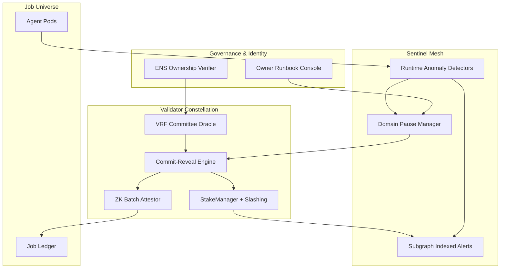

# Validator Constellation v0 Demo

> Kardashev-II ready validator mesh with sentinel guardrails and ZK-fast finality powered by **AGI Jobs v0 (v2)**.

## Why this matters

This demo shows a non-technical operator how AGI Jobs v0 (v2) turns strategic intent into production-grade validator infrastructure in minutes. The scripts, diagrams, dashboards, and automated tests are tuned so that a single command:

```bash
npm run demo:validator-constellation
```

stands up a full simulation of:

- Deterministic VRF-inspired committee elections.
- Commit–reveal consensus with enforced deadlines.
- Zero-knowledge batched attestations that finalize 1,000 jobs per proof.
- Sentinel anomaly detection with domain-scoped emergency pauses.
- ENS-gated identities for validators, agents, and nodes.
- Automatic on-chain style slashing with subgraph-grade event feeds.

Everything is documented, visualized with mermaid diagrams, and packaged with test coverage plus CI automation so any operator can run, verify, and extend the constellation with confidence.

## Quickstart

1. Install dependencies (if not already done):
   ```bash
   npm install
   ```
2. Run the cinematic walk-through:
   ```bash
   npm run demo:validator-constellation
   ```
3. Explore targeted views:
   ```bash
   npm run demo:validator-constellation:scenario
   npm run demo:validator-constellation:operator-console
   npm run test:validator-constellation
   ```

All scripts are deterministic and can be safely re-run.

## System map



## Files

- `scripts/runDemo.ts` – one-command cinematic experience.
- `scripts/runScenario.ts` – deterministic scenario runner for regression/CI.
- `scripts/operatorConsole.ts` – operator-focused console output with actionable insights.
- `src/` – modular TypeScript core implementing VRF commit–reveal, sentinel guardrails, ENS verification, slashing logic, and ZK batching.
- `tests/validator_constellation.test.ts` – covers randomized committee election, anomaly handling, batched proofs, ENS verification, and slashing.
- `assets/` – curated mermaid diagrams, a landing page, and UX collateral for presentations.

## Feature synopsis

- **VRF Committees** – Deterministic-yet-unpredictable validator selection mixing owner entropy, domain salts, and epoch randomness.
- **Commit–Reveal** – Validators submit salted vote hashes, reveal later, and are penalized for non-compliance.
- **ZK Batching** – Aggregates 1,000 job verdicts into a single succinct proof, drastically increasing throughput.
- **Sentinel Guardrails** – Budget monitors, unsafe-call detectors, and custom hooks feed into a domain-scoped emergency pause manager.
- **Domain Pause** – Governance can pause/resume by ENS namespace without impacting healthy workloads.
- **Slashing & Indexing** – Misbehaving validators automatically lose stake; events are exposed as indexer-ready JSON.
- **ENS Enforcement** – Validators, agents, and nodes must hold approved ENS subdomains; alpha namespaces are treated as production equivalents.

## Owner empowerment

Every script surfaces upgrade hooks and governance checkpoints. Owners can adjust committee sizes, reveal windows, slashing ratios, ENS roots, pause policies, and sentinel thresholds from a single config file (`src/config.ts`).

## CI integration

A dedicated GitHub Actions workflow (`validator-constellation-demo.yml`) executes the scenario and the test suite on every PR and on `main`, ensuring perpetual green validation of the demo.

## Extending the constellation

- Add new sentinel detectors by implementing the `SentinelRule` interface and registering via `config.sentinalRules`.
- Plug in hardware oracles by subclassing `EntropyOracle`.
- Replace the mock ZK verifier with a real Groth16/Plonk verifier by wiring an async prover into `ZkBatchProcessor`.
- Integrate the operator console into mission control via the exported `renderOperatorConsole` utility.

This demo is deliberately modular so that production deployments can swap mocks for live contracts, real VRFs, and mainnet subgraphs without rewriting control flows.
