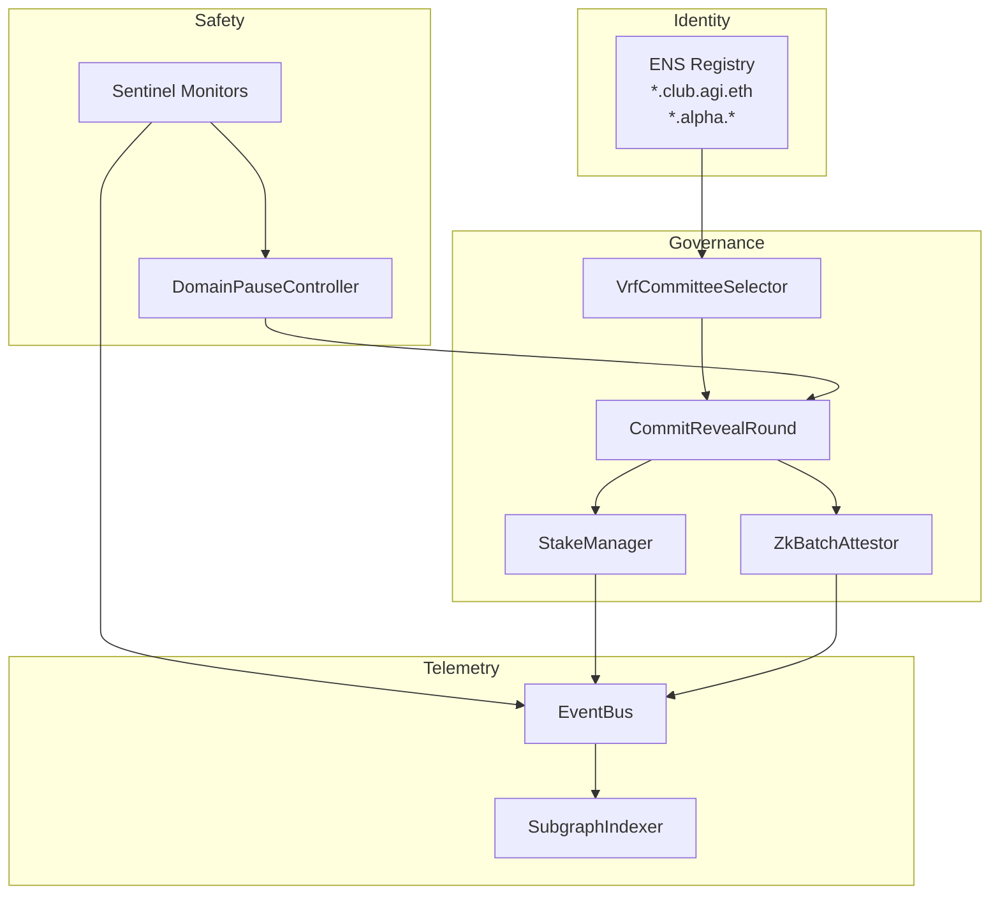
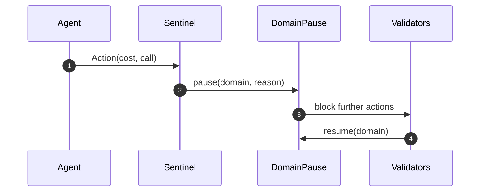

# Validator Constellation v0

> Kardashev-II ready validator, sentinel and ZK batching constellation built entirely through AGI Jobs v0 (v2).

This demo empowers non-technical operators to orchestrate an entire validator constellation, complete with VRF-selected committees, secure commit–reveal voting, ZK-batched attestations, sentinel guardrails and ENS-governed identities. Everything runs from a single command with auditable logs, high-stakes safety controls and subgraph friendly telemetry.

## Why it matters

- **Super-scaled throughput** – validate 1,000 jobs in a single zero-knowledge proof submission.
- **Cryptographic truth** – deterministic VRF committee selection with sealed commit–reveal voting and automatic slashing.
- **Sentinel autonomy** – anomaly detection triggers domain-scoped pauses within SLA guarantees.
- **ENS identity compliance** – validators, agents and nodes must control approved ENS subdomains before participating.

## System architecture



## Demo capabilities

| Capability | Outcome |
| --- | --- |
| Deterministic VRF | Committee assignments are unbiased and unpredictable using entropy derived from round seeds. |
| Commit–reveal quorum | Validators commit hashed votes, reveal later and are slashed for dishonesty or non-reveals. |
| ZK batch proofs | A 1,000-job batch proof finalises in a single attestation round. |
| Sentinel guardrails | Budget or forbidden-call anomalies automatically pause only the affected domain. |
| ENS enforcement | Only validators/agents controlling approved ENS subdomains can register. |
| Subgraph visibility | Every slashing and sentinel event is index-ready for dashboards. |

## One-command experience

```bash
npm run demo:validator-constellation
```

The command prints:

1. **VRF committee members** with ENS names, addresses and stakes.
2. **Consensus resolution** including the batch proof ID and validator slashing outcomes.
3. **Sentinel response** showing the domain pause state triggered by an overspend + forbidden call.
4. **Subgraph event feed** enumerating validator slashes and sentinel alerts.

## Safety loop



## Extending the demo

- Tune quorum, penalty, committee size or sentinel SLA in `scripts/runDemo.ts`.
- Register additional validators/agents by appending ENS-authorised records.
- Adjust monitors or add new checks (e.g. rate limits) via `src/sentinel/Sentinel.ts`.
- Connect to real infrastructure by swapping the mock VRF/ENS/ZK adapters with production integrations.

## Testing

Execute the full test suite to validate every capability:

```bash
npm run lint:validator-constellation
npm run test:validator-constellation
```

The tests simulate VRF committees, commit–reveal honesty guarantees, sentinel anomalies, ENS enforcement and ZK batching at 1,000-job scale.

## Files

- `scripts/runDemo.ts` – turn-key orchestrator.
- `src/index.ts` – core demo facade wiring VRF, commit–reveal, sentinel, pause and ZK batching.
- `src/**` – modular components ready for production hardening.
- `tests/validator_constellation.test.ts` – high coverage, high-stakes validation specs.

Enjoy operating a validator constellation with AGI Jobs v0 (v2) as your autonomous copilot.
