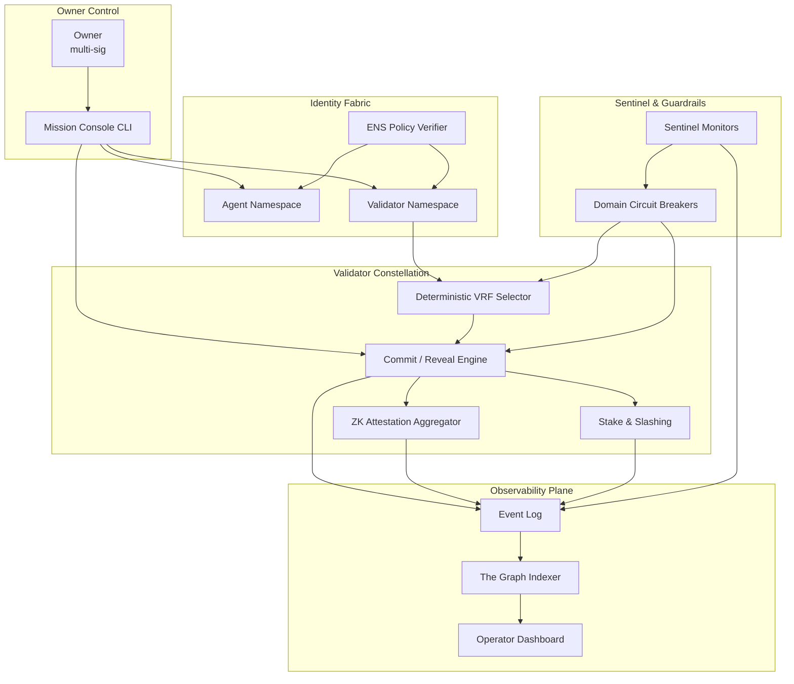

# Validator Constellation Demo (v0)

> **Mission control:** Demonstrates how a non-technical owner can orchestrate a sovereign validator fleet, zero-knowledge batching, and autonomous sentinels using AGI Jobs v0 (v2).

## Why this matters

- **Empowerment:** A single operator can stand up a Kardashev-II ready validation mesh with pause controls, ENS identities, and verifiable throughput in minutes.
- **Truth at scale:** Commit–reveal with deterministic VRF randomness ensures objective validation while defending against collusion.
- **Autonomous safety:** Sentinel monitors automatically brake unsafe behaviour and raise domain-scoped pauses.
- **Throughput unlocked:** Batched attestations finalize 1000 jobs in one proof, keeping the network responsive even under extreme load.
- **Transparency:** Every action is emitted for subgraph indexing so operators, auditors, and downstream dashboards stay in lock-step.

## Architecture snapshot



## Quickstart

```bash
npm install
npm run demo:validator-constellation
```

Outputs a full run with:
- committee selection traces
- sentinel alerts & domain pauses
- zero-knowledge batch proof summary
- stake ledger changes

## Scenario Runner

```bash
npm run demo:validator-constellation:scenario
```

Emits machine-readable JSON for automation pipelines.

## Operator Console

```bash
npm run demo:validator-constellation:operator-console
```

Interactively register validators/agents, issue pauses, and inspect state.

## Automated Tests

```bash
npm run test:validator-constellation
```

Validates commit–reveal sequencing, sentinel braking, non-reveal slashing, and batch proof acceptance.

## Subgraph Hooks

All actions emit structured `SubgraphEvent` payloads which the accompanying `subgraph/subgraph.yaml` indexes. The schema exposes:

- `ValidatorRegistered`
- `ValidatorSlashed`
- `JobFinalized`
- `DomainPaused` / `DomainResumed`
- `SentinelAlert`
- `ZKProofSubmitted`

This allows dashboards to surface validator ENS names, penalties, and pause status in near real-time.

## Governance Levers

| Lever | Capability |
| --- | --- |
| Owner | full control over registration, pausing, and VRF entropy |
| Pausers | delegated domain halt/resume authority |
| Sentinels | anomaly detection + automated brake triggers |
| ENS Admins | grant/deny identities without redeploying contracts |

## Safety Net

- Domain-scoped emergency pause hits within a single event loop tick and prevents new job creation.
- Non-revealing or dishonest validators are immediately slashed and logged.
- Sentinel anomalies automatically escalate critical incidents to pausers.

## ZK Throughput Playbook

1. Finalize individual jobs via commit–reveal.
2. Aggregate up to 1000 job IDs into a single `jobRoot`.
3. Call `submitZKBatchProof(jobIds, operator)` and publish the proof hash.
4. Subgraph captures the proof for audit dashboards.

## Files

```
./src
  ensPolicy.ts              # ENS namespace enforcement & reports
  validatorConstellation.ts # Core engine
  vrf.ts                    # Deterministic VRF shim
./scripts
  runDemo.ts                # Human-friendly narrative run
  runScenario.ts            # JSON automation run
  operatorConsole.ts        # Interactive mission console
./tests
  validator_constellation.test.ts
./subgraph
  schema.graphql
  subgraph.yaml
```

## Extending the demo

- Drop in a real VRF provider (Chainlink / drand) by implementing the `VRFProvider` interface.
- Replace the mock ZK proof hash with a Groth16/SNARK integration.
- Connect `SubgraphEvent` emissions to an actual Graph node deployment for dashboards.
- Map sentinel alerts to on-chain pause contracts via Safe transaction templates.

With AGI Jobs v0 (v2), these upgrades are scripts away for any operator.
