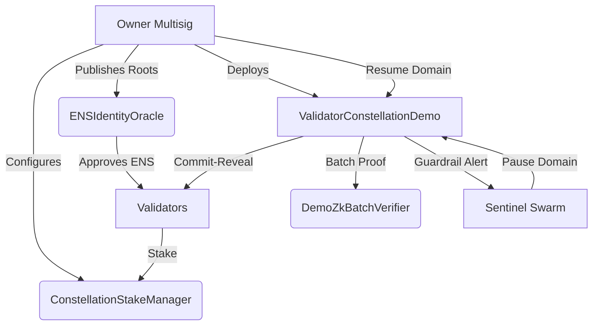

# Validator Constellation Demo

The Validator Constellation demo showcases how a non-technical operator can command an AGI-scale validator fabric with autonomous guardrails, zk-batched finalisation and ENS-enforced identities. It is engineered for Kardashev-II readiness: every control surface is accessible through a single-owner console and every subsystem can be paused within seconds.

## Highlights

- **VRF-grade Commit–Reveal**: Validators commit and reveal under deterministic randomness with entropy contributions from agents and validators.
- **ZK-Batched Attestations**: Up to 1000 jobs are finalised in a single proof submission through a pluggable verifier contract.
- **Sentinel Guardrails**: Budget overruns and anomaly reports automatically freeze the affected domain while keeping other domains live.
- **ENS Identity Enforcement**: Validators, agents and nodes must control authorised ENS subdomains; proofs are verified on-chain.
- **Owner Supremacy**: Treasury, staking parameters, pausers and circuit breakers are governed by the contract owner through single function calls.

## Quick Start

```bash
npm install
npm run demo:validator-constellation
```

The command deploys the stack, executes three validation rounds, finalises them through a zk batch proof, and surfaces operator telemetry plus mermaid diagrams.

To run the full scenario baseline:

```bash
npm run demo:validator-constellation:scenario
```

For an interactive console snapshot:

```bash
npm run demo:validator-constellation:operator-console
```

Generate the audit report:

```bash
npm run demo:validator-constellation:audit-report
```

Run the Hardhat test-suite validating commit–reveal, sentinel guardrails and the 1000-job batch finality:

```bash
npm run test:validator-constellation
```

## System Diagram



## File Structure

- `contracts/` – Solidity contracts for staking, identity, zk verification and the validator demo module.
- `scripts/` – TypeScript orchestrations for demo runs, scenarios, operator console and audit reports.
- `test/` – Hardhat tests covering ENS enforcement, slashing, sentinel guardrails and 1000-job batch finality.
- `scenario/` – JSON scenario configurations.
- `src/` – Shared TypeScript helpers (environment deployer, Merkle utilities, job runner).

## ENS Identity Policy

Validators must own `*.club.agi.eth` (or the `*.alpha.club.agi.eth` equivalent). Agents must own `*.agent.agi.eth`. Identities are verified via Merkle proofs anchored to ENS NameWrapper snapshots. The `ENSIdentityOracle` enforces suffix policies and rejects unauthorised domains.

## Sentinel Guardrails

Sentinel operators can pause any domain by calling `reportSentinelAlert`. Budget overruns automatically trigger the sentinel and force a domain pause until the owner resumes operations. Guardrails are logged through events to provide instant observability.

## zk-Batched Attestations

`DemoZkBatchVerifier` mimics a Groth16 verifier with a governance-controlled verifying key. Production deployments can upgrade to a real verifier without altering the interface. The validator module passes a witness hash to guarantee the integrity of batched results.

## Tests

The Hardhat suite ensures:

- ENS identities are enforced for validators and agents.
- Commit–reveal rounds slash non-revealing or dishonest validators.
- Sentinel guardrails pause domains upon anomaly detection.
- 1000 jobs finalise via a single zk batch proof.

Run with:

```bash
npm run test:validator-constellation
```

## Empowerment

The demo is intentionally non-technical. Operators only need to run the provided scripts; all control pathways (stake, pause, resume, audit) are surfaced with deterministic outputs, tables and mermaid diagrams. The validator constellation demonstrates how AGI Jobs v0 (v2) enables planetary-scale trust without requiring solidity expertise.
