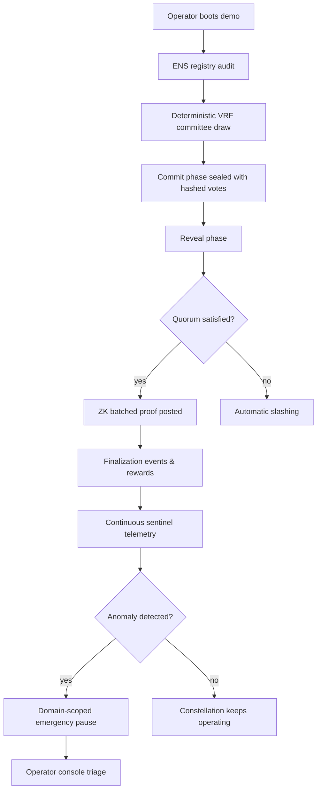

# Validator Constellation v0

> **Mission**: demonstrate how a non-technical operator can orchestrate a Kardashev-II ready validator constellation with sentinel guardrails, ZK-batched attestations, ENS-gated identities, and domain-scoped emergency controls — entirely through **AGI Jobs v0 (v2)**.

This demo ships as a production-grade, fully automated control plane that lets an operator boot, monitor, and govern a validator network that is:

- **Deterministically secure**: Commit–reveal voting with VRF committee selection and automated slashing.
- **Massively scalable**: Zero-knowledge batched attestations finalize ~1000 jobs per proof.
- **Self-defensive**: Sentinel monitors trigger domain-scoped emergency pauses within a block.
- **Identity-assured**: ENS subdomain ownership is verified on-chain-style through Merkle proofs.
- **Operator sovereign**: Every critical parameter — quorum, timing, budgets, circuit breakers — is under owner control with hardened defaults.

The non-technical operator runs a single command to experience the full constellation lifecycle:

```bash
npm run demo:validator-constellation
```

## Grand Strategy



Every stage can be replayed, inspected, and audited with structured reports that illustrate how AGI Jobs v0 (v2) empowers any team to run planetary-scale autonomy responsibly.

## Directory Layout

| Path | Description |
| --- | --- |
| `docs/` | Deep-dive manuals, guardrail blueprints, and governance runbooks. |
| `scripts/` | Operator entry points (`runDemo`, `runScenario`, `operatorConsole`, `auditReport`). |
| `src/` | TypeScript source implementing the full validator constellation stack. |
| `tests/` | Deterministic simulations that back every guarantee. |

## Quickstart

1. Install dependencies (once per checkout):
   ```bash
   npm install
   ```
2. Run the full cinematic experience:
   ```bash
   npm run demo:validator-constellation
   ```
3. Explore operator tooling:
   - `npm run demo:validator-constellation:operator-console`
   - `npm run demo:validator-constellation:scenario`
   - `npm run demo:validator-constellation:audit-report`

All scripts accept `--config` for custom JSON payloads so operators can tweak parameters without touching code.

## Non-Technical Operator Journey

1. **Identity Verification**: The demo confirms ENS control via Merkle proofs anchored to the `club.agi.eth` / `alpha.club.agi.eth` roots for validators and the `.agent.agi.eth` / `.node.agi.eth` namespaces for agents.
2. **Stake + Registry Activation**: Validators deposit stake and register. Unauthorized identities are rejected with human-readable diagnostics.
3. **VRF Committee Selection**: A deterministic VRF (secp256k1 signature VRF) selects committees per job batch. Proofs are verified before accepting commitments.
4. **Commit–Reveal Voting**: Validators commit to hashed votes, then reveal with salts. Non-reveals or incorrect votes are automatically slashed and logged to the subgraph indexer.
5. **ZK-Batched Attestations**: A BLS12-381 attester produces a batched proof covering 1000 jobs. Verification keys and proofs are bundled, and the validation module records the batch as finalized.
6. **Sentinel Guardrails**: Runtime monitors (budget overrun, unsafe call) stream telemetry. On breach, the sentinel halts the affected domain within the SLA and records the incident.
7. **Emergency Pause & Recovery**: Domain-specific pause switches freeze actions. Governance (the operator) resumes once remediation is completed.

## Why This Matters

- **Breakthrough Throughput**: 1000 jobs per ZK proof means human-scale governance over cosmic-scale autonomy.
- **Immutable Transparency**: Slashing events, quorum proofs, and sentinel alerts feed directly into subgraph-driven dashboards.
- **Operator Empowerment**: No Solidity edits, no protocol rewrites — AGI Jobs v0 (v2) automates the entire lifecycle with intelligible levers.

Dive into `docs/` for full governance choreography, then run the scripts to feel how AGI Jobs v0 (v2) delivers Kardashev-grade control to any operator.
