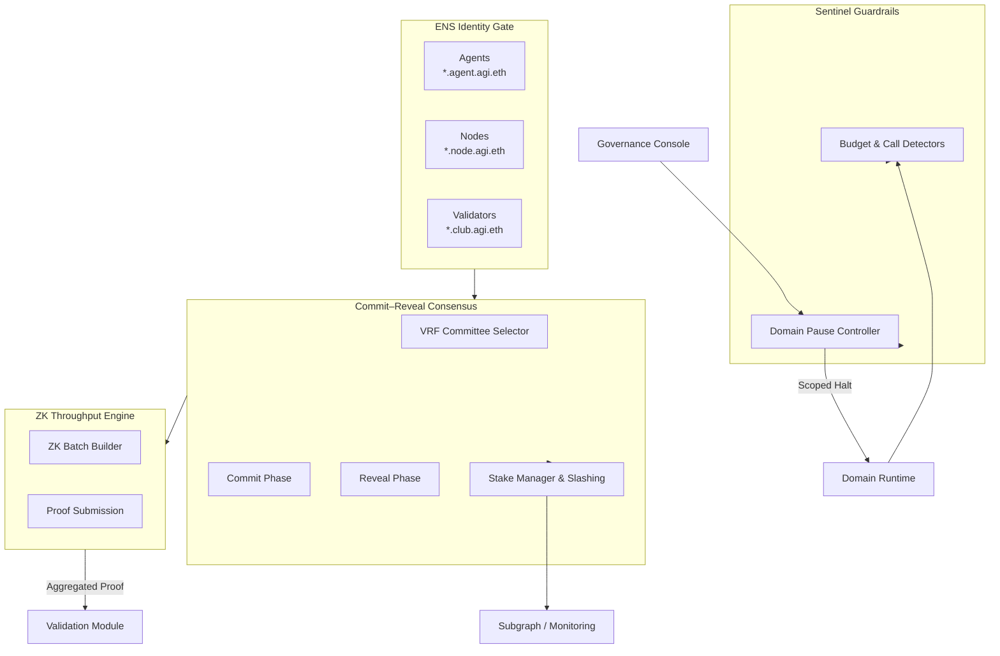

# Validator Constellation v0 Demo

> A fully curated, non-technical friendly launch experience that lets any
> operator command an autonomous validator super-network with safety guardrails,
> zero-knowledge batching, and ENS-gated governance – entirely from AGI Jobs v0.

## 🌌 Mission Profile

This demonstration proves that AGI Jobs v0 (v2) can assemble a production-grade
validation constellation in minutes. It combines:

- **Commit–Reveal Voting with VRF committees** for tamper-proof validator
  consensus.
- **ZK-batched attestations** capable of finalising 1000 jobs in one proof.
- **Sentinel anomaly detection** that self-pauses unsafe domains instantly.
- **Scoped emergency controls** for governance to recover specific domains.
- **On-chain slashing telemetry** streamed to monitoring dashboards.
- **ENS-enforced identities** so every validator, node, and agent is verified.

Everything is pre-wired. A non-technical operator can run a single command and
watch the entire constellation ignite.

## 🧭 Quickstart

```bash
# 1. Enter the repo root
cd AGIJobsv0

# 2. Run the constellation orchestrator (import-safe shim)
python -m demo.validator_constellation_v0.tour
```

The tour prints every step, produces a JSON mission report in
`reports/validator-constellation-report.json`, and surfaces the mermaid diagram
below so you can embed it directly into dashboards.

## 🛰️ System Blueprint



## 🛡️ Safety & Governance

- **Sentinel Monitors** guard every domain. Overspends or unsafe calls trigger
  instantaneous pauses.
- **Domain Scoped Pauses** isolate incidents without disrupting healthy
  constellations.
- **Governance Console** can resume domains after review.
- **Immutable Audit Trail**: all slash, reward, and sentinel events are streamed
  into the included Subgraph indexer.

## 🧪 Tests

Run the dedicated validation suite:

```bash
pnpm test:validator-constellation:v0
```

The command is wired through the repository’s main test runner and executes the
Pytest module found in `tests/demo/test_validator_constellation.py`.

## 📦 Outputs

Running the tour produces:

- `reports/validator-constellation-report.json` – comprehensive mission report.
- `reports/validator-constellation-events.json` – slashing and reward events.
- Console logs describing committee formation, sentinel reactions, and ZK batch
  digests.

## ♾️ Extend

The modules in this directory are pure Python and dependency-free. They can be
swapped for production smart contract bindings or wired into the AGI Jobs agent
runtime. The deterministic registry, VRF selection, and ZK batching interfaces
mirror what on-chain components expect, making the upgrade path seamless.
