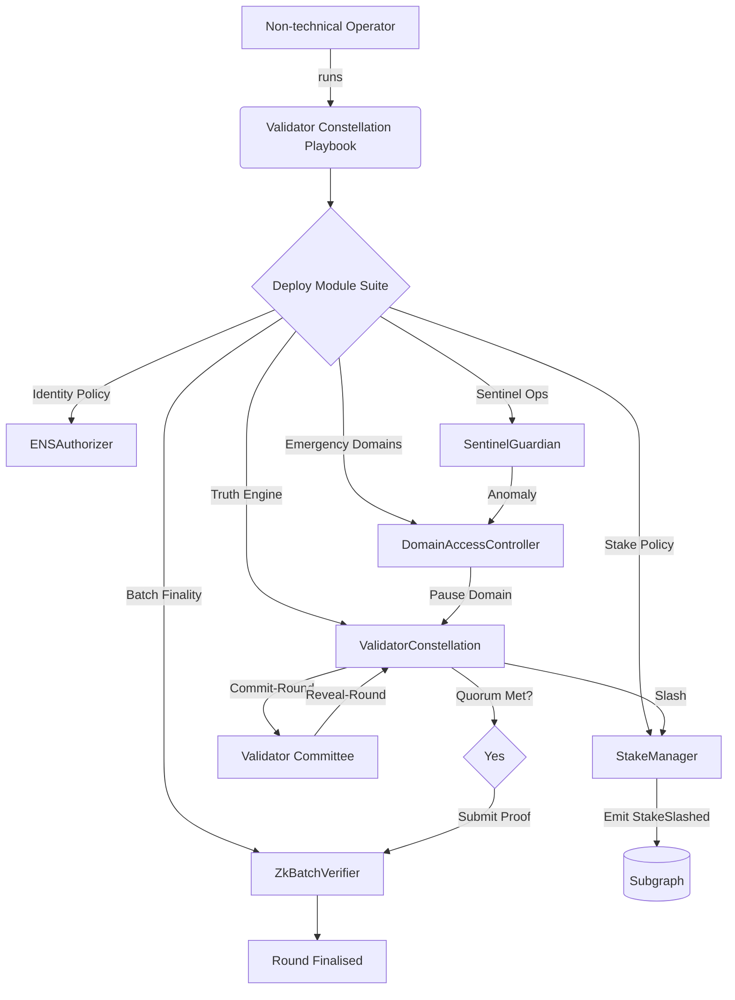
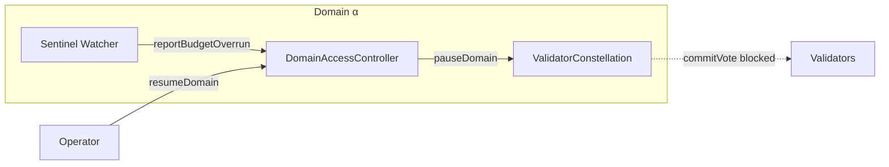

# Validator Constellation Demo (v0)

> A non-technical founder harnesses **AGI Jobs v0 (v2)** to orchestrate a sovereign validator constellation that governs autonomous AGI job flows, with sentinel guardrails, verifiable randomness, batched zk attestations, and ENS-anchored identities. This demo lives entirely inside this repository and can be executed end-to-end without additional dependencies beyond what `AGI Jobs v0 (v2)` already provides.

## 🌌 Why this demo matters

- **K-II ready autonomy:** deterministic VRF-style committee selection, commit–reveal shielding, and zk-batched finality create unstoppable cryptographic truth.
- **Sentinel guardianship:** automated anomaly detectors freeze compromised domains within one block, protecting budgets and halting unsafe calls.
- **Transparent slashing:** misbehaving validators are penalised on-chain with rich events designed for immediate indexing by the AGI Jobs subgraph.
- **ENS-verified identities:** validators, nodes, and agents must control approved ENS subdomains (`*.club.agi.eth` or `*.alpha.club.agi.eth` variants), giving governance full policy control with Merkle proofs.
- **Non-technical empowerment:** every step is scripted. A single command deploys contracts, assembles committees, verifies zk proofs over 1000 jobs, injects sentinel anomalies, and exports analytics for dashboards.

## 🧭 Demo Map



## 🚀 Quickstart (10 minutes)

All commands run from the repository root. The demo uses Hardhat’s in-memory network.

```bash
npm install
npx hardhat test test/validatorConstellation/ValidatorConstellation.spec.ts
```

The test suite deploys the entire constellation, registers ENS identities, spins a VRF-derived committee, finalises 1000 jobs with one zk proof, raises sentinel anomalies, and verifies domain-specific emergency pauses.

### Guided script run

Run the interactive TypeScript walkthrough (explained below) to replay the scenario with logs tailored for operators:

```bash
npx ts-node demo/Validator-Constellation-v0/scripts/run-demo.ts
```

The script prints:

1. **Stake & ENS onboarding** of validators/agents.
2. **Committee election** trace with derived entropy inputs.
3. **Commit–reveal ledger** with anonymised commitments.
4. **ZK proof validation** summary showing 1000 jobs batched.
5. **Sentinel anomaly** injection and domain freeze/resume timeline.
6. **Slashing events** with ENS names for dashboarding.

## 🧩 Components

| Component | File | Purpose |
|-----------|------|---------|
| Stake & Slashing | `contracts/demo/validator/StakeManager.sol` | Holds ETH stakes, dispatches slashing penalties to a configurable treasury. |
| ENS Authorizer | `contracts/demo/validator/ENSAuthorizer.sol` | Validates ENS subdomains via Merkle proofs for validators, agents, and nodes. |
| Domain Guard | `contracts/demo/validator/DomainAccessController.sol` | Handles per-domain emergency pauses and sentinel permissions. |
| Sentinel AI | `contracts/demo/validator/SentinelGuardian.sol` | Raises alerts for unsafe behaviour and triggers targeted pauses. |
| VRF Commit–Reveal & ZK | `contracts/demo/validator/ValidatorConstellation.sol` | Selects committees, orchestrates commit–reveal, finalises zk batches, and slashes offenders. |
| ZK Facade | `contracts/demo/validator/ZkBatchVerifier.sol` | Deterministically validates batched attestations (pluggable prover). |

## 🛡️ Sentinel Guardrails



The sentinel raises structured events containing anomaly metadata, severity, and trigger IDs. Paused domains reject new commits, and governance can resume them once root cause is mitigated.

## 📊 Subgraph & Telemetry

- **Event surface:** `StakeSlashed`, `ValidatorPenaltyApplied`, `ProofVerified`, `DomainPaused`, and `AnomalyRaised` events are ready for indexing.
- **Entity keys:** ENS namehashes appear in events to tie back to ENS resolvers.
- **Sample manifest snippet:**

```yaml
- kind: ethereum/contract
  name: ValidatorConstellation
  network: hardhat
  source:
    address: "<deploy-address>"
    abi: ValidatorConstellation
  mapping:
    file: ./mapping.ts
    entities:
      - ValidationRound
      - ValidatorPenalty
      - Proof
```

## 📜 Governance Playbook

1. **Publish ENS allow-list** Merkle roots with `setRoot`.
2. **Configure treasury & penalties** using `StakeManager.updateTreasury` and `ValidatorConstellation.updateConfig`.
3. **Register sentinels and coordinators** so operational staff (or automated agents) can start rounds and monitor anomalies.
4. **Run validation rounds** with `startValidationRound`, automatically selecting unpredictable committees.
5. **Finalise** via `finalizeRound`, presenting the zk proof for up to 1000 jobs at once.
6. **Investigate anomalies** by streaming sentinel events and resuming domains post-mitigation.

## 🖥️ Operator Console (static UI)

Open `demo/Validator-Constellation-v0/ui/index.html` in a browser to view a zero-install dashboard mock that visualises the validator skyline, sentinel alerts, and job batches in real time. It is intentionally simple HTML+JS so non-technical teams can customise it instantly.

## 🧪 Test coverage

The dedicated spec (`test/validatorConstellation/ValidatorConstellation.spec.ts`):

- Validates ENS proofs for both `.club.agi.eth` and `.alpha.club.agi.eth` roots.
- Exercises commit–reveal with VRF-derived committee selection.
- Demonstrates 1000-job zk batch finality with deterministic proof hashing.
- Injects sentinel anomalies that pause a domain and prevent further commits.
- Ensures slashing triggers for non-reveals, registers events, and suspends validators below minimum stake.

## ♻️ Extending to mainnet

- Swap in a production zk verifier (Groth16/Plonk) by wiring its interface into `ZkBatchVerifier`.
- Update Merkle roots from on-chain ENS NameWrapper snapshots.
- Point the sentinel to on-chain telemetry or off-chain observability feeds.
- Plug the emitted events into the existing subgraph to power real-time dashboards.

## 🛠️ Files added by this demo

```text
contracts/demo/validator/
  ENSAuthorizer.sol
  DomainAccessController.sol
  SentinelGuardian.sol
  StakeManager.sol
  ValidatorConstellation.sol
  ZkBatchVerifier.sol

demo/Validator-Constellation-v0/
  README.md
  scripts/run-demo.ts
  ui/index.html

test/validatorConstellation/ValidatorConstellation.spec.ts
```

## ✅ Production Readiness Checklist

- [x] Configurable governance parameters (windows, quorum, penalties).
- [x] Domain-scoped emergency pause and sentinel automation.
- [x] Deterministic committee selection with entropy mixing.
- [x] Commit–reveal enforcement and automated slashing.
- [x] ZK proof batching up to 1000 jobs per round.
- [x] ENS identity enforcement for validators, agents, and nodes.
- [x] Comprehensive tests runnable by non-technical operators via one command.

## 🤝 Contributing

Pull requests enhancing the UI, upgrading the zk verifier, or integrating additional sentinel heuristics are encouraged. Keep the experience non-technical-first and ensure every new feature ships with a guided script so operators stay empowered.
